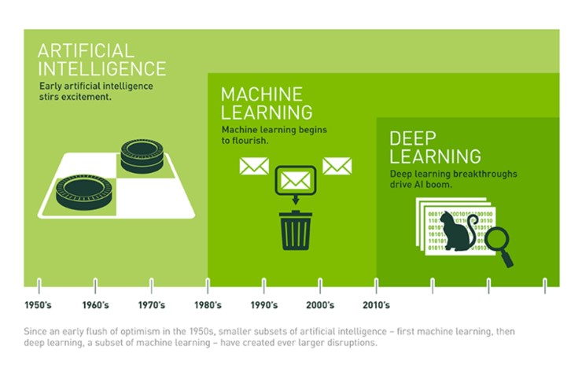

# 1.1.	인공지능\(Artificial Intelligence\) 시대

“인간의 지능을 컴퓨터로 구현한다” 초기에 인공지능을 연구했던 과학자은 인간의 지능과 유사한 특성을 가진 컴퓨터를 만드는 것이었습니다. 인간과 같은 사고력, 지능을 가지고 인간처럼 생각 하는 인공지능\(Artificial Intelligence\)을 일반적으로 ‘AI’라고 합니다.

인공 지능이라는 개념은 1956년 미국 다트머스 대학에 있던 존 매카시 교수가 개최한 다트머스 회의에서 처음 등장했으며, 최근 몇 년 사이 폭발적으로 성장하고 있는 중입니다. 특히 2012년 이후 신속하고 강력한 병렬 처리 성능을 제공하는 GPU의 도입으로 더욱 가속 성장하고 있습니다. 갈수록 폭발적으로 늘어나고 있는 저장 용량과 이미지, 텍스트, 매핑 데이터 등 모든 영역의 데이터가 범람하게 된 ‘빅데이터’ 시대의 도래도 이러한 성장세에 큰 영향을 주었습니다.

초기 AI 개념으로는 인간의 감각, 사고력을 지닌 채 인간처럼 생각하는 인공 지능을 ‘일반적인 AI\(General AI\)’를 AI라고 했습니다. 하지만 현재의 기술 발전 수준에서 만들 수 있는 인공지능은 ‘좁은 의미의 AI\(Narrow AI\)’입니다. 좁은 의미의 AI는 소셜 미디어의 이미지 분류 서비스나 얼굴 인식 기능 등과 같이 특정 작업을 인간 이상의 능력으로 해낼 수 있는 것을 말합니다.

머신러닝은 프로그래머의 프로그래밍 없이 컴퓨터 스스로 원하는 방식으로 배우게 하는 능력을 갖게 하는 기술입니다. 기본적으로 알고리즘을 이용해 데이터를 분석하고, 이 데이터를 이용해서 학습하고, 학습된 정보를 기반으로 판단이나 예측을 하는 시스템을 말합니다. 프로그래머를 고용하여 복잡한 규칙을 가진 프로그래밍을 하는 것보다 머신러닝을 통하여 프로그램을 생산하는 것이 시간과 비용면에서 더 효율적이기 때문에 각광을 받고 있는 것입니다.

구글의 알파고와 이세돌 9단 간 대결로 전 세계의 주목을 받은 알파고가 수백만 기보를 학습한 뒤 이세돌 9단과의 대결을 펼쳤던 것과 마찬가지로 머싱러닝은 스스로 학습한 뒤 인간이 원하는 결과물을 도출해내는 인공지능을 똑똑하게 만드는 기술입니다.

머신 러닝은 초기 인공 지능 연구자들이 직접 제창한 개념에서 나온 것이며, 알고리즘 방식에는 의사 결정 트리 학습, 귀납 논리 프로그래밍, 클러스터링, 강화 학습, 베이지안\(Bayesian\) 네트워크 등이 포함됩니다. 그러나 이 중 어느 것도 최종 목표라 할 수 있는 General AI를 달성하진 못했으며, 초기의 머신 러닝 접근 방식으로는 Narrow AI조차 완성하기 어려웠던 것이 사실입니다.

딥러닝은 머신러닝의 세부 방법론으로써, 이론적으로 딥러닝은 머신러닝의 ‘부분집합’이라고 할 수 있습니다. 머신러닝과 딥러닝의 차이점은 머신러닝은 컴퓨터에게 다양한 정보를 가르치고 그 학습한 결과에 따라 컴퓨터가 새로운 것을 예측하는 반면 딥러닝은 가르치는 과정 없이도 스스로 학습하고 미래 상황을 예측할 수 있다는 것입니다. 딥러닝은 수많은 데이터를 제시하고 그 사이에서 패턴을 발견하도록 만듭니든다.

예를 들어 사진을 보고 자동차 종류를 식별하기 위해서 과거엔 각 자동차들의 특징 데이터들을 입력해 분류했다. ‘바퀴가 4개이고 뒷좌석이 없으며 뒤에 화물 짐칸이 개방형으로 있는 자동차’라는 사전지식을 입력해 트럭 사진을 찾아내는 식입니다. 이때 안개가 끼거나 사진의 각도에 따라 바퀴의 개수나 화물 짐칸이 사진에서 잘 안 보이면 어떻게 될까? 머신러닝에서는 바로 트럭 사진이 아니라고 분류했습니다. 사전지식의 내용과 다르기 때문입니다. 하지만 딥러닝은 이러한 사전지식을 사용하지 않습니다. 일단 데이터를 넣어놓고 기계가 스스로 특성을 분류합니다. 이때 무작정 데이터가 많아선 안 되며, 실제로 트럭 사진을 무엇인지 알려주는 이른바 ‘정답’ 데이터도 많이 있어야 합니다. 이렇게 학습을 계속 시키면 기계가 스스로 트럭을 구별 할 수 있게 됩니다. 어린아이는 사람의 얼굴을 잘 구별하지 못하지만, 나이가 들며 많은 얼굴\(데이터\)을 보고 개개인을 잘 구별하게 되는 것과 마찬가지로 학습이 계속될수록 더 똑똑한 인공지능이 만들어 질 수 있는 것입니다.

머신러닝이나 딥러닝 모두 학습 모델을 제공해 데이터를 분류하는 데 사용되는 기술입니다.

현재 딥 러닝으로 훈련된 시스템의 이미지 인식 능력은 이미 인간을 앞서고 있습니다. 이 밖에도 딥 러닝의 영역에는 혈액의 암세포, MRI 스캔에서의 종양 식별 능력 등이 포함됩니다.

딥러닝의 등장으로 인해 머신러닝의 실용성은 강화됐고, 인공 지능의 영역은 확장되었습니다. 딥러닝은 컴퓨터 시스템을 통해 지원 가능한 모든 방식으로 작업을 세분화합니다. 자율주행 자동차, 더 나은 예방 의학, 더 정확한 영화 추천 등 딥러닝 기반의 기술들은 우리 일상에서 이미 사용되고 있거나, 실용화를 앞두고 있습니다. 딥러닝은 공상과학에서 등장했던 일반 AI를 실현할 수 있는 잠재력을 지닌 인공 지능의 현재이자, 미래로 평가 받고 있습니다.

현재 기업과 개발자들의 인공지능 개발 방식은 크게 세 가지로 나눌 수 있습니다. 첫 번째는 데이터 수집 및 분석, 머신러닝, 인공신경망 구축 등 모든 작업을 처음부터 끝까지 직접 하는 것입니다. 인공지능 기술 역량을 축적하기에는 매우 좋지만 개발 속도가 매우 느려진다는 단점이 있습니다. 두 번째는 텐서플로, 카페, 토치 등 오픈소스 인공지능 프레임워크를 활용해 인공지능을 개발하는 것입니다. 인공지능 개발에 들어가는 시간을 제법 단축할 수 있고, 데이터 가공이나 인공신경망 구축 등 핵심 기술에 대한 노하우도 많이 얻을 수 있어 대학과 연구소를 중심으로 많이 선호 받고 있는 방식입니다. 세 번째는 구글, 마이크로소프트, 아마존 등이 클라우드 컴퓨팅 서비스를 통해 제공하는 인공지능 API를 적극 활용해 인공지능을 개발하는 것입니다. 기술 종속이 일어날 수 있지만, 인공지능 모델을 빠르게 완성해 상용화할 수 있다는 점에서 많은 기업들에게 각광받은 방식입니다.

세계 최대 인터넷 기업 구글이 2015년 인공지능 엔진 '텐서플로'\(TensorFlow\)를 오픈 소스로 공개하였습니다. 그 이후 인공지능, 딥러닝 프로그래밍의 대중화가 시작되었다고 볼수 있습니다. 구글 브레인 팀이 개발한 텐서플로우는 수치 계산과 대규모 머신러닝을 위한 오픈소스 라이브러리입니다. 텐서플로우는 다수의 머신러닝과 딥 러닝\(신경망\) 모델과 알고리즘을 결합해 유용성을 높혔습니다. 개발 언어로 파이썬\(Python\)을 사용하고,  애플리케이션을 구축하기 위한 편리한 프론트 엔드 API를 제공하며, 성능이 우수한 C++로 애플리케이션을 실행합니다.

그러나 구글은 텐서플로에 몇 가지 제약을 걸어 놓았습니다. 가장 대표적인 것이 클라우드 서비스를 제공하지는 않는다는 것입니다. 텐서플로에 다양한 서비스에 붙여 머신러닝, 딥러닝을 적용하고 있지만 구글 컴퓨트 엔진의 모듈로 올리지는 못합니다. 필요하면 만들어 쓰라는 것입니다. 또한 구글은 텐서플로에 그 어떤 데이터도 제공하지 않습니는다. 구글이 제공하는 텐서플로는 분석할 수 있는 도구일 뿐입니다. 텐서플로가 뭘 하는지 알려면 먼저 머신러닝의 기본 구조를 스스로 이해할 필요가있습니다.

딥러닝은 방대한 양의 데이터에 대한 계산 처리를 위해 연산 능력이 높은 GPU 등의 하드웨어가 필요합니다. 텐서플로 자체는 C++로 작성되었지만 다양한 언어를 지원합니다. 다만 파이썬\(Python\)을 최우선으로 지원합니다. 대다수의 편의 기능이 파이썬 라이브러리로만 구현되어 있으므로 파이썬으로 개발하는 것이 가장 편리하다고 볼 수 있습니다. 케라스는 그 자체가 파이썬으로 구현된 라이브러리니 말할 것도 없습니다. 텐서플로는 머신러닝, 딥러닝 라이브러리들 중에서 가장 안정적인 성능을 보입니다. 케라스는 가장 이해하기 쉽고 직관적입니다.

