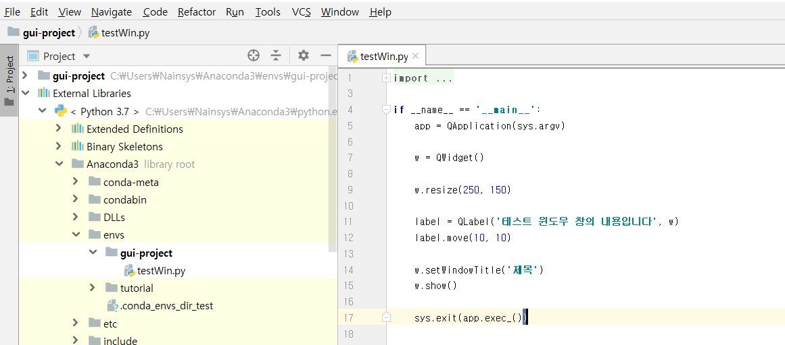

# 1.6.2.     파이참\(PyCharm\)


  
Jetbrain에서 개발한 파이참은 파이썬 프로그램을 쉽게 개발할 수 있도록 하는 IDE\(Integrated Development Environment, 통합 개발 환경\)로 분류됩니다. IDE는 코드 편집기, 디버거, 컴파일러, 인터프리터 등을 포함하고 개발자에게 제공됩니다.

현재까지 파이썬 개발툴 중에서는 가장 높은 완성도를 지니고 있기 때문에 많이 쓰이는 개발툴중 하나입니다. PyCharm은 커뮤니티 에디션\(무료\)과 프로페셔널 에디션\(유료\)으로 나뉍니다. 윈도우, 리눅스, 맥 모두를 지원하여 어느 플랫폼에서나 사용 할 수 있다는 것도 큰 장점입니다.

파이참은 통합 개발 환경으로 더욱 전문가적인 일을 할 수 있고, 다양한 단축키로 작업 속도가 빠르며 오류를 찾아주는 기능으로 디버깅이 쉽습니다.

