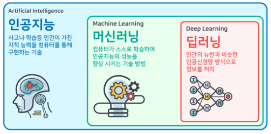

# 1.4. 인공지능 &gt; 머신러닝 &gt; 딥러닝

AI의 역사에서 그 패러다임이 탐색에서 지식으로 그리고 학습으로 키워드가 변해 온 것을 확인할 수 있습니다.

탐색 --&gt; 지식 --&gt; 학습

AI와 머신러닝\(기계학습\), 딥러닝\(심층신경망\)의 뜻을 정확하게 구분할 수 있어야 합니다. 인공지능의 여러 방식 중 학습에 기반을 둔 것이 머신러닝\(기계학습\)이고, 딥러닝은 머신러닝 중에서 스스로 학습하는 최신 기법이라고 할 수 있습니다.

