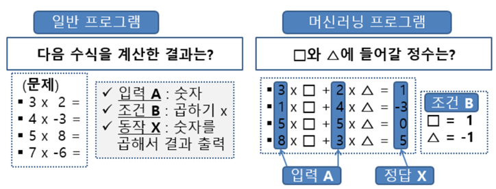

# 1.5. 머신러닝

인간은 학습 \(Learning\) 할 수 있기 때문에 자신의 지식을 계속적으로 확장 시켜 나갈 수 있습니다. 기계학습\(Machine Learning\) 은 인간의 이러한 학습능력을 컴퓨터에 구현하고자 하는 시도입니다.

인간의 가장 두드러진 특징은 새로운 것을 배우고 변화하는 환경에 적응할 수 있는 학습능력을 가지고 있다는 것입니이다. 컴퓨터가 학습능력을 가질 수 있다면 지능을 가진 인간과 유사한 적응력을 가질 수 있게될 것입니다.

기계 학습 또는 머신 러닝은 인공 지능의 한 분야로, 컴퓨터가 학습할 수 있도록 하는 알고리즘과 기술을 개발하는 분야를 말합니한다.

 1959년, 아서 사무엘은 기계 학습을 “컴퓨터에게 배울 수 있는 능력, 즉 코드로 정의하지 않은 동작을 실행하는 능력에 대한 연구 분야”라고 정의하였습니다. \[위키피디아\] 

머신 러닝 기술은 명시적으로 프로그래밍하는 것이 아니라 데이터로부터의 학습을 통해 작업을 수행하는 방법을 컴퓨터에 가르치는 것입니이다. 아래 곱하기 계산 예에서 일반적인 프로그램은 입력 숫자와 곱하기 연산자를 활용하여 결과 값을 계산하지만, 머신러닝에서는 입력값 A와 정답 X를 활용하여 스스로 학습하여 조건 B를 찾는다는 것이 다릅니다.

