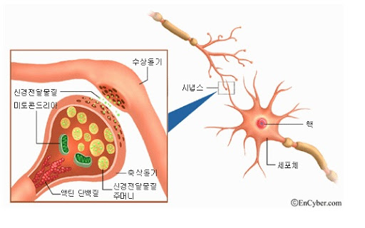
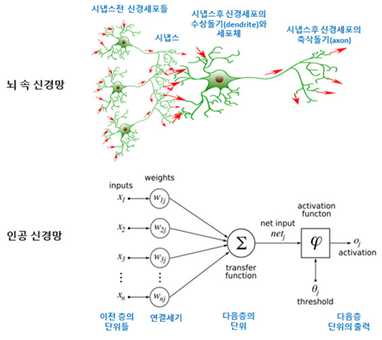

# 1.7. 인공신경망\(ANN\)

뉴런이란 신경계의 구조적 및 기능의 단위로써 신경세포와 거기서 나온 돌기를 합친 것을 말합니다.  신경 세포체, 핵, 가지돌기, 축삭돌기, 시냅스 등으로 구성되어 있습니다. 인간의 뇌는 뉴런이라는 수많은 신경세포로 이루어 져 있습니다.

각각의 뉴런은 시냅스라는 연결 부위를 통해 수백 수천개의 다른 뉴런들과 연결되어 있습니다. 한 뉴런의 흥분은 시냅스를 통하여 다른 뉴런의 수상돌기로 전달됩니된다. 감각 기관에서 받아들인 정보가 뉴런을 통해 뇌로 전달 됩니다.

갓난 아기는 태어나서 개와 고양이를 보고 구분해내지 못한다. 하지만 이후 다양한 사물들을 보고, 듣고, 언어에 대한 개념이 생기고 무의식적인 학습을 통해서 사물을 구분하고 분류하게 됩니다. 성인은 개와 고양이의 사진이나, 개와 고양이의 음성을 거의 즉각적으로 구분해 낼 수 있습니다. 사람의 이런 능력이 가능한 것은 뇌의 뉴런을 통한 학습체계 덕분이라고 합니다. 

인간의 뇌는 1천억개의 뉴런을 가지고 있고, 초파리는 10만개, 선충은 302개의 뉴런을 갖고 있다고 합니다. 초파리는 10만개의 뉴런으로 잘 날아다니고, 음식을 섭취하며, 위험을 피하는 등 복잡한 업무를 수행하고, 선충도 불과 302개의 뉴런으로 컴퓨터보다 힘든 업무를 잘 수행합니다. 

과학자들의 관찰에 의하면 뉴런은 입력을 받았을 때 즉시 반응하지는 않습니다. 입력이 누적되어 특정 수준\(threshold\)에 도달된 경우에만 출력을 합니다. 뉴런이 미세한 잡음 신호는 전달하지 않고 의미 있는 신호만 전달합니다. \(시냅스 가소성\)

인공신경망\(ANN; Artificial Neural Network\)은 사람 또는 동물 두뇌의 신경망에 착안하여 구현된 컴퓨팅 시스템으로 인간의 신경을 흉내 낸 머신러닝 기법을 말합니다.  
Artificial Neural Network \(ANN\)는 딥 러닝의 가장 핵심적인 기술로써, 신경 세포인 뉴런을 추상화한 인공 뉴런으로 구성된 네트워크를 말합니다.

