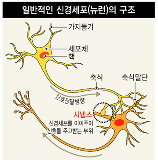

# 1.7. 인공신경망\(ANN\)

뉴런이란 신경계의 구조적 및 기능의 단위로써 신경세포와 거기서 나온 돌기를 합친 것을 말합니다.  신경 세포체, 핵, 가지돌기, 축삭돌기, 시냅스 등으로 구성되어 있습니다. 인간의 뇌는 뉴런이라는 수많은 신경세포로 이루어 져 있습니다.

각각의 뉴런은 시냅스라는 연결 부위를 통해 수백 수천개의 다른 뉴런들과 연결되어 있습니다. 한 뉴런의 흥분은 시냅스를 통하여 다른 뉴런의 수상돌기로 전달됩니된다. 감각 기관에서 받아들인 정보가 뉴런을 통해 뇌로 전달 됩니다.

