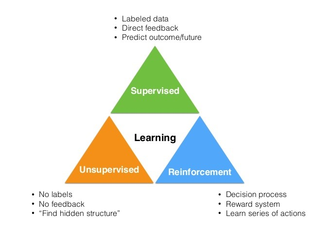

# 1.6.    머신러닝 알고리즘


  
머신러닝은 제공되는 데이터를 기반으로 컴퓨터를 학습시켜서 무언가를 예측하게 만드는 기법입니다. 

즉 컴퓨터에게 여러가지 예제 데이터를 주고 스스로 학습하여 프로그램을 작성하도록 하자는 것입니다. 

머신 러닝 알고리즘은 크게 세가지 분류로 나눌 수 있습니다. 바로, 지도 학습\(Supervised Learning\), 비지도 학습\(Unsupervised Learning\), 강화 학습\(Reinforcement Learning\)입니다.

머신러닝, 딥러닝의 이론적인 이해를 하려면 김성훈님의 Youtube “모두를 위한 딥러닝” 강좌를 반드시 공부하기를 바랍니다.

강의:      [https://www.youtube.com/playlist?list=PLlMkM4tgfjnLSOjrEJN31gZATbcj\_MpUm](https://www.youtube.com/playlist?list=PLlMkM4tgfjnLSOjrEJN31gZATbcj_MpUm)

소스:      [https://github.com/hunkim/ml](https://github.com/hunkim/ml)

정리:      [https://hunkim.github.io/ml/](https://hunkim.github.io/ml/)

               [https://aileen93.tistory.com/48?category=769137](https://aileen93.tistory.com/48?category=769137)

