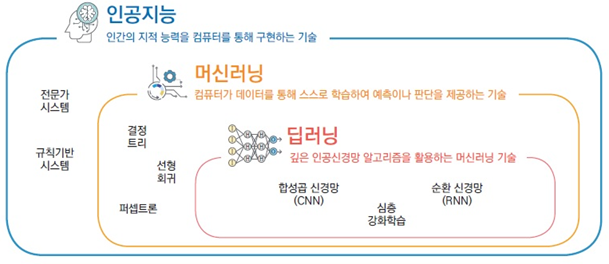

# 1.8. 딥러닝

딥러닝은 인간의 신경망을 본 딴 인공 신경망에서 발전한 개념 입니다.

뇌의 뉴런과 유사한 정보 입출력 계층을 활용해 데이터를 학습합니다. 딥러닝은 머신러닝을 실현하기 위한 여러가지 방법 중 한 가지이며, 하위 개념이 됩니다. 딥러닝은 인공신경망에 기반을 둔 머신러닝 기술의 한 종류입니이다. 신경망은 굉장한 양의 연산을 필요로 하는 탓에 딥러닝의 상용화는 초기에 어려웠으나, 2012년 이후에는 하드웨어 성능의 폭발적 향상, 알고리즘 향상, 인터넷 성장에 따른 데이터셋 수집의 용이성 등으로 인해 진정한 딥러닝 기반 인공 지능의 등장하게 되었습니다. 

딥러닝의 ‘딥‘이란 단어가 어떤 깊은 통찰을 얻을 수 있다는 것을 의미하지는 않습니는다. 그냥 연속된 층으로 표현을 학습한다는 개념을 나타 냅니낸다. 레이어를 거치면서 신뢰도가 높아진다는 개념입니다.

대부분의 딥러닝 방식은 인공신경망 아키텍처를 사용하는데, 이런 이유로 딥러닝 모델은 종종 **심층 신경망**으로 불립니다.

“딥”이라는 용어는 뉴럴 네트워크를 구성하는 숨겨진 레이어\(Hidden Layer\)의 수를 가리킵니다. 기존 뉴럴 네트워크는 숨겨진 레이어가 2-3개에 불과하지만 딥 네트워크는 수백개까지 이르는 경우도 있습니다.

딥러닝의 개념을 포함하고 있는 것이 머신러닝이기 때문에 칼로 그은 듯 서로를 구분할 수는 없지만, 업계에서는 인공지능을 이야기할 때 머신러닝보다는 딥러닝이라는 용어를 더 많이 사용하고 있습니다. 현재까지로는 딥러닝 방식\(즉, 레이어를 지나면서 데이터를 처리하는 방식\)이 밝혀진 머신러닝 방법 중에는 가장 정확도가 높은 방법이기 때문입니다.

