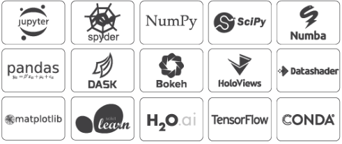

# 1.3.    아나콘다\(Anaconda\)


  
아나콘다는 컨티눔\(Continuum Analytics\)이라는 회사에서 만든 파이썬 배포판으로, 수백 개의 파이썬 패키지를 포함하고 있습니다. 또한 회사 내에서도 상업용으로 무료로 사용할 수 있다는 장점이 있습니다. 여러 가지 파이썬 배포판 중 가장 후발주자이지만 가장 뛰어난 완성도로 현재는 사실상의 표준 배포판으로 되어가고 있습니다. 아나콘다는 패키지 의존성을 관리해주므로 가상환경에 따라 독립적으로 패키지를 관리할 수 있습니다.

파이썬은 파이썬 공식 홈페이지에서 받을 수 있으며, pip 툴만을 포함하고 있습니다. 필요한 패키지나 라이브러리 등을 설치할 때 모두 수동으로 해줘야 합니다. 그러나 아나콘다는 파이썬 기본 패키지에 각종 수학/과학 라이브러리들을 같이 패키징해서 배포하는 개발 플랫폼이라고 볼 수 있습니다.

아나콘다에 포함된 툴들로는 대표적으로 panda, numpy, scipy, sklearn, matplotlib, Jupyter Notebook 등이 있습니다.

일반적으로 파이썬으로 프로그래밍을 할 때 아나콘다를 사용하지 않아도 무방합니다. 그러나 파이썬을 계속하다 보면 아나콘다 없이 사용하기는 불편한 경우가 많이 발생합니다. 특정 라이브러리가 파이썬 버전에 종속되는 경우가 있습니다. 가령 텐서플로우 윈도우버전은 파이썬 3.5버전 까지만 있습니다. 이런 문제들을 해결하는 방법 중 가장 편한 방법이 아나콘다를 사용하는 것입니다. 아나콘다의 가장 큰 장점은 각 프로젝트 별로 개발 환경을 구성 할 수 있다는 것입니다. 하나의 PC에서 목적에 따라 여러 개의 독립적인 개발환경을 구성하여 프로그램을 개발할 수 있으며, 해당 프로그램의 의존성을 보다 명확하게 할 수 있다는 장점도 있습니다.

