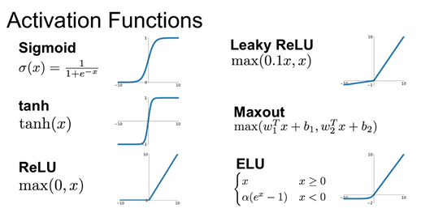

# 2.1.6. 활성화 함수

인공 신경망은 가중치와 활성화 함수의 연결로 이루어진 간단한 구조입니다.

놀라운 것은 이렇게 간단한 개념의 인공 뉴런을 충분히 많이 연결해 놓는 것만으로 인간이 인지하기 어려운 매우 복잡한 패턴까지도 스스로 학습할 수 있게 된다는 사실입니다.

인공 신경망모델에서 뉴런은 층으로 구성 되고 층에는 여러 개의 노드로 구성되어 있습니다. 하나의 노드는 1개이상의 노드와 연결되어 있고 데이터 입력을 받게 되는데 연결강도의 가중치의 합을 구하게 되고 활성화 함수를 통해 가중치의 값의 크기에 따라 출력하게 됩니다.

인공신경망에서 입력신호를 받아 임계치\(threshold\)를 넘어서는 경우에만 출력 신호를 생성해주는 함수를 활성화함수\(activation function\) 이라고 합니다. 즉 인공신경망에서 입력 받은 데이터를 다음층으로 출력할지 말지를 결정 활성화 함수\(activation function\)는 인공신경망을 통과해온 값을 최종적으로 어떤 값으로 만들지를 결정합니다. 즉, 이 함수가 바로 인공 뉴런의 핵심 중에서도 가장 중요한 요소입니다. 활성화 함수에는 대표적으로 Sigmoid, ReLU, tanh 함수가 있습니다.

  
 1\) Sigmoid Function\(시그모이드함수\)

로지스틱함수라고도 하며 x값의 변화에 따라 0에서 1까지의 값을 출력하는 S자형 함수입니다.

2\) Tanh

Sigmoid Function을 재활용하여 -1 ~ 1의 범위를 갖는 함수입니다.

3\) ReLU\(Rectified Linear Unit 경사함수\)

Gradient Vanishing 문제\(layer가 늘어날때 값이 사라지는 현상\)을 해결하기 위한 함수 입니다. x값이 음수일 경우 0을 출력합니다.

4\) Leaky ReLU

x값이 음수일때 입력값의 10분의 1만을 출력하는 ReLU 입니다.

