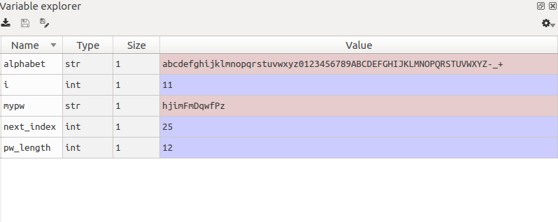

# 2.5.3.     스파이더\(Spyder\)


  
Spyder는 Anaconda 배포본에 포함되어 있는 IDE입니다. 에디터와 콘솔을 지원하기 때문에 디버깅 작업을 편하기 수행할 수 있습니다. 또한, 프로젝트, 디버깅, 헬프, 변수 보기\(variable explorer\) 등 다양한 편의기능을 제공합니다. 편집기에서 편집하다가 스크립트를 전체 수행하거나 일부 영역을 선택한 후 그 부분만 수행할 수 있습니다. 과학기술계산용으로 특화되었습니다.

Spyder는 Python으로 작성되었습니다. Spyder에서 PyCharm과 비교하여 가장 큰 장점은 변수 탐색기가 있다는 것입니다.

