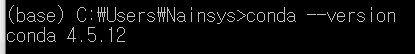
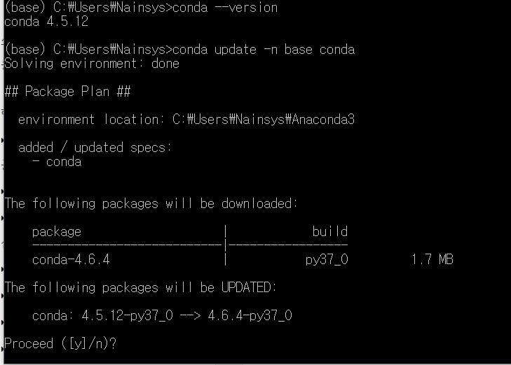
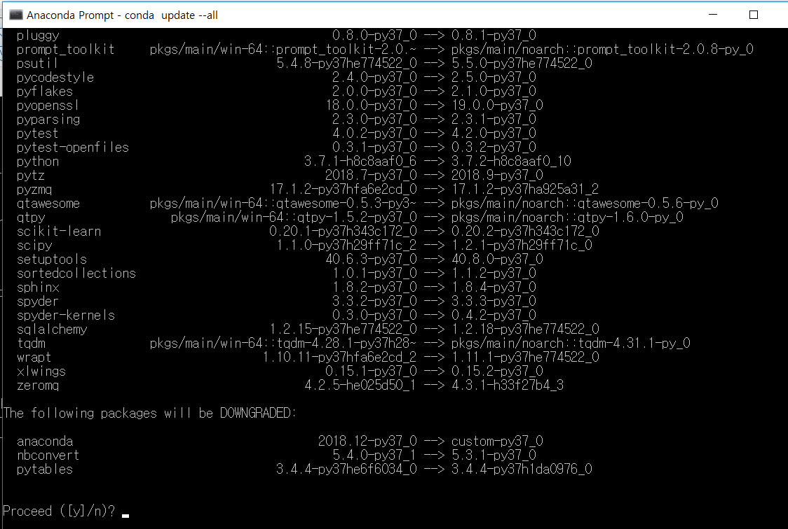

# 1\)	아나콘다 패키지 업데이트


  
현재 설치된 아나콘다의 버전을 확인해 보겠습니다.

```text
(base) C:\Users\사용자계정>conda -–version
```



아나콘다를 사용하다 보면 아나콘다 자체 및 부속 라이브러리들을 업데이트 해야 할 일이 생기곤 합니다. 그럴 때에는 다음과 같이 하면 쉽게 전체 업데이트를 할 수 있습니다.

아나콘다 자체를 최신 버전으로 업데이트 하는 명령은 다음과 같습니다.

```text
(base) C:\Users\사용자계정>conda update conda
(base) C:\Users\사용자계정>conda update anaconda
(base) C:\Users\사용자계정>conda update –n base conda
```



아나콘다의 파이썬 패키지 전체를 업데이트 하는 명령은 다음과 같습니다.

```text
(base) C:\Users\사용자계정>conda update --all
```



conda update --all 은 파이썬 패키지 전체를 업데이트 하는 명령인데, 경우에 따라 두 번 실행해야 다 업데이트가 되는 경우가 있으므로 시간이 된다면 한번 더 실행해 줍니다.

