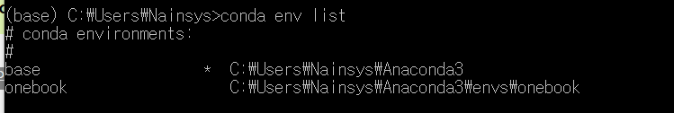
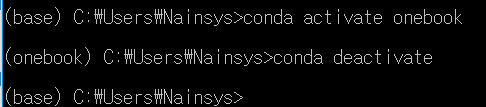
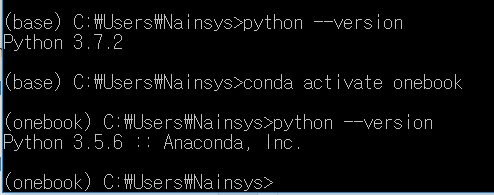
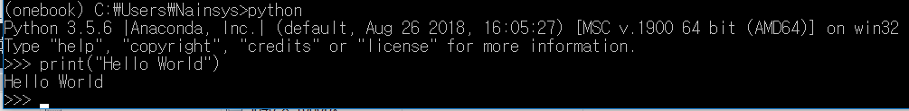

# 2\)    conda에서 파이썬 가상 환경 \(virtual environments\) 생성하기


  
가상환경\(virtualenv\)은 여러 개의 파이썬 프로젝트가 하나의 컴퓨터에서 충동을 일으키지 않고 존재할 수 있도록 해줍니다. virtualenv는 각 프로그램별로 완전히 독립적인 가상의 환경을 만들어서 각 프로그램별로 라이브러리 모듈등의 버전을 별도로 지정할 수 있게 합니다. 즉 한 컴퓨터에 여러 개발환경을 서로 독립적으로 설치, 실행할 수 있게 해줍니다.

다음 명령어를 통해 가상환경이 만들어 집니다.

```text
>conda create -n <환경명> python=<버전(ex:3.5이나 2.7 등)>
```

본 교재의 모든 예제들은 다음과 같은 명령으로 만들어 실행하도록 합니다. 본인 스스로 가상 환경을 관리할 수 있다면 다른 이름을 사용해도 관계없습니다.

```text
>conda create -n onebook python=3.5 numpy scipy matplotlib spyder pandas seaborn scikit-learn h5py statsmodels
```

-       onebook 은 가상환경 이름을 의미합니다.

-       python=3.5 는 파이썬 3.5 환경으로 가상환경을 만들어라 하는 것 입니다. 다른 패키지들과의 호환성을 위해 본 교재는 파이썬 3.5를 사용합니다.

-       numpy ~ statsmodels : 사용해야 할 라이브러리들을 지정합니다.

위의 명령을 실행하면 "c:\users\사용자계정\anaconda3\onebook" 라는 디렉토리가 생성되면서 그 안에 필요한 것들을 설치하겠냐고 묻게 됩니다. 당연히 "y" 를 눌러서 설치를 합니다.


내가 제대로 환경을 만들었는지 다음 명령을 실행하여 확인합니다.

&gt;conda env list

내가 만든 환경이 리스트에 존재한다면 성공적으로 만들어 진 것입니다.



이후에 가상환경을 활성화하고 싶으면 activate 명령어로 해당 가상환경을 활성화합니다.

activate 가상환경명 혹은 conda activate 가상환경명

&gt;conda activate onebook



\(base\)표시가 \(onebook\) 으로 변경되었음을 볼 수 있습니다.

비활성화 시키고 싶으면 onebook 이 활성화되어 있는 상태에서

&gt;deactivate    혹은     &gt;conda deactivate

라고 해 주면 됩니다.

가상 환경을 제거하고 싶으면 아나콘다 터미널에서 \(base\)환경을 확인하고 다음을 입력한 후 실행하면 됩니다.

&gt;conda remove -n name --all

만들어진 onebook 환경을 제거하고 다시 설치하고 싶다면 다음 명령으로 가상환경을 제거하고 다시 만들어 주시면 됩니다.

\(base\)&gt;conda remove -n onebook --all

Anaconda Prompt에서 \(onebook\)이 표시되어 있다면 deactivate 를 입력하여 \(base\)환경으로 돌아옵니다.  \(base\) 환경에서 python --version 을 실행해 봅니다. 그리고 “conda activate onebook” 명령으로 가상환경 \(onebook\)을 활성화시킨 후 python --version 을 실행해 봅니다. \(base\) 환경에서 파이썬 버전은 3.7.2 이고 \(onebook\) 환경에서 파이썬 버전은 3.5.6 이 적용됨을 확인할 수 있습니다.



가상환경 \(onebook\)에서 파이썬이 제대로 동작하는지 “Hello Workd” 예제를 사용하여 확인해 보자.

Anaconda Prompt에서 \(onebook\) 환경에서 “python”을 입력합니다.

&gt;&gt;&gt; 표시가 나타나면 print\(“Hello World”\) 를 입력하고 엔터를 누릅니다.



“Hello World”가 화면에 제대로 출력이 된다면 Ctrl+C 혹은 Ctrl+D 를 눌러 빠져나오면 됩니다.

