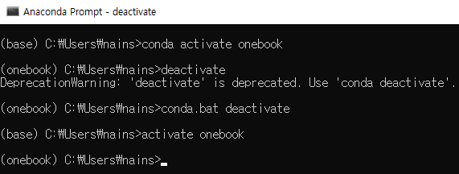
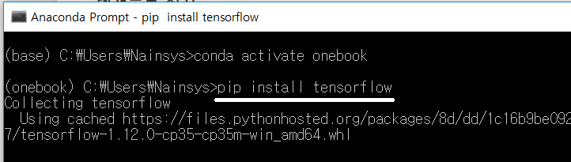
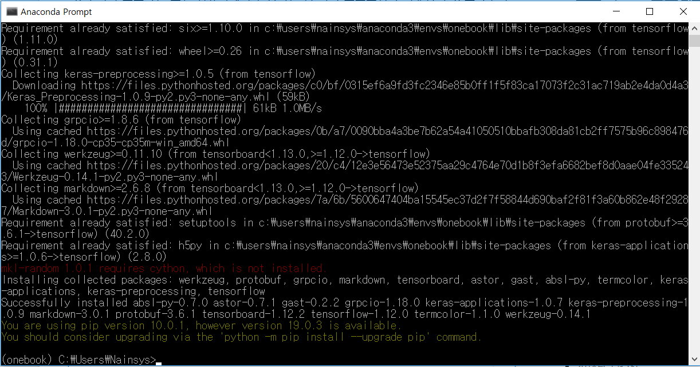

# 2.1.2.     텐서플로 설치


  
Anaconda Prompt에서 다음 명령으로 가상환경 onebook을 활성화시킨 후 가상환경내에서 우리가 필요한 다른 라이브러리들을 설치합니다. 

&gt;conda activate onebook   혹은   &gt;activate onebook  명령으로 가상환경 onebook을 활성화 시킵니다.

Tensorflow 2.x 가 사용가능합니다. 이전 버전 Tensorflow 경우 다음과 같이 구분 됩니다.  Python 3.8 지원에는 TensorFlow 2.2 이상이 필요합니다. TensorFlow 1.x의 경우 CPU와 GPU 패키지는 다음과 같이 구분됩니다.     

* `tensorflow==1.15` - CPU 전용 출시
* `tensorflow-gpu==1.15` - [GPU 지원](https://www.tensorflow.org/install/gpu?hl=ko)이 포함된 출시_\(Ubuntu 및 Windows\)_



아나콘다 배포판에는 텐서플로 최신 버전이 늦게 포함되므로 파이썬 기본 패키지 관리자인 pip로 텐서플로를 설치합니다.

텐서플로우를 설치하기 전에 일단 pip 를 다시한번 업그레이드시켜줍니다.

```text
(onebook)>python -m pip install --upgrade pip
```

무언가가 설치 안되어 있다는 메시지가 나온다면 pip를 사용하여 다시 설치해 줍니다.

제 경우에는 mkl-random 이 설치 안되어 있다고 하여 다시 설치해 주었습니다.

&gt;pip install mkl-random

일반적으로 CPU만 사용하는 버전은

```text
(koreait)>pip install --upgrade tensorflow
```

또는

```text
(onebook)>conda install tensorflow
```



GPU 지원을 받는 버전은 다음과 같은 명령으로 설치해 줍니다.

```text
(onebook)>pip install tensorflow-gpu 혹은 
(onebook)>pip install --ignore-installed --upgrade tensorflow-gpu
```

Tensorflow 를 지원하는 NVIDIA 그래픽 카드를 사용한다면 CUDA를 설치해야 합니다.

-      NVIDIA Cuda Toolkit 설치: [https://developer.nvidia.com/cuda-toolkit-archive](https://developer.nvidia.com/cuda-toolkit-archive)

또한 cuDNN을 설치해야 합니다. cuDNN을 받으려면 NVIDIA DEVELOPER 홈페이지에 가입이 필요합니다. 텐서플로우\(Tensorflow\) GPU 버전 설치하기는 이곳에서 다루지 않겠습니다.

-       cuDNN 다운로드: [https://developer.nvidia.com/rdp/cudnn-archive](https://developer.nvidia.com/rdp/cudnn-archive) 

물론 tensorflow를 설치할 때 conda를 사용해도 됩니다

다음과 같이 모든 설치 과정이 끝날 때까지 기다립니다.



텐서프로가 설치 완료되면 파이썬을 실행하여 텐서플로가 동작하는지 확인해 봅니다.

Anaconda Prompt에서 onebook 가상환경인지를 확인한 후 python을 실행합니다.  다음을 코드를 실행 해 봅니다.

```text
>>> import tensorflow as tf
>>> print(tf.__version__)
1.12.0
>>> hello=tf.constant(‘Hello World’)
>>> sess=tf.Session()
>>> print(sess.run(hello))
b’Hello World’
>>>
```


출력된 2.3.1 은 현재 내 개발환경에 설치된 텐서플로의 버전이고 b’Hello world’는 print 텐서플로의 세션을 실행하여 출력 된 문자입니다.

