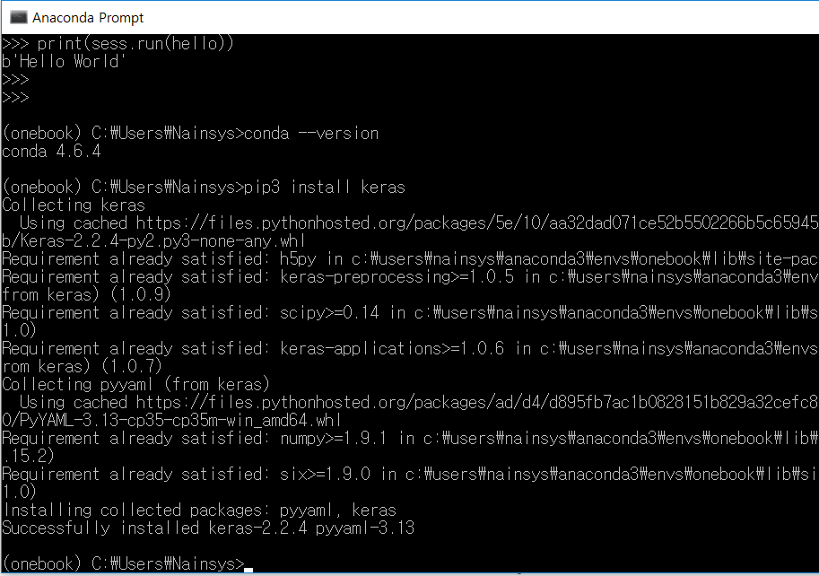
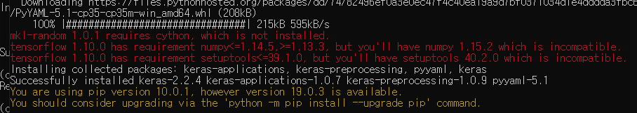
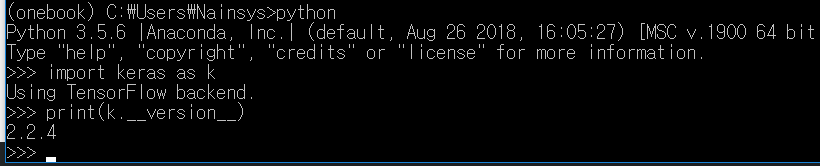

# 2.1.3.     케라스 설치


  
Anaconda Prompt에서 앞장에서 생성한, 그리고 텐서플로우가 설치된  onebook 가상환경인지를 확인한 후

&gt;pip install keras

를 실행하여 케라스를 설치합니다.



무언가가 설치되지 않았다거나 버전이 맞지 않는다고 나온다면 해결 해야 합니다.

제일 먼저 python -m pip install --upgrade pip 를 사용하여 pip 부터 체크해 줍니다.



제가 설치할 때는 위와 같은 메시지가 나왔는데 python -m pip install --upgrade pip를 실행한 후 다시 설치하니 해결이 되었습니다.

Anaconda Prompt 에서 onebook 가상환경인지를 확인한 후 python을 실행합니다.  다음을 코드를 실행 해 봅니다.

```text
>>> import keras as k
>>> print(k.__version__)
```



출력된 2.2.4 는 현재 내 개발환경에 설치된 케라스의 버전입니다.

