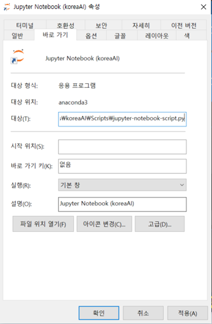

# 3.1.4. Jupyter Notebook 설치

주피터 노트북이란 파이썬의 개발 지원 툴로 사용방법이 간편하며 시각화에 강해 데이터 분석에 주로 사용됩니다.

Jupyter notebook은 대화형 파이썬 인터프리터\(Interpreter\)로써 웹 브라우저 환경에서 파이썬 코드를 작성 및 실행할 수 있는 툴입니다. 서버에 설치하여 포트를 개방한 후 해당 url에 접속하여 원격으로 사용도 가능합니다. 로컬 환경에서 브라우저를 띄워 대화형 환경에서 코드 작성 및 실행 가능합니다.

설치는 두 가지 방법이 있는데, 첫 번째는 Anaconda와 함께 설치하는 방법이 있습다. Anaconda를 설치할 때 Jupyter Notebook도 같이 설치하면 됩니다. 

Anadonda를 설치하는 방법 외에 기본적으로 pip은 Jupyter 패키지 설치를 지원합니다. 설치 방법은 다른 패키지 설치 방법과 똑같습다.

```text
pip install jupyter
```

실행하는 방법은 

```text
jupyter notebook
```

위 명령을 입력하면 자동으로 어떤 html 파일을 열면서 브라우저가 실행됩니다. 만약 실행되지 않는다면 [http://localhost:8888](http://localhost:8888) 으로 접속하거나 위 그림의 맨 마지막 줄에 있는 url을 복사하여 브라우저에서 접속합니다.

Jupyter notebook에 가상환경 kernel을 추가하려면 다음 명령을 실행 합니다.

```text
conda activate 가상환경명
python -m ipykernel install --user --name 가상환경명 --display-name “가상환경명“
conda install nb_conda
jupyter notebook
```

Jupyter Notebook의 시작 폴더를  변경하기 위해 다음 명령을 입력합니다.

```text
jupyter notebook --generate-config
```

그러면 Jupyter가 실행되는 •사용자 폴더에 보면 .jupyter 폴더가 생성 되었습니다.       \(사용자 폴더 :\Users\사용자이름 또는 바탕화면 사용자 폴더\)

Linux에서는 기본적으로 `/home/<username>/.jupyter/jupyter_notebook_config.py` 파일로 생성되며, 윈도우에서는 `C:\Users\<username>\.jupyter\jupyter_notebook_config.py`로 생성된다.

설정 파일에서 필요한 옵션을 변경하여 사용하면 됩다.

폴더 안에 jupyter\_notebook\_config.py 파일을 열어 \#c.NotebookApp.notebook\_dir 이 부분을 찾습니다. 주석을 제거하고 c.NotebookApp.notebook\_dir = ‘C:\작업폴더’ 로 수정하고 저장합니다.

윈도우 시작 메뉴에서 Jupyter notebook\(koreaAI\) 아이콘을 마우스 오른쪽 메뉴를 이용해 파일 위치 열기를 합니다. 그 다음 Jupyter notebook\(koreaAI\) 아이콘을 마우스 오른쪽 메뉴에서 속성을 선택합니다. 주피터 노트북 속성 창에서 대상 입력란에 있는 %USERPROFILE%을 삭제합니다. 그리고 시작 위치 란은 공란으로 하고 확인을 누릅니다.




