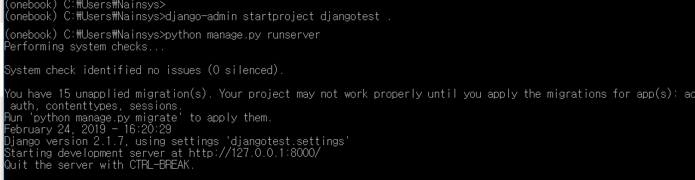
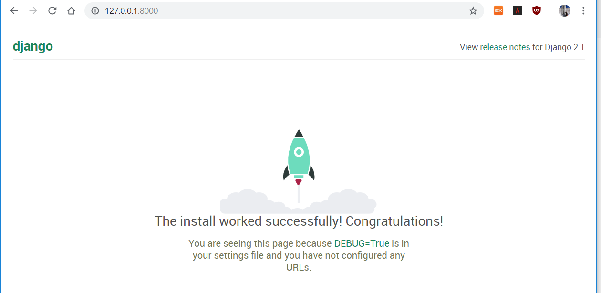

# 2.1.4.     장고 설치


  
Djano는 보안이 우수하고 유지보수가 편리한 웹사이트를 신속하게 개발하는 하도록 도움을 주는 파이썬 웹 프레임워크입니다.

장고 버전은 Python 2.7 이하를 사용한다면 Django 1.11을 설치해야 하고 Python 3.x 버전을 사용한다면 Django 2.1.7을 설치해야 합니다.

Anaconda Prompt에서 onebook 가상환경인지를 확인한 후

```text
>pip install Django==2.1.7
```

를 실행하여 장고를 설치합니다. 장고 영문 표기에 D가 대문자이고, 설치버전을 지정할 때 == 두 개를 사용해야 합니다.

장고 설치가 정상적으로 완료되었다면 장고 웹 프레임워크가 동작 하는지 확인해 봅니다.

```text
>django-admin startproject djangotest .
```

위의 명령을 실행해 줍니다. 명령 끝에 . \(점\)을 입력하는 것은 현재 디렉토리에 장고를 설치하라고 스크립트에 알려주는 축약된 표시입니다. 이 명령으로 윈도우 사용자 기본 폴더에 djangotest 라는 폴더가 생성 되었으며 manage.py , settings.py 같은 파일도 자동으로 생성됩니다. 생성된 웹사이트를 확인 하려면 다음의 명령을 실행합니다.

```text
> python manage.py runserver
```



웹브라우저에서 주소창에 [http://127.0.0.1:8000/](http://127.0.0.1:8000/)을 입력하면 아래와 같은 웹 페이지를 볼 수 있습니다.



