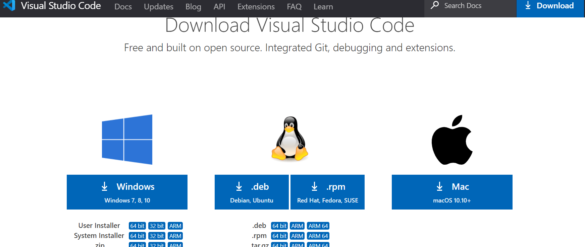

# 3.1.5. Visual Studio Code 설치

Visual Studio Code\(약자 VS Code\)는 편리한 프로그래밍 에디터 입니다. Visual Studio Code \(VS Code\)는 크로스 플랫폼 소스 편집기로서 윈도우즈, 리눅스, Mac OS 에서 무료로 사용할 수 있습다. Visual Studio Code를 설치한 후 여러 Extension들을 설치할 수 있는데, 파이썬 Extension을 설치하면, 파이썬 프로그래밍과 디버깅을 할 수 있습니다.

다음 링크에서 다운로드 할 수 있습니다.



User Installer는 현재 로그온된 사용자 계정에만 설치를 하며, System Installer는 Windows 전체 사용자 계정에서 사용할 수 있도록 설치\(관리자 권한 필요\)합니다. 저는 System Installer 버전을 다운로드하여 설치하겠습니다. 

기본 옵션으로 설치를 끝까지 진행 합니다. 마지막에는 자신이 편리한대로 설정해 줍니다.

VSCode 가 설치 완료되면 필요한 Extension 들을 설치해 줍니다. Visual Studio Code를 설치한 후 여러 Extension들을 설치할 수 있는데, 파이썬 Extension을 설치하면, 파이썬 프로그래밍과 디버깅을 할 수 있습니다.

좌측 상단에 python을 입력하면 여러가지 Extension들이 나타납니다. 이중 Python Extension Pack 을 설치하면 Python, MagicPython, Visual Studio InteliCode, Django 등이 한꺼번에 설치됩니다. 이렇게 파이썬 Extension을 설치 완료하면 파이썬 프로그래밍을 진행할 수 있습니다. korean language pack 도 설치해 줍니다.

Pylance, Material Theme, Material Icon Theme,  Prettier 등 필요한 Extension 들을 설치해 줍니다.

Pylance : Fast, feature-rich language support for Python

Prettier : 파일 저장시 알아서 포매쇼에 맞게 소스 코드 정

이제는 **Visual Studio Code의 기본 터미널이 Windows의 Power Shell로 설정되어 있기 때문**에 약간의 수정이 필요합니다.

이 기본 터미널의 종류를 cmd 또는 cmdGit Bash로 변경하면 오류없이 실행이 가능합니다. 먼저 Ctrl + Shift + P \(컨트롤 + 쉬프트 + P\) 키를 눌러 Command Palette를 열고 Terminal: Select Default Shell 을 입력합니다.

VS Code에서 파이썬 코드를 작성하기 위해서는 확장자 .py 를 가진 임의의 파이썬 파일을 생성하면 됩니다. \[File\] 메뉴에서 \[New File\]을 눌러 새 파일을 만들면 됩니다. 새 파일을 만드는 것보다 C:\ 에 'korAI'라는 새로운 작업 폴더를 만들어 줍니다.

이 작업 폴더에 새 hello.py 파일을 생성하고 에디터에서 코드를 작성합니다. 그리고 해당 폴더에 저장 합니다.

   `print("Hello World")`

코드를 실행하기 전에 인터프리터를 선택해야 합니다. Ctrl + Shift + P \(컨트롤 + 쉬프트 + P\) 키를 눌러 Command Palette를 열고 Python: Select Interpreter 을 입력합니다.

여기에 가상 환경 설정에서 지정한 koreait 폴더내의 인터프리터를 지정합니다.

 koreait 가상환경을 activate 합니다.

코드 작성 완료 후 프로그램을 실행하기 위해서는 \[Debug\] 메뉴의 \[Start Debugging \(F5\)\] 나 \[Start without Debugging \(Ctrl+F5\)\]를 누르면 됩니다.

 특히 F5를 눌러 디버깅 모드로 실행하면, 로컬변수, 콜스택 등 여러 디버깅 정보를 이용할 수 있으며, Step Over, Step Into 등의 디버거 컨트롤을 사용할 수 있다.

파이썬 파일에 코드를 작성한 후, VS Code 에디터에서 우측 마우스 버튼을 클릭 \[Run Python File in Terminal\] 메뉴를 선택하면 하단에 터미날 창이 생기고 파이썬 프로그램을 인터프리터와 함께 실행해 준다.

VS Code 권장 Extension Pack

* Korean Language 
* Meterial Theme : 배경색 테마 설정. 
* Meterial Icon Theme : 배경색 테마 설정. 
* Prettier - Code formatter : 코드 포맷. 
* Bracket Pair Colorizer : 괄호마다 다른 색깔 넣기. 
* Indent Rainbow : 들여쓰기 된 부분에 색깔 넣기. 
* Auto Rename Tag : 시작태그 종료태그 한번에 변경. 
* Markdown Preview : readme.md 마크다운 파일 작성 시 결과 확인 가능 툴

 

