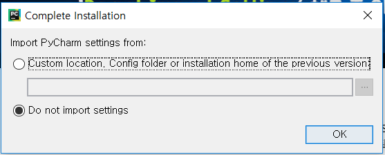
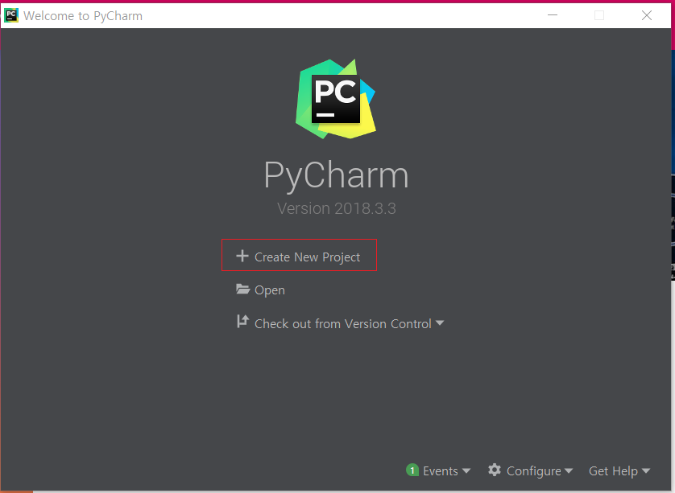
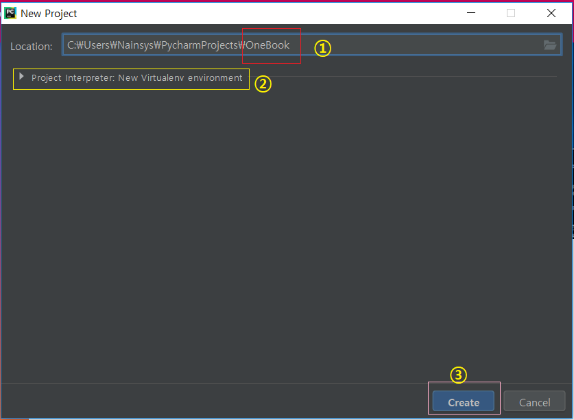
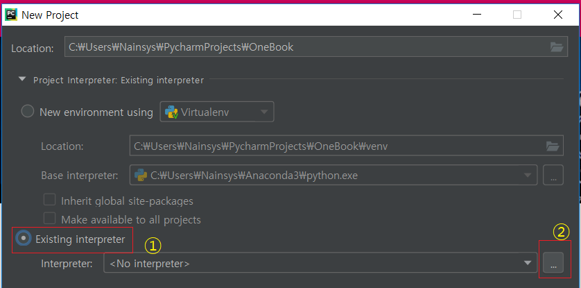
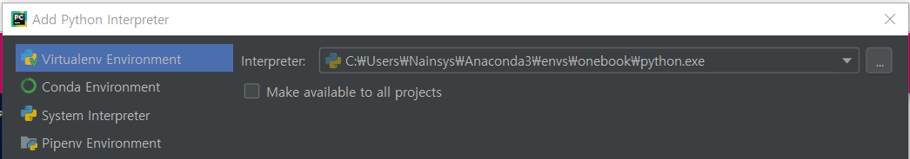
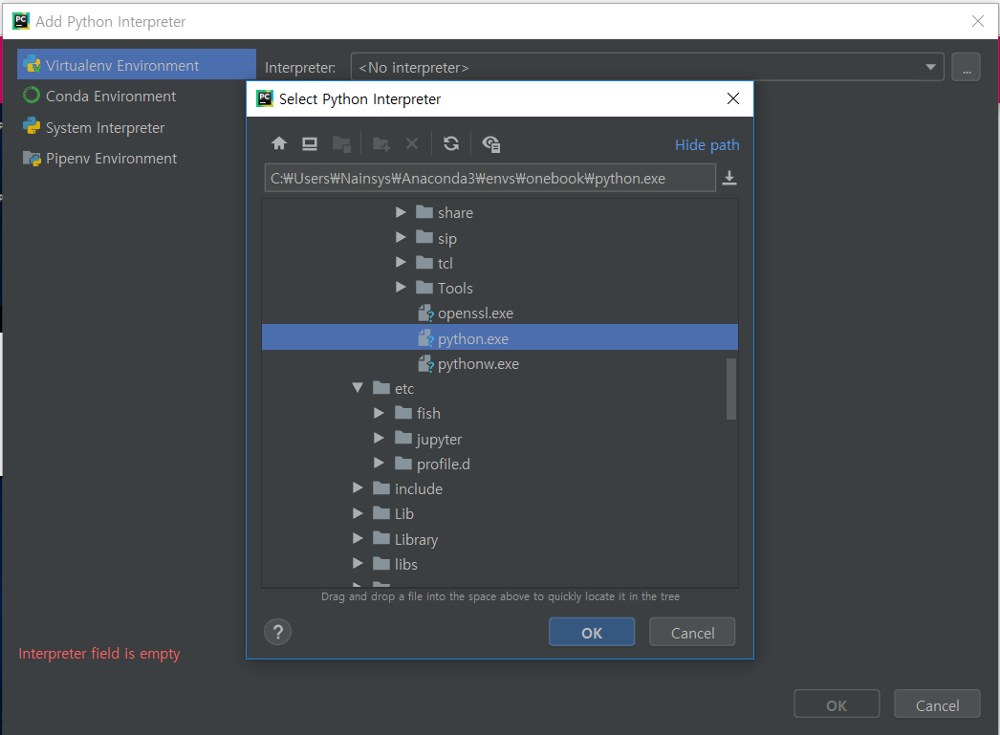
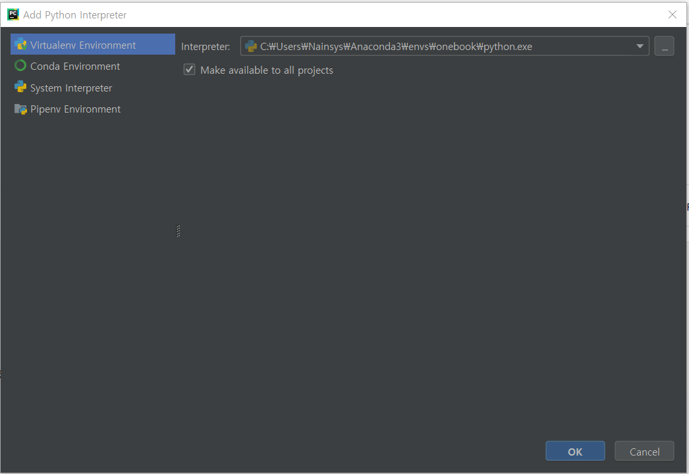
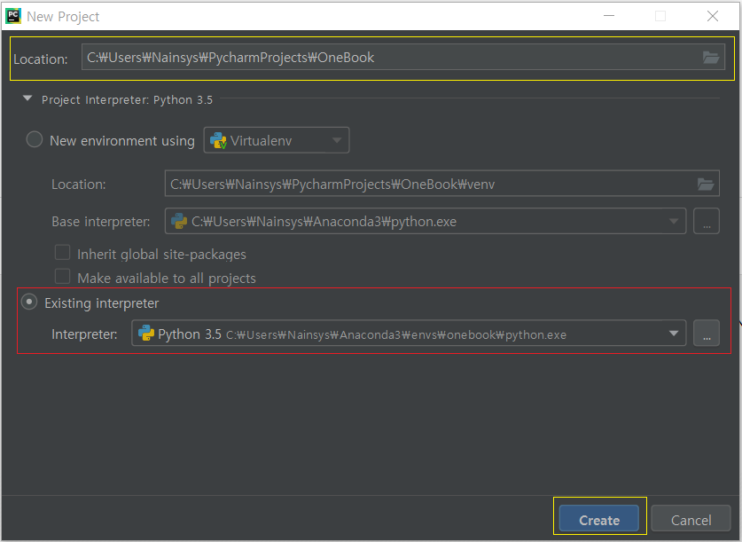
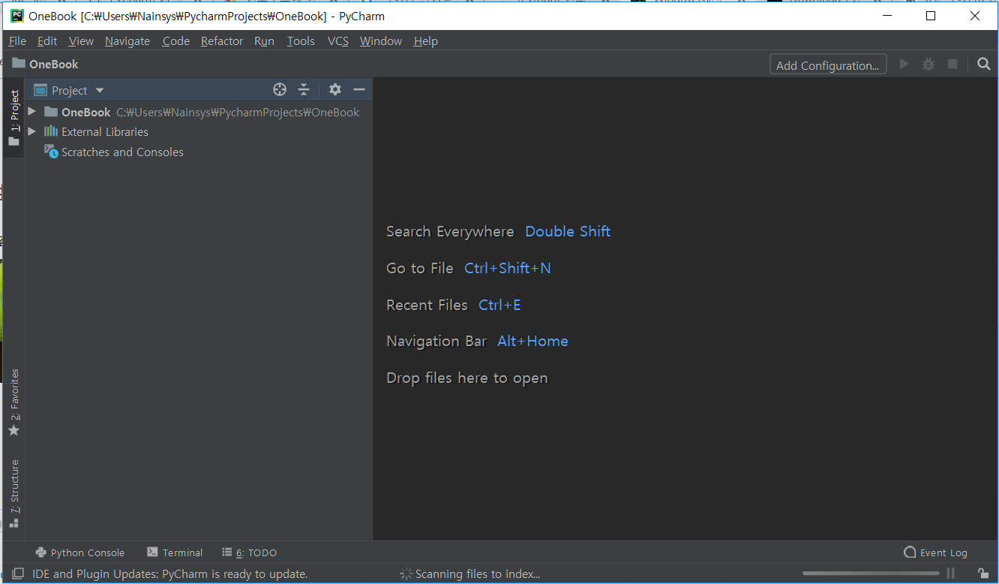

# 1\)	파이참 가상환경 설정

파이참 실행이 완료되면 파이참을 실행합니다. 최초 실행시 설정 값을 어떻게 설정할 것인지 묻는 화면이 나타납니다. 최초 설치이기 때문에 Do not import settings 로 설정합니다.



파이참의 UI theme는 검은 Darcula 혹은 Light 중에 원하는 것으로 선택합니다. 

Featured plugins 는  필요한 시점에서 다시 설치할 수 있으니 그냥 넘어 갑니다.

PyCharm 웰컴 창에서 Create New Project를 선택하거나 PyCharm 프로젝트가 열린 상태라면 메뉴에서 File &gt; New Project를 선택합니다.



이제 몇 가지 중요한 작업을 해야 합니다.

첫 번째는 생성되는 파이썬 프로젝트들의 Location 을 설정 하는 작업입니다. 다음과 같이 입력합니다.

```text
C:\Users\사용자 계정\PycharmProjects\OneBook
```



그 다음에는 Project Interpreter를 설정 해야 합니다.

그 이유는 앞에서도 설명 했듯이 파이참은 프로젝트별로 파이썬, 그리고 다른 라이브러리들을 프로젝트별로 다르게 선택 할 수 있습니다. 프로젝트 단위로 Virtualenv\(가상환경\)을 별도로 만들어서 관리하기 때문입니다.

초기 Project Interpreter는 New Virtualenv environment 로 되어 있습니다. 위의 그림 2번인 Project Interpreter를 마우스로 선택하면 다음과 같은 화면이 나타납니다.



이 화면에서 Existing interpreter 를 선택하고 오른쪽 끝의 \[…\] 를 누르면 Interpreter를 선택하는 화면이 다시 나타납니난다



다시 우측의 \[…\]를 눌러서 아나콘다 설치시에 설정했던 가상환경의 파이썬을 선택해 줍니다.

아나콘다 설치시 설정한 가상환경의 위치가

C:\Users\\[사용자계정\]\Anaconda3\envs\onebook 이므로 해당 폴더내에 있는 python.exe.를 선택해야 합니다.



Interpreter 선택이 제대로 되었는지 확인하고 Ok 버튼을 누릅니다.



‘Make available to all projects’를 체크하고 Ok 버튼을 누릅니다.



프로젝트 소스가 저장되는 위치, 그리고 사용할 가상환경과 인터프리터 선택이 올바르게 되었는지 다시한번 확인하고 ‘Create’버튼을 누릅니다. 다음과 같이 파이참이 실행되는 것을 확인 합니다.



