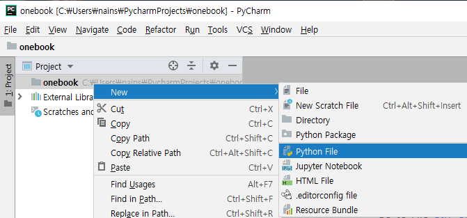
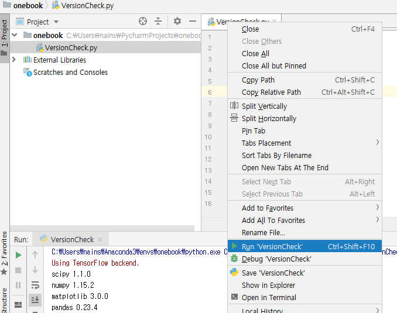
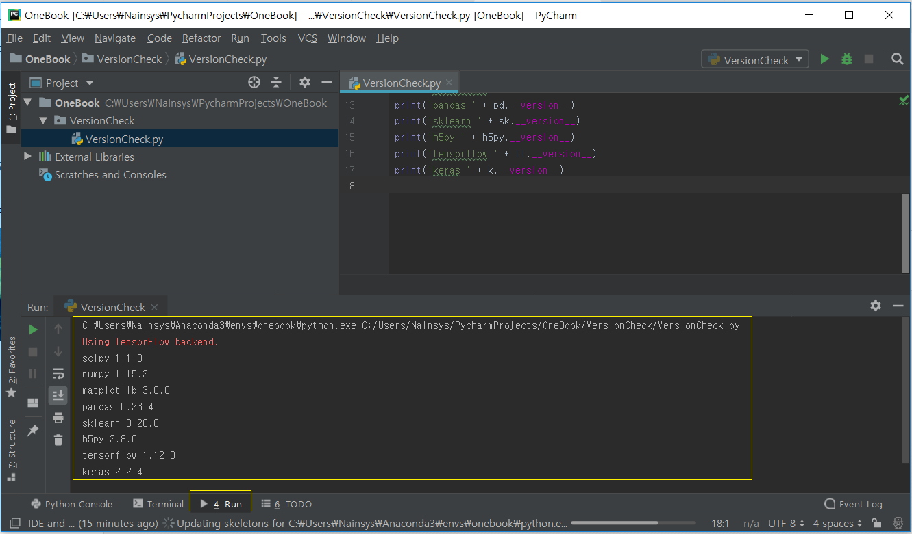

# 3\)	설치된 라이브러리들의 버전 확인 하기


  
설치된 라이브러리들이 정상 동작 하는지 확인해 보겠습니다. 파이참이 실행되면 좌측 윈도우의 OneBook을 선택하고 우측 마우스를 눌러 New 를 선택합니다.



New Python File 을 눌러 VersionCheck.py를 생성합니다.

에디터 영역에 아래 코드를 삽입합니다.

```text
import scipy as sp
import numpy as np
import matplotlib as mpl
import pandas as pd
import sklearn as sk
import h5py
import tensorflow as tf
import keras as k
print('scipy ' + sp.__version__)
print('numpy ' + np.__version__)
print('matplotlib ' + mpl.__version__)
print('pandas ' + pd.__version__)
print('sklearn ' + sk.__version__)
print('h5py ' + h5py.__version__)
print('tensorflow ' + tf.__version__)
print('keras ' + k.__version__)
```

상단 메뉴에서 Run ==&gt; Run을 선택하여 프로그램을 실행 시킵니다. \(단축키는 Alt+Shift+F10\)

에디터 영역의 제목을 우측 마우스 클릭하여 실행시킬 수도 있습니다.



초기 실행시 사용하는 컴퓨터에 따라 패키지 인덱싱으로 많은 시간이 걸릴 수 있습니다. 컴퓨터 성능에 따라 정말로 5~6분이 걸리 수 있으니 인내를 갖고 기다려야 합니다. 인덱싱이 끝나면 그 후부터 빠르게 처리됩니다. 다음과 같이 설치된 라이브러리들의 버전을 확인할 수 있습니다.



\(\*\) 이 코드를 실행하면서 numpy 등 특정 모듈과 관련된 에러가 난다면 해당 모듈을 제거하고 다시 설치 한 후 실행해 봅니다.

&gt;pip uninstall numpy

&gt;pip install numpy

