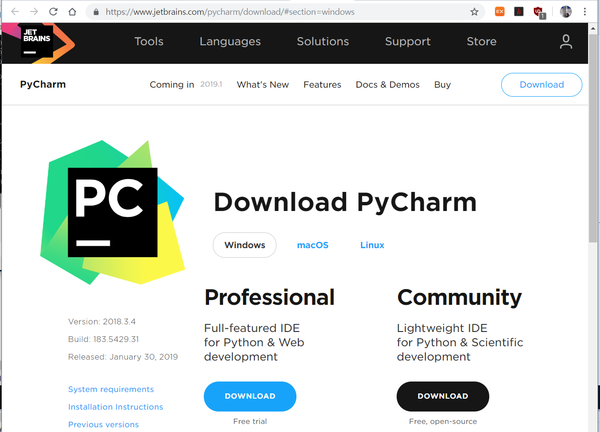
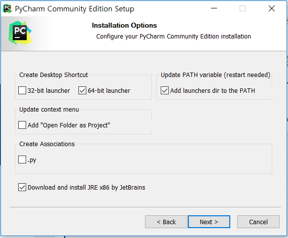

# 2.1.5. 	파이참 설치


  
파이참은 JET BRAINS 사에서 제공하는 파이썬 개발을 편하게 해주는 통합 개발 환경입니다.

다음의 링크에서 다운 받을 수 있습니다.



접속하시면 아래와 같은 화면의 다운로드 페이지가 나옵니다. PyCharm은 유료인 Professional과 무료인 Community가 있습니다. 무료로 제공되는 Community 버전이 있고, 기능이 추가돼 유료로 제공되는 professional 버전이 있습니다. Professional은 Web개발 환경이나 Database 관련 등의 기능을 추가로 제공하지만, 관련된 기능이 없는 Community 무료 버전도 충분한 기능이 제공됩니다.

다운로드 후 설치를 진행합니다.

지금까지 64bit 환경으로 설치를 진행했으니 파이참도 64bit 만 설치해 줍니다.

PATH 환경 설정과, Oracle의 JRE를 설치하지 않았다면 Download and Install JRE x86 by JetBrans를 체크해줍니다.

나머지 설정들은 기본으로 정해줍니다.

