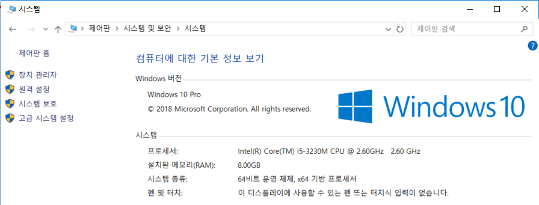
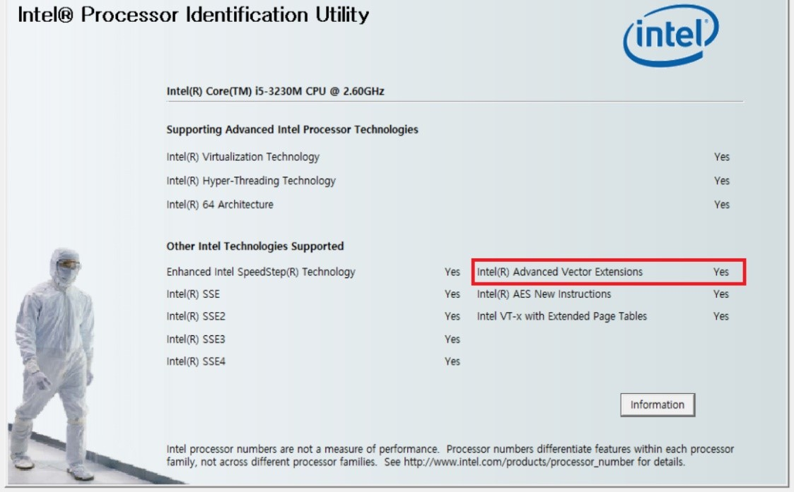

# 2.1.	윈도우 환경에서 설치하기


  
윈도 텐서플로 바이너리 파일리 64비트 윈도우 만을 지원하므로 제일 먼저 내가 사용하는 컴퓨터가 32비트인지 64비트인지 확인 해야 합니다. 32비트 윈도우에서는 직접 컴파일 해야 합니다.

파이썬은 무료로 사용할 수 있습니다. 공식 사이트에서 설치파일을 다운받아 사용할 수도 있지만, 그렇게 하면 과학 계산을 위한 SciPy, NumPy, scikit-learn 등의 여러 파이썬 패키지는 따로 설치해야 합니다. 패키지들을 하나 하나 직접 설치하면 갖가지 예상하지 못한 문제가 생길 수 있기 때문에 많은 사람들이 운영체제 환경에 맞게 패키지들을 미리 준비해놓은 배포판으로 설치합니다.

텐서플로 1.6버전부터 CPU 버전 바이너리는 AVX\(고급 벡터 확장\) 명령을 지원하도록 컴파일되어 있습니다. 만약 AVX를 지원하지 않는 CPU를 사용한다면 텐서플로 1.5 버전을 사용해야 합니다. 사용하고 있는 CPU가 AVX 명령을 지원하는지 확인하려면 다음 주소에서 인텔의 프로세서 유틸리티를 다운받아 설치하고 확인해야 합니다. 이 프로그램을 다운받아 설치하고 실행하면 다음과 같은 화면을 볼 수 있습니다. 두 번째 탭에서 Advanced Vector Extensions에 ‘예’라고 표시되면 AVX 명령을 지원하는 CPU입니다.



