# 3.2.1.     아나콘다 설치\(파이썬 설치\)

우분투\(Ubuntu\)에 기본 설치되어 있는 파이어폭스 웹브라우저 \(Firefox Web Browser\)에서 주소창에 아나콘다 다운로드 사이트 주소를 입력합니다.



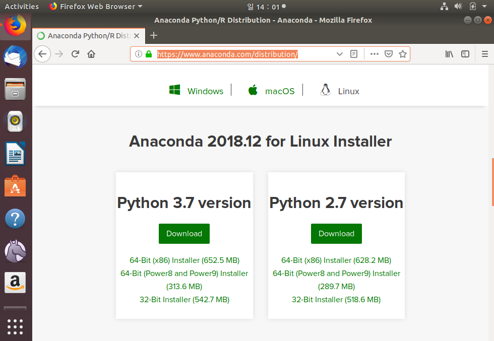

Anaconda 2018.12 for Linux에서 Python 3.7 version \(64bit Installer\)을 다운 로드 받습니다.

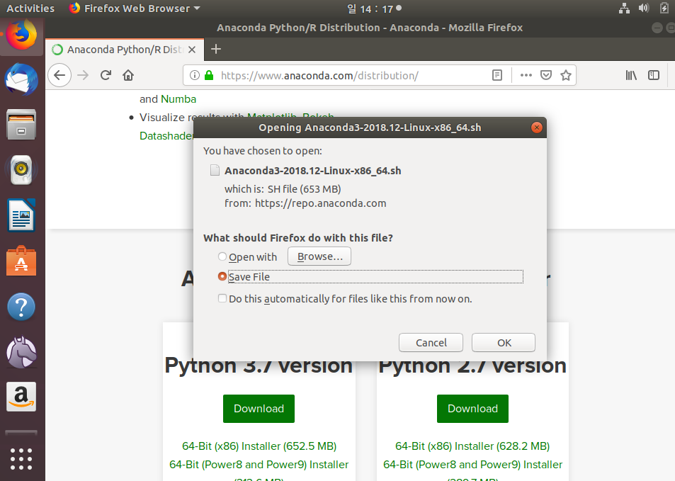

다운로드한 파일들은 별도의 디렉토리에 원본 설치 파일을 관리하는 것이 더 좋습니다.

/home/\[사용자 계정\]/deepsoft 로 지정하겠습니다. 터미널을 열고 mkdir deepsoft 명령어로 새로운 디렉토리를 만들어 줍니다. 다운로드한 파일을 그 위치로 이동합니다.

터미날 창에서 다음 명령으로 설치를 진행 합니다.

먼저 “cd deepsoft” 명령으로 다운로드한 디렉토리로 이동합니다.

그후 bash 쉘 스크립트 명령으로 설치를 진행합니다.

“bash ./Anaconda3-2018.12-Linux-x86\_64.sh”

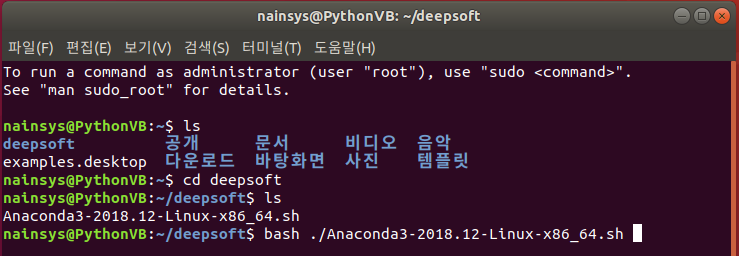

이 때부터 Enter 키와 yes 타이핑 등을 차례로 요구하기 때문에 천천히 설치를 진행합니다.

Enter 를 누르면 license 동의하는 페이지가 나타납니다. 스페이스바를 눌러 페이지를 넘기고 마지막에 \[yes\] 를 입력하여 제품 사용에 동의해야 합니다.

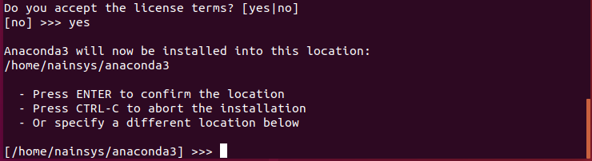

설치 경로는 보통 /home/\[userid\]/anaconda3로 지정이 될 것이며, 그 후 .bashrc에 Path 등록까지 자동으로 처리됩니다.

_-       \* 쉘\(Shell\)은 운영체제에서 사용자가 입력하는 명령을 읽고 해석하여 대신 실행해주는 프로그램입니다. 운영체제 상에서 다양한 운영체제 기능과 서비스를 구현하는 인터페이스를 제공하며, 사용자와 운영체제의 내부\(커널\) 사이의 인터페이스를 감싸는 층이기 때문에 셸이라는 이름이 붙었습니다. 쉘은 운영체제에서 필수적으로 존재합니다. .bashrc 는 이미 로그인 한 상태에서 새 터미널 창을 열 때마다 로드되는 쉘입니다._

Anaconda 설치시 bashrc설정을 묻는다면 \[yes\]로 지정합니다. Microsoft VS Code 는 사용할 경우에만 설치해 줍니다.

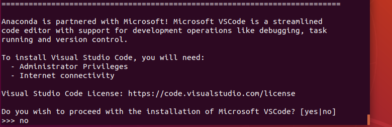

그 후 source ~/.bashrc 명령어를 통해 .bashrc를 한 번 더 수행해주면 됩니다.

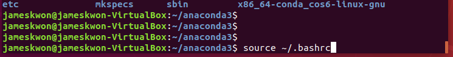

그 이후 conda list 명령어가 정상적으로 동작하는지 확인하면 됩니다.

설치를 마치면 아나콘다를 업데이트 합니다. 아나콘다 자체를 최신 버전으로 업데이트 하는 명령은 다음과 같습니다.

conda update conda

conda update anaconda

conda update –n base conda

시스템을 분석한 후 진행할 것인가 묻는다면 y 를 입력하여 계속 진행합니다.

아나콘다의 파이썬 패키지 전체를 업데이트 하는 명령은 다음과 같습니다.

conda update --all

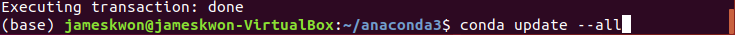

아나콘다 5.3 버전부터 파이썬 3.7 버전을 사용하도록 바뀌었습니다. 텐서플로는 파이썬 3.7 버전의 패키지를 제공하지 않기 때문에 파이썬 3.6으로 다운그레이드해야 합니다.

일단 설치된 파이썬의 버전을 확인합니다.

conda search python

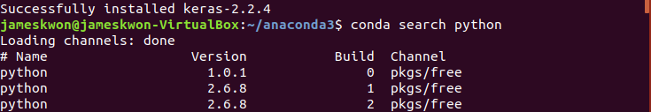

파이썬 및 여러 라이브러리를 지정하며 가상 환경을 생성하는 이유는 윈도우 환경 설정을 참조하면 됩니다. 먼저 pip 를 먼저 설치해야 합니다. 

sudo apt install python-pip

sudo apt install python3-pip

이 교재에서는 python 3.5 를 사용하기로 하였으므로 pip3 로 hdf5 파일 시스템을 처리하는 h5py를 설치해 봅니다.

pip3 install h5py

이제 가상환경을 만들겠습니다.

아래 명령어의 의미는 onebook이라는 작업환경을 새롭게 만드는데 Python 은 3.5 버전을 사용 할 것이며, 이 작업환경에서 numpy scipy matplotlib spyder pandas seaborn scikit-learn h5py 등의 라이브러리를 사용 할 것이라는 것을 알려 주는 것입니다.

```text
>conda create -n onebook python=3.5 numpy scipy matplotlib spyder pandas seaborn scikit-learn h5py statsmodels
```

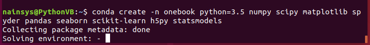

만약에 쉘이 conda 명령에 대해 정상 동작 하지 않는다면 conda init bash 를 실행하여 콘다를 초기화 하고 터미널을 다시 실행합니다.

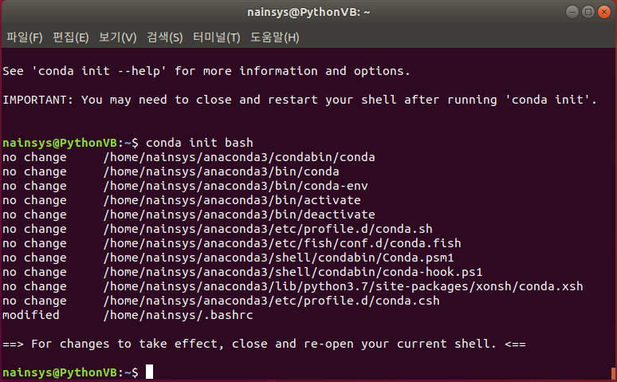

생성한 onebook 작업 환경을 동작되도록 합니다.

conda activate onebook

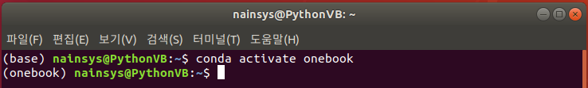

명령 프롬프트의 앞부분이 base 에서 onebook 으로 변경 된 것을 확인할 수 있습니다.

