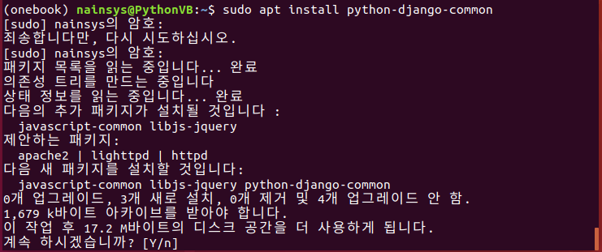
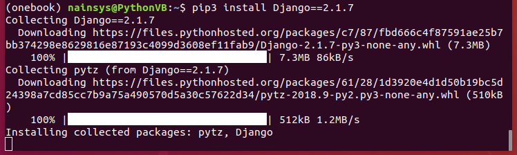
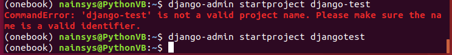
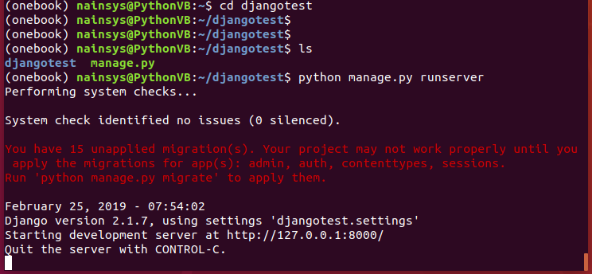
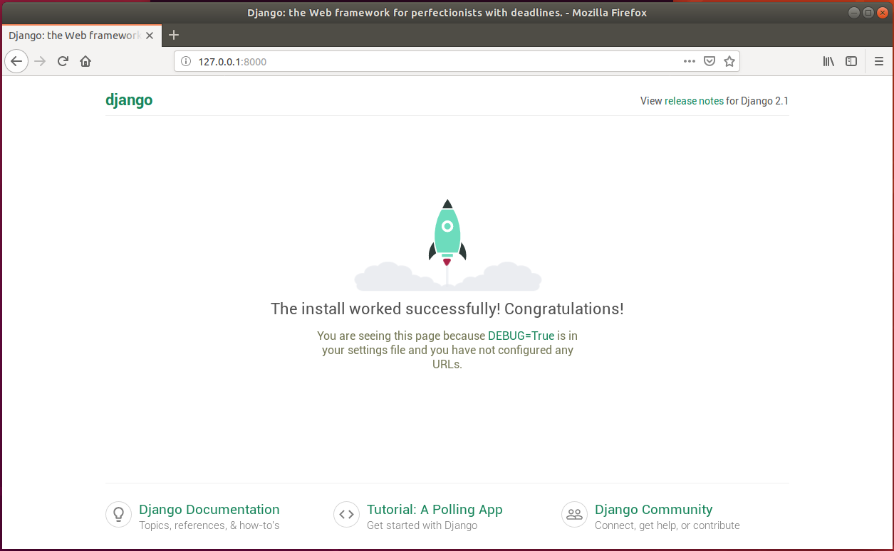

# 3.2.4.     장고 설치


  
Anaconda Prompt 에서 onebook 가상환경인지를 확인한 후 먼저 장고의 기본 환경을 설치합니다.

&gt;sudo apt install python3-django-common

&gt;sudo apt install python3-django

다음 명령으로 장고를 설치합니다.

&gt;pip install Django==2.1.7

장고 영문 표기에 D가 대문자이고, 설치버전을 지정할 때 == 두 개를 사용해야 합니다.

장고 설치가 정상적으로 완료 되었다면 장고 웹 프레임워크가 동작 하는지 확인해 봅니다.

&gt;django-admin startproject djangotest .

위의 명령을 실행해 줍니다. 명령 끝에. \(점\)을 입력하는 것은 현재 디렉토리에 장고를 설치하라고 스크립트에 알려주는 축약된 표시입니다. 이 명령으로 윈도우 사용자 기본 폴더에 djangotest 라는 폴더가 생성 되었으며 manage.py , settings.py 같은 파일도 자동으로 생성됩니다. 생성된 웹사이트를 확인 하려면 다음의 명령을 실행합니다.

&gt; python manage.py runserver

웹브라우저에서 주소창에 [http://127.0.0.1:8000/](http://127.0.0.1:8000/)을 입력하면 아래와 같은 웹 페이지를 볼 수 있습니다.

