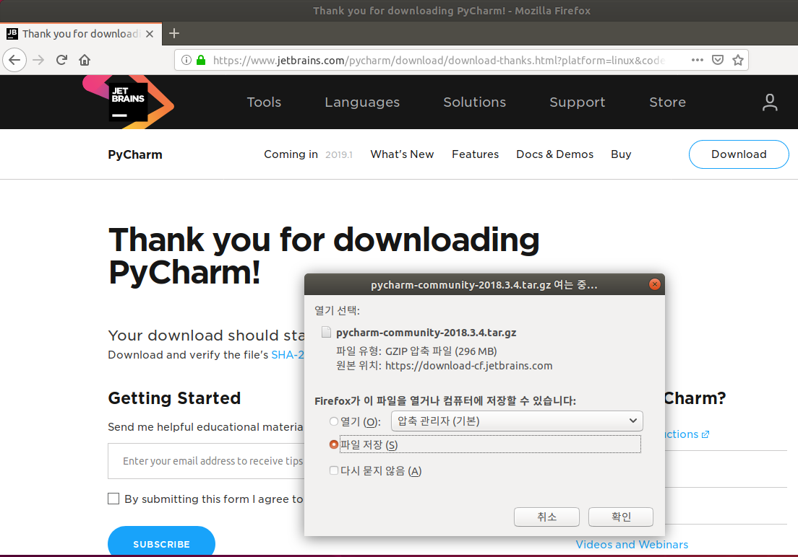
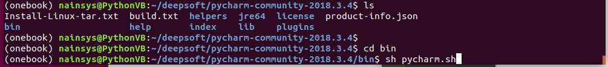
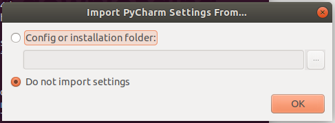
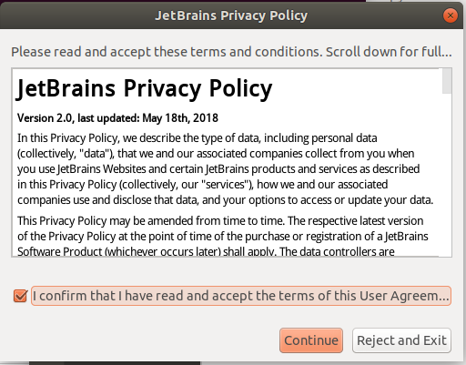
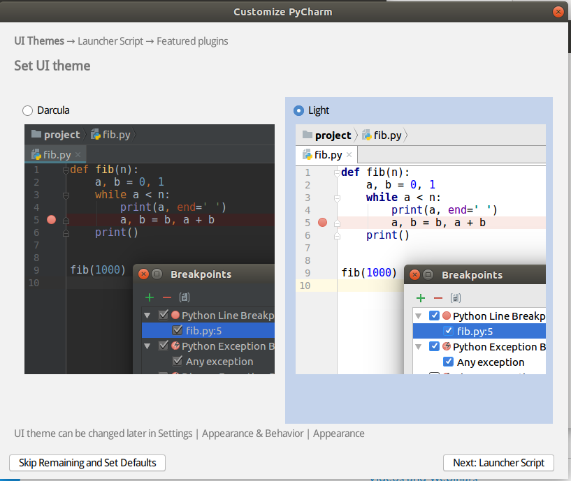
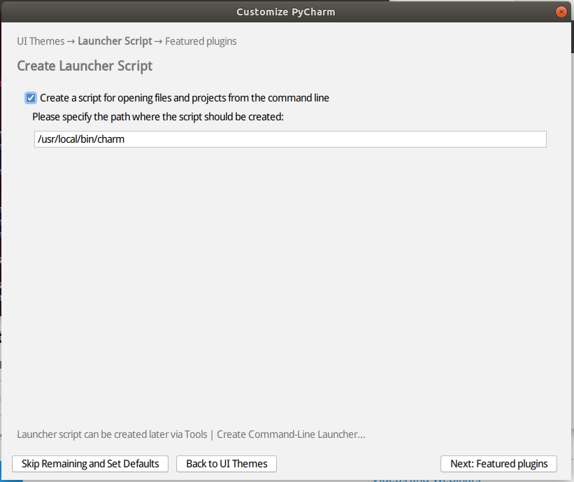

# 3.2.5.     파이참\(PyCharm\) 설치


  
다음의 링크에서 파이참으, 을다운 받을 수 있습니다.

[https://www.jetbrains.com/pycharm/download/](https://www.jetbrains.com/pycharm/download/#section=windows)

위의 링크에 접속하면 아래와 같은 화면의 다운로드 페이지가 나옵니다. Linux 64bit 버전을 다운로드 합니다.

PyCharm Linux 64bit 버전을 다운로드 후 설치를 진행합니다. 먼저 다운받은 디렉토리로 이동하여 다음의 tar 명령으로 압축을 해제합니다.

&gt;tar xvf pycharm-community-5.0.4.tar.gz

cd 명령으로 PyCharm의 bin 폴더로 이동하여 $ sh pycharm.sh 명령어로 파이참 설치를 진행합니다.

대부분 설정을 default값으로 설치를 진행합니다.

Do not import settings 으로 설정 합니다. 라이선스에 동의하고

파이참의 UI 테마는 원하는 것으로 선택합니다.

나머지 설정들은 기본으로 정해줍니다.

