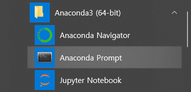
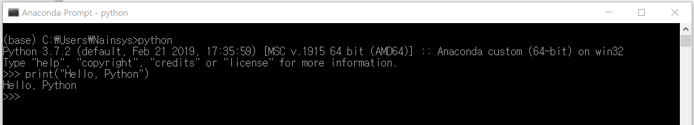
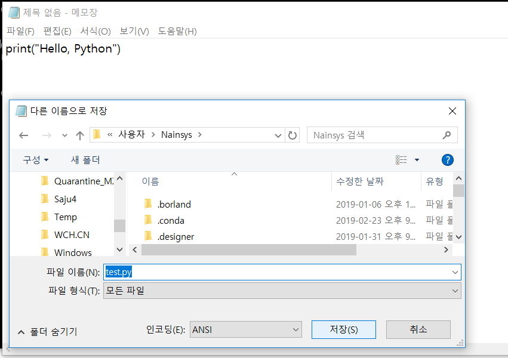
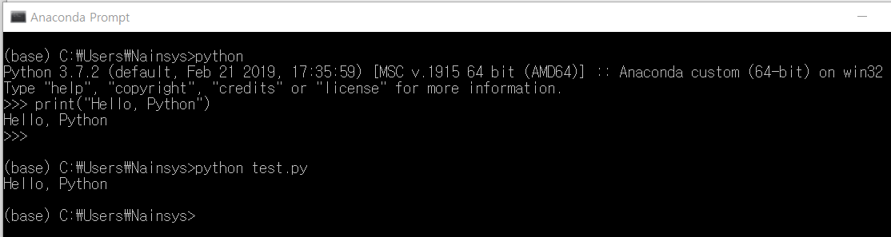
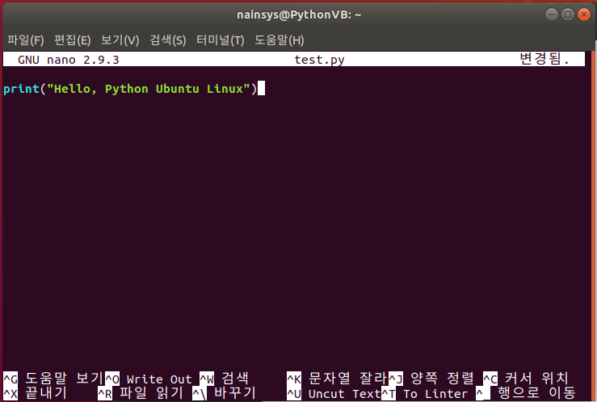

# 3.3.1.     대화형과 스크립트 모드 프로그래밍


파이참 개발 환경을 사용하지 않고 파이썬을 실행 하기 위해서는 아나콘다 프롬프트에서 

&gt;python 

을 실행 하면 됩니다.



파이썬을 호출할 때 사용할 옵션들을 확인 하는 방법은 아나콘다 프롬프트에서 python -h 를 실행하는 것입니다.

```text
(onebook) C:\Users\Nainsys>python -h
usage: python [option] ... [-c cmd | -m mod | file | -] [arg] ...
Options and arguments (and corresponding environment variables):
-b     : issue warnings about str(bytes_instance), str(bytearray_instance)
         and comparing bytes/bytearray with str. (-bb: issue errors)
…
file   : program read from script file
-      : program read from stdin (default; interactive mode if a tty)
arg ...: arguments passed to program in sys.argv[1:]
[ etc. ]
```

커맨드 라인 인자 \(Command Line Arguments\)는 진보된 주제이므로 일단 파이썬 개념을 완전히 이해하면 좀 더 공부해야 합니다. 중요한 몇 개만 소개합니다.

* **-c:** command 로 호출되면, command로 주어지는 파이썬 문장을 실행합니다. 여기서 command는 개행 문자로 구분된 여러 개의 문장을 포함할 수 있습니다.
* **-m:** module-name 으로 호출되면, 주어진 모듈을 파이썬 모듈 경로에서 찾은 후에 스크립트로 실행합니다.
* **script file**: 지정한 스크립트 파일에 저장된 파이썬 코드를 실행합니다. script는 파이썬 파일이나 \_\_main\_\_.py 파일이 들어있는 디렉터리나 \_\_main\_\_.py 파일을 포함하는 zip 파일을 가리키는 파일 시스템 경로\(절대나 상대\)여야 합니다.
* **--help**: 모든 명령 줄 옵션에 대한 간단한 설명을 인쇄합니다.
* **--version**: 파이썬 버전 번호를 출력하고 종료합니다.

Anaconda Prompt 를 실행하고 스크립트 파일 옵션을 전달하지 않고 Python 인터프리터를 실행하면 다음 &gt;&gt;&gt; 프롬프트가 표시됩니다. &gt;&gt;&gt; 표시가 나타나면 print\(“Hello, Python”\) 을 입력하고 엔터를 누릅니다.



Hello, Python이 출력되는 것을 확인 할 수 있습니다. 이런 형태의 프로그래밍 방법이 대화형 모드 프로그래밍입니다.

윈도우 메모장을 실행하여 print\(“Hello, Python”\) 을 입력하고 C:\Users\\[사용자 계정\]에 test.py 이름으로 저장합니다.



다시 Anaconda Prompt 를 실행하고 python test.py 와 같이 스크립트 파일명을 옵션으로 주고  실행하면 다음과 같이 결과를 바로 출력합니다.



이런 형태의 프로그래밍 방법이 스크립트 모드 프로그래밍입니다.

만약에 리눅스 환경이라면 다음과 같이 처리할 수도 있습니다.

메모장과 동일하게 nano 에디터를 사용하여 nano tesy.py 를 실행하여 print\(“Hello, Python”\) 을 입력합니다.



python test.py 와 같이 스크립트 파일명을 옵션으로 주고 실행하면 동일하게 결과를 출력합니다.

