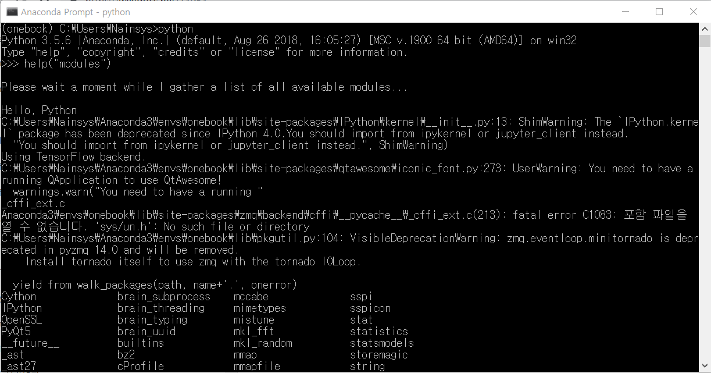

# 3.3.2. 	모듈의 사용\(import\)


**1\)   모듈이란?**

파이썬\(Python\) 모듈\(Module\)이란 자주 사용되는 코드나 유용한 코드를 논리적으로 묶어서 관리하고 사용할 수 있도록 하는 것입니다. 보통 하나의 파이썬.py 파일이 하나의 모듈이 됩니다. 모듈 안에는 함수, 클래스, 혹은 변수들이 정의될 수 있으며, 실행 코드를 포함할 수도 있습니다.

**2\)   내장 모듈**

파이썬은 기본적으로 상당히 많은 표준 라이브러리 모듈들을 제공하고 있으며, 써드파티\(3rd Party\)에서도 많은 파이쎤 모듈들을 제공하고 있습니다. 파이썬 프롬프트에서 다음과 같이 help\("modules"\)을 입력하면 설치된 모듈의 목록을 확인할 수 있습니다.



**3\)   모듈의 사용\(import\)**

이러한 모듈들을 사용하기 위해서는 모듈을 import하여 사용하면 되는데, import 문은 다음과 같이 하나 혹은 복수의 모듈을 불러들일 수 있습니다.

```text
import 모듈
import 모듈1, 모듈2, 모듈3 ...
import 모듈명 as 별명
```

이 명령들은 현재 작업하고 있는 파이썬 스크립트에 모듈에 있는 모든 내용을 포함시킵니다. 모듈에 포함된 함수를 사용하기 위해서는 '모듈명.함수명'처럼 모듈명을 반드시 입력해야 합니다. as를 사용하여 모듈명에 별명을 붙일 수 있습니다.

```text
from 모듈 import 함수
from 모듈 import 함수1, 함수2, 함수3 ...
from 모듈 import *
from 모듈 import 함수 as 별명
```

form import 방식을 사용하면 모듈이름을 생략할 수 있습니다. \*를 사용하면 모듈에 있는 모든 내용이 포함됩니다. 

