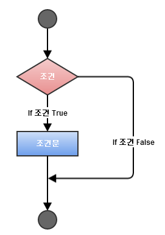
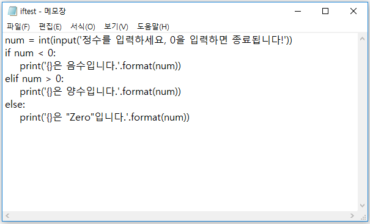
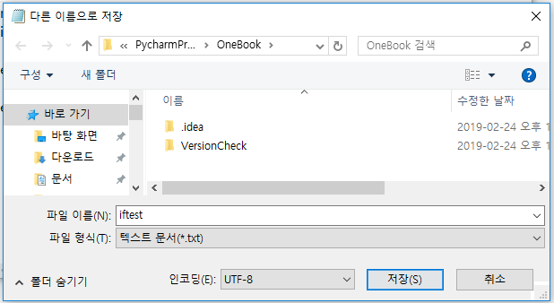
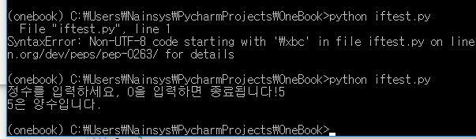

# 3.5.1.     조건문

일반적으로 프로그램을 작성하면 위에서부터 아래로 순서대로 실행됩니다. 하지만 프로그램이 꼭 순서대로만 실행되어서는 올바른 결과를 얻을 수 없습니다. 경우에 따라서 실행 순서를 변경해야 하는 경우가 생기는데 이때에 조건문을 사용합니다. 다음 그림은 대부분의 프로그래밍 언어에서 보여지는 일반적인 의사 결정 구조의 형태입니다.



파이썬 프로그램에서 0이 아닌 값과 null이 아닌 값을 모두 TRUE로 가정하고, 0 또는 Null 인 경우 FALSE 값으로 가정합니다.

파이썬 프로그래밍 언어는 의사 결정 문을 다음과 같은 유형을 제공합니다.

| Statement | Description |
| :--- | :--- |
| if 문 | 하나의 if문이 있는 경우 boolean 표현식 결과에 따른 하나 이상의 문이 올 수 있습니다. 조건이 참인 경우에만 실행됩니다. |
| if..else 문 | 하나의 if문에 선택적으로 else 문을 쓸 수 있습니다. else 는 if문의 boolean 표현식 결과가 false 일 때 실행됩니다. 조건이 참일 때와 거짓일 때 다른 코드 실행하려고 하는 경우 사용됩니다. |
| 중첩된 if 문 | 하나의 if문 안에서 다른 if문을 다시 사용 할 수 있습니다. 조건이 복잡한 경우 사용합니다. |

```text
var = 100
if ( var == 100 ) : print "Value of expression is 100"
print "Good bye!"
```

위 코드의 결과는 다음과 같습니다.

```text
Value of expression is 100
Good bye!
```

복습하는 차원에서 스크립트 형태로 프로그램 테스트를 해 봅니다. 메모장을 열어 다음의 코드를 입력 합니다.



저장할 때 인코딩을 UTF-8로 지정합니다.



python iftest.py 로 실행 해 봅니다.



