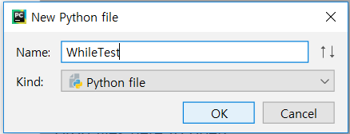
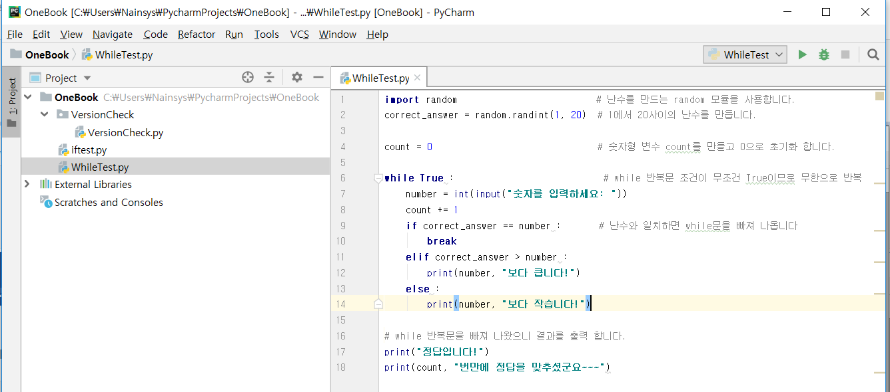
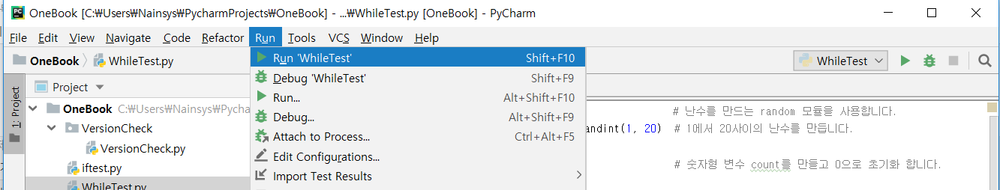
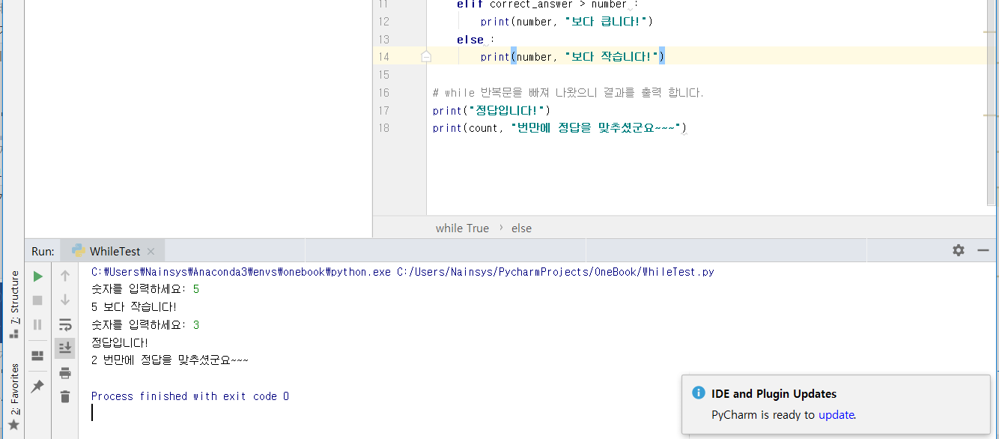

# 3.5.2. 	반복문

일반적으로 명령문은 순차적으로 실행됩니다. 함수의 첫 번째 명령문이 먼저 실행되고 두 번째 명령문이 계속 실행됩니다. 여러 개의 코드 블록을 여러 번 실행해야 하는 상황이 있을 수 있습니다. 프로그래밍 언어는 보다 복잡한 실행 경로를 허용하는 다양한 제어 구조를 제공합니다.

반복문을 사용하면 명령문이나 명령문 그룹을 여러 번 실행할 수 있습니다. 파이썬 반복문은 두가지가 존재합니다.

1. while loops

2. for loops

**1\)    while 반복문**

while 조건:  
     조건이 참인 동안 반복 실행할 명령들....

break : 반복문을 탈출 합니다.  
 continue : 반복문의 처음으로 간다.

**2\)    for 반복문**

for 변수명 in Collection Data:   
     in 뒤의 Collection Data 값이 없을 때까지 하나씩 변수로 복사되어 반복

반복 실행할 명령  
     ....  
 else:  
     데이터가 없을때 실행할 명령  
     ....

파이참을 사용하여 조건문, 반복문을 테스트 해 봅니다.

파이참을 실행하고 New &gt; Python File 을 선택하여 새로운 파이썬 파일을 만듭니다.


파일 이름은 WhileTest로 지정합니다.



다음의 코드를 입력합니다.

```text
import random                          # 난수를 만드는 random 모듈을 사용합니다.
correct_answer = random.randint(1, 20)  # 1에서 20사이의 난수를 만듭니다.

count = 0                               # 숫자형 변수 count를 만들고 0으로 초기화 합니다.

while True :                            # while 반복문 조건이 무조건 True이므로 무한으로 반복
    number = int(input("숫자를 입력하세요: "))
    count += 1
    if correct_answer == number :       # 난수와 일치하면 while문을 빠져 나옵니다
        break
    elif correct_answer > number :
        print(number, "보다 큽니다!")
    else :
        print(number, "보다 작습니다!")

# while 반복문을 빠져 나왔으니 결과를 출력 합니다.
print("정답입니다!")
print(count, "번 만에 정답을 맞추셨군요~~~")
```



상단 메뉴 Run &gt; Run WhileTest 를 선택하여 실행해 봅니다.



하단 윈도우에서 결과를 확인 합니다.



