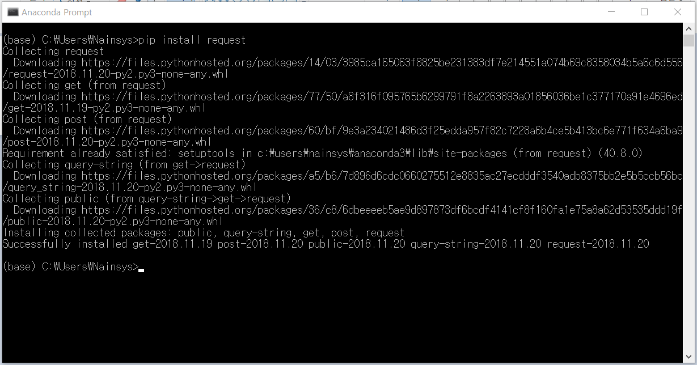

# 4.7.5.      기본 내장 모듈

파이썬에는 다음과 같은 기본 내장형 모듈들이 제공됩니다.

<table>
  <thead>
    <tr>
      <th style="text-align:left">&#xBAA8;&#xB4C8; &#xC774;&#xB984;</th>
      <th style="text-align:left">&#xC124; &#xBA85;</th>
    </tr>
  </thead>
  <tbody>
    <tr>
      <td style="text-align:left">sys</td>
      <td style="text-align:left">
        
&#xD30C;&#xC774;&#xC36C; &#xC2DC;&#xC2A4;&#xD15C;&#xACFC; &#xB300;&#xD654;&#xB97C;
          &#xAC00;&#xB2A5;&#xD558;&#xAC8C; &#xD569;&#xB2C8;&#xB2E4;.:

        
exit() - &#xC885;&#xB8CC;!

        
argv - &#xBA85;&#xB839;&#xC5B4; &#xB77C;&#xC778; &#xC778;&#xC218;&#xC5D0;
          &#xC811;&#xADFC;&#xD569;&#xB2C8;&#xB2E4;.

        
path - &#xC2DC;&#xC2A4;&#xD15C;&#xC758; &#xACBD;&#xB85C;&#xC5D0; &#xC811;&#xADFC;&#xD569;&#xB2C8;&#xB2E4;.

        
ps1 - &apos;&gt;&gt;&gt;&apos; &#xD30C;&#xC774;&#xC36C;&#xC758; &#xD504;&#xB86C;&#xD504;&#xD2B8;&#xB97C;
          &#xBCC0;&#xACBD;&#xD569;&#xB2C8;&#xB2E4;.!

      </td>
    </tr>
    <tr>
      <td style="text-align:left">os</td>
      <td style="text-align:left">
        
&#xC6B4;&#xC601;&#xCCB4;&#xC81C;&#xC640; &#xB300;&#xD654;&#xB97C; &#xAC00;&#xB2A5;&#xD558;&#xAC8C;
          &#xD569;&#xB2C8;&#xB2E4;.:

        
open - &#xD30C;&#xC77C;&#xC744; &#xC5F0;&#xB2E4;

        
system - &#xC2DC;&#xC2A4;&#xD15C; &#xBA85;&#xB839;&#xC5B4;&#xB97C; &#xC2E4;&#xD589;&#xD569;&#xB2C8;&#xB2E4;.

        
mkdir - &#xB514;&#xB809;&#xD1A0;&#xB9AC;&#xB97C; &#xC0DD;&#xC131;&#xD569;&#xB2C8;&#xB2E4;.

        
getcwd - &#xD604;&#xC7AC;&#xC758; &#xC791;&#xC5C5; &#xB514;&#xB809;&#xD1A0;&#xB9AC;&#xB97C;
          &#xCC3E;&#xB294;&#xB2E4;

      </td>
    </tr>
    <tr>
      <td style="text-align:left">string</td>
      <td style="text-align:left">
        
&#xBB38;&#xC790;&#xC5F4;&#xC744; &#xCC98;&#xB9AC;&#xD560; &#xC218; &#xC788;&#xB3C4;&#xB85D;
          &#xD574;&#xC900;&#xB2E4;

        
atoi/f/l - &#xBB38;&#xC790;&#xC5F4;&#xC744; integer/float/long &#xB85C;
          &#xBCC0;&#xD658;&#xD569;&#xB2C8;&#xB2E4;.

        
find - &#xD558;&#xBD80;&#xBB38;&#xC790;&#xC5F4;&#xC744; &#xD0D0;&#xC0C9;&#xD569;&#xB2C8;&#xB2E4;.

        
split - &apos;&#xB2E8;&#xC5B4;&apos;&#xC758; &#xBD80;&#xBD84;&#xC744;
          &#xC774;&#xC6A9;&#xD569;&#xB2C8;&#xB2E4;.

        
upper/lower - &#xB300;&#xC18C;&#xBB38;&#xC790; &#xBCC0;&#xD658;

      </td>
    </tr>
    <tr>
      <td style="text-align:left">re</td>
      <td style="text-align:left">
        
&#xBB38;&#xC790;&#xC5F4;&#xC744; &#xC720;&#xB2C9;&#xC2A4; &#xC2A4;&#xD0C0;&#xC77C;&#xB85C;
          &#xB2E4;&#xB8E8;&#xB3C4;&#xB85D; &#xD574; &#xC900;&#xB2E4;
           &#xC815;&#xADDC; &#xD45C;&#xD604;&#xC2DD; regular expressions

        
search - &#xBB38;&#xC790;&#xC5F4;&#xC758; &#xC5B4;&#xB290; &#xACF3;&#xC5D4;&#xAC00;
          &#xC788;&#xB294; &#xD328;&#xD134;&#xC744; &#xD0D0;&#xC0C9;&#xD569;&#xB2C8;&#xB2E4;.

        
match - &#xC624;&#xB85C;&#xC9C0; &#xCC98;&#xC74C;&#xBD80;&#xD130; &#xCC3E;&#xB294;&#xB2E4;

        
split - &#xD328;&#xD134;&#xC73C;&#xB85C; &#xBD84;&#xB9AC;&#xB41C; &#xD544;&#xB4DC;&#xC758;
          &#xBD80;&#xBD84;&#xC744; &#xC774;&#xC6A9;&#xD569;&#xB2C8;&#xB2E4;.

        
sub,subn - &#xBB38;&#xC790;&#xC5F4; &#xBC14;&#xAFB8;&#xAE30;

      </td>
    </tr>
    <tr>
      <td style="text-align:left">math</td>
      <td style="text-align:left">
        
&#xB9CE;&#xC740; &#xC218;&#xD559;&#xC801; &#xD568;&#xC218;&#xC5D0; &#xC811;&#xADFC;&#xD558;&#xB3C4;&#xB85D;
          &#xD574;&#xC900;&#xB2E4;:

        
sin,cos &#xB4F1;&#xB4F1; - &#xC0BC;&#xAC01; &#xD568;&#xC218;

        
log,log10 - &#xC790;&#xC5F0;&#xB85C;&#xADF8; &#xADF8;&#xB9AC;&#xACE0;
          &#xC0C1;&#xC6A9;&#xB85C;&#xADF8;

        
ceil,floor - &#xC0C1;&#xD55C;&#xAC12;&#xACFC; &#xD558;&#xD55C;&#xAC12;

        
pi, e - &#xC790;&#xC5F0; &#xC0C1;&#xC218;

      </td>
    </tr>
    <tr>
      <td style="text-align:left">time</td>
      <td style="text-align:left">
        
&#xC2DC;&#xAC04;(&#xADF8;&#xB9AC;&#xACE0; &#xB0A0;&#xC9DC;) &#xD568;&#xC218;

        
time - &#xD604;&#xC7AC;&#xC758; &#xC2DC;&#xAC04;&#xC744; &#xD68D;&#xB4DD;&#xD569;&#xB2C8;&#xB2E4;.
          (&#xCD08;&#xB2E8;&#xC704;&#xB85C; &#xD45C;&#xD604;&#xB41C;&#xB2E4;)

        
gmtime - &#xC2DC;&#xAC04;&#xC744; &#xCD08;&#xB2E8;&#xC704;&#xB85C; UTC
          (GMT) &#xB85C; &#xBCC0;&#xD658;&#xD569;&#xB2C8;&#xB2E4;.

        
localtime - &#xB300;&#xC2E0;&#xC5D0; &#xC9C0;&#xC5ED; &#xC2DC;&#xAC04;&#xC73C;&#xB85C;
          &#xBCC0;&#xD658;&#xD569;&#xB2C8;&#xB2E4;.

        
mktime - &#xC9C0;&#xC5ED;&#xC2DC;&#xAC04;&#xC758; &#xBC18;&#xB300;

        
sleep - &#xD504;&#xB85C;&#xADF8;&#xB7A8;&#xC744; n &#xCD08; &#xB3D9;&#xC548;
          &#xBA48;&#xCD98;&#xB2E4;

      </td>
    </tr>
  </tbody>
</table>

파이썬에는 이 외에도 수십가지의 모듈이 제공되고 있으며 또 많은 모듈들을 다운받아 설치 할 수 있습니다.

PIP를 사용하여 파이썬으로 작성된 패키지를 설치할 수 있습니다. 새로운 패키지를 설치하기 위해서는 ‘pip install \[패키지명\]’을 이용합니다. 

예제로 데이터를 수신하기위해 많이 사용하는 ‘request’ 패키지를 설치하여 보겠습니다. 아나콘다 프롬프트 창에서 ‘pip install request’라고 입력한 후 실행하면 다음과 같이 설치가 됩니다. 

