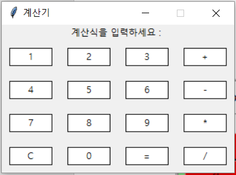

# 4.8.1.     실습: 계산기 만들기

**1\)    간단한 사칙 연산 계산기**

```python
def add(x, y):
    return x + y

 def subtract(x, y):
    return x - y

 def multiply(x, y):
    return x * y

 def divide(x, y):
    return x / y

 print("사칙연산을 선택 하세요.")
 print("1.더하기")
 print("2.빼기")
 print("3.곱하기")
 print("4.나누기")

 choice = input("선택 하세요(1/2/3/4):")

 num1 = int(input("첫번째 숫자 : "))
 num2 = int(input("두번째 숫자 : "))

 if choice == '1':
    print(num1,"+",num2,"=", add(num1,num2))

 elif choice == '2':
    print(num1,"-",num2,"=", subtract(num1,num2))

 elif choice == '3':
    print(num1,"*",num2,"=", multiply(num1,num2))

 elif choice == '4':
    print(num1,"/",num2,"=", divide(num1,num2))
 else:
    print("잘못된 선택")
```

  
**2\)    Tkinter를 사용한 GUI 계산기**

tkinter는 GUI에 대한 표준 Python 인터페이스이며 Window 창을 생성할 수 있습니다. 이번 예제는 tkinter를 사용하여 GUI 계산기를 만들어 보겠습니다.

```python
 import tkinter as tkt

 root = tkt.Tk()
 root.title("계산기")
 root.resizable(0, 0)                                # 윈도우 크기 고정한다
 root.wm_attributes("-topmost", 1)                   # 화면 상단에 유지된다.

 # 변수 선언
 equa = ""
 equation = tkt.StringVar()

 calculation = tkt.Label(root, textvariable=equation)
 equation.set("계산식을 입력하세요 : ")
 calculation.grid(row=2, columnspan=8)


 def btnPress(num):
     global equa
     equa = equa + str(num)
     equation.set(equa)

 def EqualPress():
     global equa
     total = str(eval(equa))
     equation.set(total)
     equa = ""

 def ClearPress():
     global equa
     equa = ""
     equation.set("")

 Button0 = tkt.Button(root, text="0", bg='white',command=lambda: btnPress(0), height=1, width=7, borderwidth=1, relief=tkt.SOLID)
 Button0.grid(row=6, column=2, padx=10, pady=10)
 Button1 = tkt.Button(root, text="1", bg='white',command=lambda: btnPress(1), height=1, width=7, borderwidth=1, relief=tkt.SOLID)
 Button1.grid(row=3, column=1, padx=10, pady=10)
 Button2 = tkt.Button(root, text="2", bg='white',command=lambda: btnPress(2), height=1, width=7, borderwidth=1, relief=tkt.SOLID)
 Button2.grid(row=3, column=2, padx=10, pady=10)
 Button3 = tkt.Button(root, text="3", bg='white',command=lambda: btnPress(3), height=1, width=7, borderwidth=1, relief=tkt.SOLID)
 Button3.grid(row=3, column=3, padx=10, pady=10)
 Button4 = tkt.Button(root, text="4", bg='white',command=lambda: btnPress(4), height=1, width=7, borderwidth=1, relief=tkt.SOLID)
 Button4.grid(row=4, column=1, padx=10, pady=10)
 Button5 = tkt.Button(root, text="5", bg='white',command=lambda: btnPress(5), height=1, width=7, borderwidth=1, relief=tkt.SOLID)
 Button5.grid(row=4, column=2, padx=10, pady=10)
 Button6 = tkt.Button(root, text="6", bg='white',command=lambda: btnPress(6), height=1, width=7, borderwidth=1, relief=tkt.SOLID)
 Button6.grid(row=4, column=3, padx=10, pady=10)
 Button7 = tkt.Button(root, text="7", bg='white',command=lambda: btnPress(7), height=1, width=7, borderwidth=1, relief=tkt.SOLID)
 Button7.grid(row=5, column=1, padx=10, pady=10)
 Button8 = tkt.Button(root, text="8", bg='white',command=lambda: btnPress(8), height=1, width=7, borderwidth=1, relief=tkt.SOLID)
 Button8.grid(row=5, column=2, padx=10, pady=10)
 Button9 = tkt.Button(root, text="9", bg='white',command=lambda: btnPress(9), height=1, width=7, borderwidth=1, relief=tkt.SOLID)
 Button9.grid(row=5, column=3, padx=10, pady=10)
 Plus = tkt.Button(root, text="+", bg='white',command=lambda: btnPress("+"), height=1, width=7, borderwidth=1, relief=tkt.SOLID)
 Plus.grid(row=3, column=4, padx=10, pady=10)
 Minus = tkt.Button(root, text="-", bg='white',command=lambda: btnPress("-"), height=1, width=7, borderwidth=1, relief=tkt.SOLID)
 Minus.grid(row=4, column=4, padx=10, pady=10)
 Multiply = tkt.Button(root, text="*", bg='white',command=lambda: btnPress("*"), height=1, width=7, borderwidth=1, relief=tkt.SOLID)
 Multiply.grid(row=5, column=4, padx=10, pady=10)
 Divide = tkt.Button(root, text="/", bg='white',command=lambda: btnPress("/"), height=1, width=7, borderwidth=1, relief=tkt.SOLID)
 Divide.grid(row=6, column=4, padx=10, pady=10)
 Equal = tkt.Button(root, text="=", bg='white',command=EqualPress, height=1, width=7, borderwidth=1, relief=tkt.SOLID)
 Equal.grid(row=6, column=3, padx=10, pady=10)
 Clear = tkt.Button(root, text="C", bg='white',command=ClearPress, height=1, width=7, borderwidth=1, relief=tkt.SOLID)
 Clear.grid(row=6, column=1, padx=10, pady=10)

 root.mainloop()
```

1번행에서 상단에 import tkinter as tkt를 사용하여 GUI 모듈을 포함시킵니다.

3번행 root = tkt.Tk\(\)는 가장 기본적인 윈도우 창 root 가 생성됩니다.

4번행 윈도우이름.title\("제목"\)을 이용하여 윈도우 창의 제목을 설정할 수 있습니다. root.title\("계산기"\) 코드는 root 라는 윈도우의 제목이 “계산기”라고 지정하는 것입니다.

윈도우이름.geometry\("너비x높이+x좌표+y좌표"\)를 이용하여 윈도우 창의 너비와 높이, 초기 화면 위치의 x좌표와 y좌표를 설정할 수 있습니다.

5번행 윈도우이름.resizeable\(상하, 좌우\)을 이용하여 윈도우 창의 창 크기 조절 가능 여부를 설정할 수 있습니다. True로 설정할 경우 윈도우 창의 크기를 조절할 수 있습니다. \(0,0\) 이라면 고정됩니다.

6번행에서 wm\_attributes 로 윈도우의 속성을 지정할 수 있습니다.

tkinter 모듈 안에는 IntVar, DoubleVar, StringVar 클래스가 정의되어 있습니다. 이 클래스들은 사용되는 값들을 객제로 만들 때 이용합니다.

14번행 .grid\(row, col\)은 객체의 배치를 담당합니다.

tkinter.Button\(윈도우 창, 파라미터1, 파라미터2, 파라미터3, ...\)을 사용하여 해당 윈도우 창에 표시할 버튼의 속성을 설정할 수 있습니다. 파라미터를 사용하여 버튼의 속성을 설정합니다.

파라미터 중 command를 이용하여 사용자 정의 함수를 실행시킬 수 있습니다.

```python
Button1 = tkt.Button(root, text="1", bg='white', command=lambda: btnPress(1), height=1, width=7, borderwidth=1, relief=tkt.SOLID)
 Button1.grid(row=3, column=1, padx=10, pady=10)
```

위의 함수는 Button1 이라는 객체를 tkinter.Button 을 이용해서 만드는데

Root 윈도우에 만들며, 버튼의 텍스트는 “1”, 배경색은 ‘white’, 버튼을 눌렀을 때 실행되는 명령은 btnPress\(1\), 높이는 1, 넓이는 7, 테두리 두께는 1, 3D 스타일은 그냥 SOLID로 만들고 3행, 1열, xy채우기는 10의 위치에 배치 하라는 명령입니다.

66번행 mainloop\(\)는 이벤트 메시지 루프로서 키보드나 마우스 혹은 화면 Redraw와 같은 다양한 이벤트로부터 오는 메시지를 받고 전달하는 역할을 합니다.




