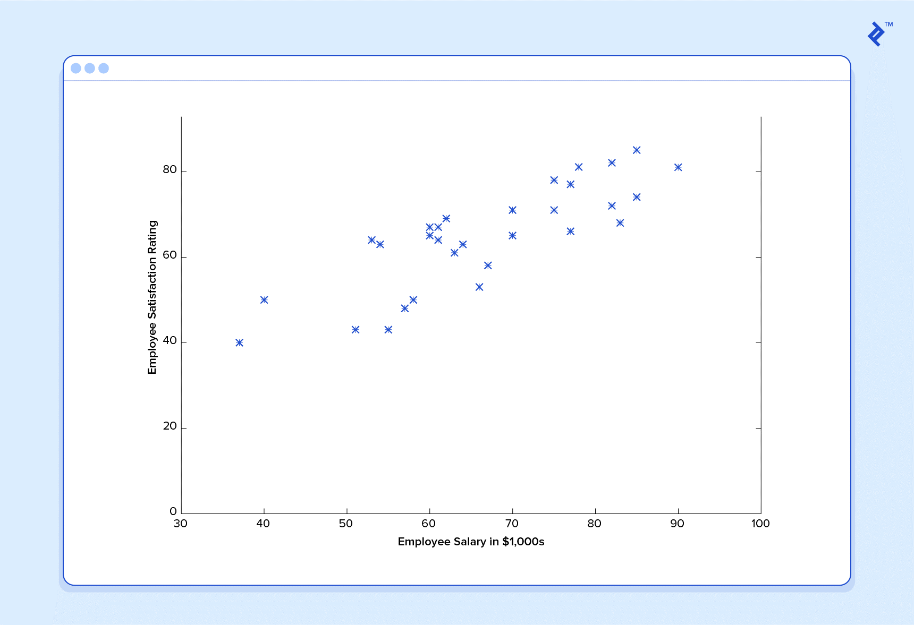
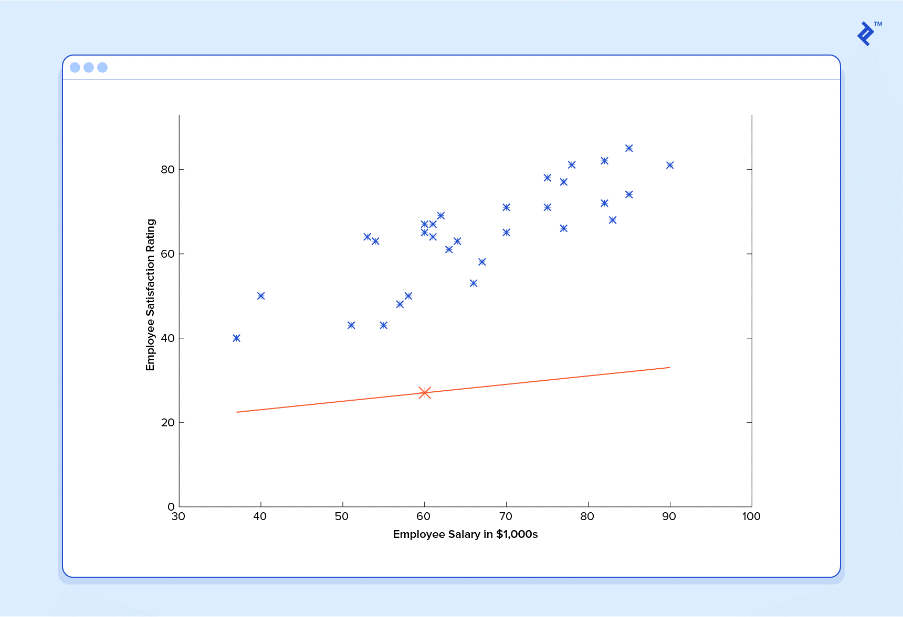
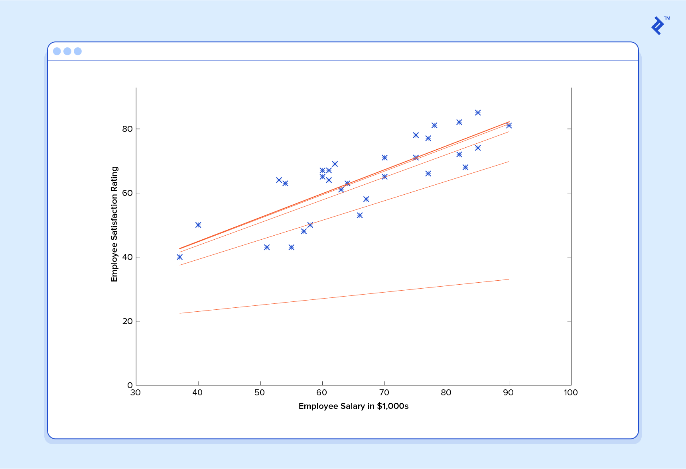
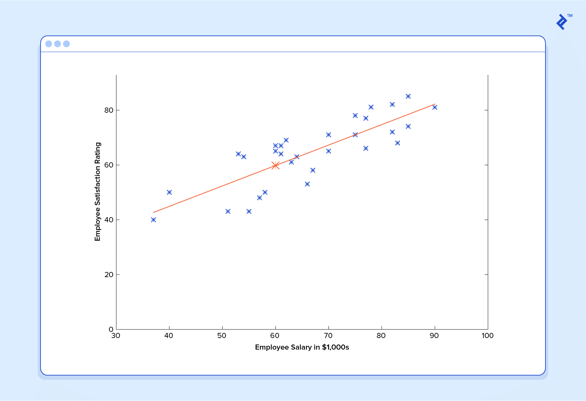

# 5.1.1. 경사하강법\(Gradient Descent \)

경사 하강법\(Gradient descent\)은 1차 근삿값 발견용 최적화 알고리즘입니다. 기본 아이디어는 함수의 기울기\(경사\)를 구하여 기울기가 낮은 쪽으로 계속 이동시켜서 극값에 이를 때까지 반복시키는 것이다.

이를 염두에 두고 간단한 예제를 살펴보겠습니다. 회사 직원들의 근무 만족도를 1~100 점 점수로 평가한  데이터가 있다고 가정하고 그것을 이차원 그래프상에 표시해보면 다음과 같을 것입니다.

위의 데이터를 보면 "급여가 올라감에 따라 직원 만족도가 높아지는 경향이 있다"와 같은 패턴이 있다는 것을 알 수 있지만 모든 것이 일직선 상에 잘 맞지는 않습니다.  이러한 현상은 현실 세계에서 실제 데이터가 있는 경우 항상 발생 합니다. 

그렇다면 급여에 따른 직원의 만족도를 완벽하게 예측할 수 있는 AI를 어떻게 학습 시킬 수 있을까요? 

그 대답은 "완벽한 예측을 할 수 없다" 입니다. 머신러닝의 목표는 결코 완벽한 예측이 아닙니다. 머신러닝의 목표는 유용할 만큼 충분히 좋은 추측을 하는 것입니다.

기계 학습은 통계에 크게 의존합니다. 예를 들어, 학습을 위해 기계를 훈련시킬 때, 훈련 데이터는 통계적으로 중요한 무작위 표본을 제공해야 합니다. 학습 세트가 무작위가 아닌 경우 실제로 존재하지 않는 기계 학습 패턴의 위험을 감수해야 합니다. 그리고 학습 세트가 너무 작아도 부정확 한 결론에 도달할 수도 있습니다. 위의 직원 만족도 예에서 상위 관리자의 데이터만으로 전직원의 만족도 패턴을 예측하려고 하면 오류가 발생하기 쉽습니다.

이러한 이해를 바탕으로 위에서 주어진 데이터를 머신러닝 AI에 제공하고 학습시켜야 합니다. 먼저  예측 인자 h \(x\)를 적절한 값인 θ0과 θ1로 초기화해야 합니다. 적당한 θ0과 θ1를 제공하여  다음과 같이 가정 할 수 있습니다.

$$
h(x) = θ0 + θ1(x)
$$

$$
h(x) = 15.00 + 0.20x
$$

이 예측 공식으로 $60K 급여를 받는 직원의 만족도를 구하면 27을 구할 수 있습니다. 

이 예측은 실제 값과 매우 다른 추측이고 이런 예측을 하는 AI는 사용할 수 없습니다. 이제 이 예측 시스템에게 학습 세트의 모든 데이터를 제공하고 예상 만족도와 해당 직원의 실제 만족도와의 차이점을 비교한 후, 약간의 수학적 계산을 수행합니다. 

첫번째 공식에서 θ0과 θ1의 값을 13.12 와 0.61로 변경하면 더 나은 예측 값을 줄 것이라고 계산할 수 있습니다.

$$
h(x) = 13.12 + 0.61x
$$

이렇게 학습 과정을 반복하면서 θ0과 θ1을 수정한다면, 우리는 실제 값에 근접한 예측 값을 발견할 것이고, 그 이후 θ0과 θ1의 값의 변화가 없을 것이므로 시스템이 수렴했다는 것을 알 수 있습니다. 실수를 하지 않는다면 최적의 예측 변수를 찾을 것입니다. 

$$
h(x) = 15.54 + 0.75x
$$

따라서 급여 60K를 받는 직원의 만족도를 다시 AI기계에 묻는다면 대략 60 등급을 예측할 것입니다.

위의 예는 기술적으로 단순한 선형 회귀의 문제입니다. 그러나 다음과 같은 예측 인자를 고려해 봅시다.

이 함수는 4차원으로 입력을 가져오고 다양한 다항식 항을 갖습니다. 이 함수의 정규 방정식을 유도하는 것은 어려운 문제입니다. 대부분의 머신러닝  문제는 수백 개의 계수를 사용하여 예측을 구축하기 위해 수천 또는 수백만 개의 데이터 차원을 필요로 합니다. 생물체의 게놈이 어떻게 표현될지 또는 기후가 50 년 후내에 어떻게 될지 예측하는 과 같은 것들이 이런 복잡한 문제의 예입니다.

다행히도, 머신러닝 시스템이 사용하는 반복적인 접근 프로세스는 이러한 복잡성들을 해결해 줍니다.

위의 예에서 우리는 각 단계별로 나온 θ0과 θ1의 값들이 점점 나아지는지, 아니면 점점 나빠지는지 어떻게 확인 할 수 있을까요? 그 해답은 약간의 미적분을 사용하면 됩니다.

잘못된 측정 값은 비용 함수 \(a.k.a., loss function\), 로 알려져 있습니다. 입력은 우리가 예측 자에서 사용하고 있는 모든 계수를 나타냅니다. 그래서 주어진의 값을 사용할 때 예측 변수가 얼마나 틀렸는지를 수학적으로 측정합니다.

비용 함수의 선택은 ML 프로그램의 또 다른 중요한 부분입니다. 다른 맥락에서 "틀린"것은 매우 다른 것을 의미할 수 있습니다. 직원 만족 사례에서 잘 정립된 표준은 선형 최소 자승 함수\(linear least squares function\)입니다.

최소 제곱을 사용하여 나쁜 예측에 대한 페널티를 예측값과 정답값 사이의 차이의 제곱으로 올라가므로 잘못을 매우 엄격하게 측정합니다. 비용 함수는 모든 훈련 예제에 대해 평균 패널티를 계산합니다. 이제 우리의 목표는 비용 함수 J\(θ0, θ1\)가 가능한 한 작아 지도록 θ0와 θ1을 찾고 예측자 h \(x\)를 찾는 것입니다. 우리는 이것을 달성하기 위해 미적분의 힘을 요구합니다.

여기서 우리는 θ0와 θ1의 다른 값과 관련된 비용을 볼 수 있습니다. 그래프에 약간의 볼록한 모양이 있습니다. 우묵한 부분의 바닥은 주어진 예측 데이터를 기반으로 예측 변수를 제공할 수 있는 가장 낮은 비용을 나타냅니다. 목표는 이 지점에 해당하는 θ0와 θ1을 찾는 것입니다. 이를 위해 미적분이 사용되어야 합니다. 즉 미분쌍인 J \(θ0, θ1\)의 기울기를 구하는 것입니다. 기울기는 θ0과 θ1의 모든 다른 값에 따라 달라지며 이러한 특정 θ에 대해 "언덕의 경사도"와 특히 어느 방향으로 내려가는지를 알려줍니다. 해당 함수의 최소값 위치를 찾기 위해 비용 함수\(Cost Function\)의 경사 반대 방향으로 정의한 step size를 가지고 조금씩 움직여 가면서 최적의 파라미터를 찾으려는 것입니다. 즉 경사가 계곡 바닥 방향이라면 θ0에 약간을 더하고 θ1에서 조금을 뺀다. 학습 알고리즘을 한 라운드 완료했습니다. 업데이트 된 예측 변수 h \(x\) = θ0 + θ1x는 이전보다 더 나은 예측을 반환합니다. 현재의 경사를 계산하고 결과에서 θ를 업데이트하는 과정을 경사하강법\(Gradient Descent\) 라고 합니다.

이를 이차원 그래프로 다시 설명한다면 다음과 같습니다.

cost를 줄이기 위해 변경되는 W의 파라미터의 상관관계를 그래프로 나타낸다면 cost의 값이 최소가 되는 것은 W의 값이 가운데로 수렴하게 된다는 것을 의미합니다. 결국, 그래프 위에 랜덤하게 파라미터가 정해지면 해당 파라미터의 위치로부터 최소값을 찾아 탐색하는 기준으로 경사도를 구해야 합니다. 우측 그래프에서 빨간점의 위치를 A라 하고 파란점의 위치를 B라 하자.

A의 위치에서의 경사의 기울기는 음수 이기 때문에 W의 값을 증가시키게 되고 B의 위치에서의 경사의 기울기는 양수 이기 때문에 W의 값을 감소시키게 됩니다.

여기서, 경사도를 구하기 위해서는 미분이 필요하며 일반적으로 다음과 같이 표현됩니다.

위의 식을 여러 번 실행시키는 것이 경사하강법 알고리즘의 핵심입니다. 이를 통해서, cost가 최소가 되는 값을 구할 수 있습니다. 

