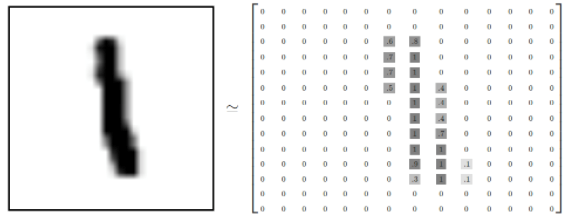
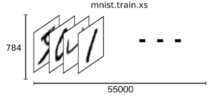
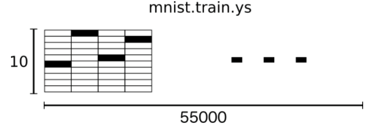

# 5.1.3.	MNIST Dataset 소개

TensorFlow 샘플에 보면 mnist 데이터셋이 많이 등장합니다. MNIST는 인공지능 연구의 권위자 LeCun교수가 만든 데이터 셋이고 현재 딥러닝을 공부할 때 반드시 거쳐야할 Hello, World같은 존재입니다. MNIST는 60,000개의 트레이닝 셋과 10,000개의 테스트 셋으로 이루어져 있고 이중 트레이닝 셋을 학습데이터로 사용하고 테스트 셋을 신경망을 검증하는 데에 사용합니다.  
 MNIST는 간단한 컴퓨터 비전 데이터 세트로, 아래와 같이 손으로 쓰여진 이미지들로 구성되어 있습니다. 숫자는 0에서 1까지의 값을 갖는 고정 크기 이미지 \(28x28 픽셀\)로 크기 표준화되고 중심에 배치되었습니다. 간단히 하기 위해 각 이미지는 평평하게되어 784 피쳐의 1-D numpy 배열로 변환되었습니다 \(28 \* 28\).

MNIST 데이터는 [Yann LeCun](http://yann.lecun.com/exdb/mnist/)의 웹사이트에서 제공합니다. 편의를 위해 데이터를 자동으로 다운로드하고 설치하는 코드를 포함해 놓았습니다. [코드](https://www.tensorflow.org/code/tensorflow/examples/tutorials/mnist/input_data.py)를 다운로드 하고아래와 같이 import하거나, 그냥 안에 붙여 넣으시면 됩니다.

```python
from tensorflow.examples.tutorials.mnist import input_data
mnist = input_data.read_data_sets("./samples/MNIST_data/", one_hot=True)
```


Mnist 데이타셋에는 총 60,000개의 데이타가 있는데, 이 데이타는 크게 아래와 같이 세종류의 데이타 셋으로 나눠 집니다. 모델 학습을 위한 학습용 데이타인 mnist.train 그리고, 학습된 모델을 테스트하기 위한 테스트 데이타 셋은 minst.test, 그리고 모델을 확인하기 위한 mnist.validation 데이타셋으로 구별됩니다. 각 데이타는 아래와 같이 학습용 데이타 55000개, 테스트용 10,000개, 그리고, 확인용 데이타 5000개로 구성되어 있습니다.

| 데이타셋 명 | 행렬 차원 | 데이타 종류 |
| :--- | :--- | :--- |
| mnist.train.images | 55000 x 784 | 학습 이미지 데이타 |
| mnist.train.labels | 55000 x 10 | 학습 라벨 데이타 |
| mnist.test.images | 10000 x 784 | 테스트용 이미지 데이타 |
| mnist.test.labels | 10000 x 10 | 테스트용 라벨 데이타 |
| mnist.validation.images | 5000 x 784 | 확인용 이미지 데이타 |
| mnist.validation.labels | 5000 x 10 | 확인용 라벨 데이타 |

각 데이타셋은 학습을 위한 글자 이미지를 저장한 데이타 image 와, 그 이미지가 어떤 숫자인지를 나타낸 라벨 데이타인 label로 두개의 데이타 셋으로 구성되어 있습니다.

**이미지**

먼저 이미지 데이타를 보면 아래 그림과 같이 28x28 로 구성되어 있는데,



이를 2차원 행렬에서 1차원으로 쭈욱 핀 형태로 784개의 열을 가진 1차원 행렬로 변환되어 저장이 되어 있습니다. mnist.train.image는 이러한 784개의 열로 구성된 이미지가 55000개가 저장이 되어 있습니다.



텐서플로우의 행렬을 나타내는 shape의 형태로는 shape=\[55000,784\] 이 됩니다.

마찬가지로, mnist.train.image 도 784개의 열로 구성된 숫자 이미지 데이타를 10000개를 가지고 있고 텐서플로우의 shape으로는 shape=\[10000,784\] 로 표현될 수 있습니다.

**라벨**

Label 은 이미지가 나타내는 숫자가 어떤 숫자인지를 나타내는 라벨 데이타로 10개의 숫자로 이루어진 1행 행렬이다. 0~9 순서로, 그 숫자이면 1 아니면 0으로 표현됩니다. 예를 들어 1인경우는 \[0,1,0,0,0,0,0,0,0,0,0\]  9인 경우는 \[0,0,0,0,0,0,0,0,0,1\] 로 표현됩니다.

이미지 데이타에 대한 라벨이기 때문에, 당연히 이미지 데이타 수만큼의 라벨을 가지게 됩니다.



Train 데이타 셋은 이미지가 55000개였기 때문에, Train의 label의 수 역시도 55000개가 됩니다.

