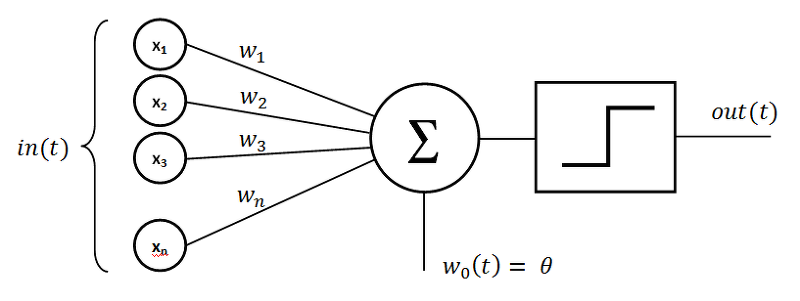
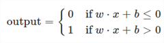
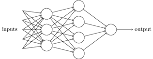

# 5.2.1. 	퍼셉트론

퍼셉트론은 인공신경망\(Neural Network\)과 딥러닝\(Deep Learning\)의 기초가 되는 이론입니다.

퍼셉트론의 동작은 노드\(뇌로 따지면 뉴런\)의 가중치와 입력치를 곱한 것을 모두 합한 값이 임계치보다 크면 활성화되고 1을 출력하며, 활성화되지 않으면 결과값으로 0을 출력하는 것입니다. 이를 그림으로 표현하면 아래와 같습니다. 즉 퍼셉트론은 2진\(Binary, 0과1\)값을 갖는 다중의 입력 x1, x2, x3…xn을 하나의 2진수 값으로 출력하는 모델입니다.

위 퍼셉트론의 개념도를 보면, x1에 w1부터 xn에 wn까지의 값이 있는데 w\(Weight\)는 가중치라고 보면 됩니다. 컴퓨터의 판단 없이 실제 있는그대로의 Data 가  X값이며,  W값은 가중치 혹은 보정치가 되는 값이라고 보면 됩니다.

w값도 4개이고, x의 값도 네개이니, 위 개념도는 즉 x1w1, x2w2, x3w3, x4w4 값들이 다음 노드에 들어가는 구조입니다. 그리고 해당 값이 지정된 특정 값\(기준이 되는 값\)을 넘으면 1, 안 넘으면 0을 출력하는 것이 바로 퍼셉트론의 구조입니다.

즉 입력 벡터 x=\(x1,x2,...,xd\) 를 받아들인 뒤 각 성분에 가중치를 곱하고, 그 결과를 모두 합산한 후, 활성함수 σ\(⋅\)을 적용하는 것이라고 할 수 있습니다. 전체 과정을 수행하는 이 선형 모델을 하나의 함수 h\(⋅\)로 나타낼 수 있으며, 이를 **퍼셉트론\(perceptron\)**이라고 부릅니다. 

이를 공식으로 다시 풀면 아주 간단하게 나오게 됩니다. 즉, 입력값x 와 가중치 w 에 b\(bias\)라고 불리우는 추가적인 보정치값을 합했을 때, 0보다 높으면 True라고 인지하여 값을 전달하고, 0이하일 경우, 버리기 위해서 False값을 전달합니다

그러나, 퍼셉트론 모델은 실제 상황에서 결정을 만드는 모델로 적용하기엔 적합하지 않습니다. 다음 그림 은 퍼셉트론의 집합으로 더 추상적인 결정을 내릴 수 있는 모델을 설계한 것입니다.

위 그림에서 왼쪽부터 1-layer,2-layer,3-layer라고 층으로 분류할 수 있습니다. 첫 번째 층에서의 입력들은 각각이 세 개의 결정을 출력합니다. 또 두 번째 층에서의 출력은 세 번째 층의 입력으로 사용되어 weighted sum을 구한 뒤 output을 출력합니다. 두 번째 층에서 나온 출력은 첫 번째 층의 출력보다 더 추상적이고 복잡한 단계입니다. 심지어 세 번째 층의 퍼셉트론은 더 추상적인 결정을 할 수 있습니다. 여기서 망의 층이 많아질수록 복잡한 결정을 만들 수 있단 걸 알 수 있습니다.

예를 들면, 치즈 페스티벌 외에 햄버거, 힙합, 체육 페스티벌들이 있을 때 그 페스티벌이 열리는 장소로 갈지 말지를 결정할 수 있습니다. 나는 치즈에 환장하지만 햄버거가 있는 곳은 가기도 싫다. 그러나 체육 페스티벌에 참여해야하고 힙합 페스티벌에는 여자 친구가 가기를 원합니다. 나의 결정은? 말로 설명하기 복잡한 이런 추상적인 결과를 퍼셉트론으로 이뤄진 여러 층의 모델로 상황별 입력을 통해 결정을 만들 수 있습니다.

위에서 퍼셉트론을 정의할 때 단일 출력을 가진다고 정의하였는데 위에 그림에선 하나의 퍼셉트론이 다중의 출력을 갖고 있습니다. 단지 출력이 여러 개의 퍼셉트론의 입력으로 사용되어짐을 그림으로 표현했을 뿐이지 여전히 하나의 퍼셉트론은 하나의 출력을 갖습니다.

퍼셉트론을 사용한 학습 방법은 처음에는 임의로 설정된 weight로 시작합니다. 학습 데이터를 퍼셉트론 모형에 입력하며 분류가 잘못됐을 때 weight를 개선해 나갑니다. weight를 개선해 나간다는 의미는 우리가 수학 문제를 잘못 풀었을 때 선생님이 다시 풀어오라고 하면 정답에 맞게 풀기 위해서 다시 풀고 다시 풀고 하다가 정답을 맞추는 것과 비슷합니다. 그래서 학습이라고 부릅니다. 하지만 퍼셉트론이 인공지능 분야에서 센세이션을 불러일으켰고 연구 과제도 이쪽으로 몰렸으나 이것이 가지는 한계점이 밝혀지면서 한동안 소외 받는 이론이 되었습니다. 퍼셉트론의 한계는 선형으로 분류를 할 수 있지만 XOR와 같이 선형 분류만 가능하며 비선형 분류는 불가능하다는 점입니다.

XOR 논리는 exclusive\(배타적\) 논리연산이다. 아래의 진리표를 보면, x1과 x2 중 어느 한쪽이 1일 때만 1을 출력한다.

| x1  | x2  | y  |
| :--- | :--- | :--- |
| 0 | 0  | 0  |
|  1  | 0  | 1  |
|  0  | 1  | 1  |
|  1  | 1  | 0  |

 아래의 그림을 보면 XOR에서는 선형으로\(직선 하나로\) 분류가 불가능함을 알 수 있습니다. 퍼셉트론의 한계를 간략히 말하면, 직선 하나로 나눈 영역만 표현할 수 있어 XOR과 같은 데이터 형태는 분류가 불가능하다는 한계가 있습니다.

