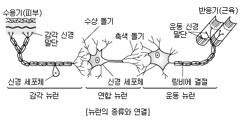
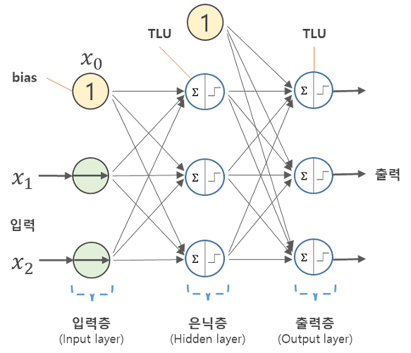
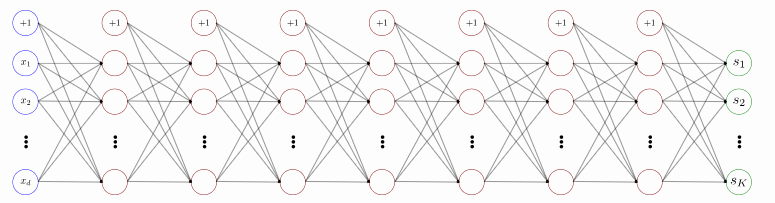
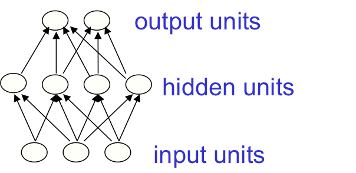
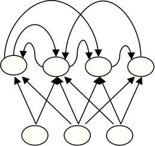
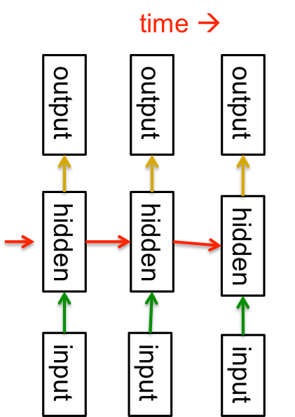

# 5.2.2.     인공 신경망

신경계에서의 뉴런들은 그 수가 엄청나게 많으며, 서로 간에 매우 복잡한 구조로 얽히고설켜 하나의 거대한 망을 구성하는데, 이를 신경망\(neural network\)이라고 합니다. 머신러닝 과학자들은 신경계의 이러한 신경망 구조에 착안하여, 퍼셉트론을 하나의 빌딩 블록\(building block\)이라고 생각하고, 여러 개의 퍼셉트론을 아래 예시와 같이 연결한 **인공신경망\(artificial neural network\)**을 고안하였습니다.

입력 벡터가 자리잡는 층을 **입력층\(input layer\)**, 최종 출력값이 자리잡는 층을 **출력층\(output layer\)**, 입력층과 출력층 사이에 위치하는 모든 층을 **은닉층\(hidden layer\)**이라고 합니다. 그림으로 표현할 때는 3개의 층을 그리나, 실제 인공신경망의 층 개수를 셀 때 입력층은 생략하는 것을 주의해야 합니다. 따라서 위 구조에서는 ‘총 2개의 층이 존재합니다.’고 부릅니다. 퍼셉트론을 기본 빌딩 블록으로 하여, 이런 패턴에 따라 2차원적으로 연결되어 구성되는 인공신경망의 일종을 특별히 **다층** **퍼셉트론\(MLP: multi-layer perceptron\)**이라고 합니다.

이런 입력층-은닉층-출력층의 경우, 다층 퍼셉트론뿐만 아니라, 좀 있다 설명할 다양한 인공신경망 구조에서 공통적으로 존재하는 층입니다. 은닉층의 개수가 많아질수록 인공신경망이 ‘깊어졌다\(deep\)’고 부르며, 이렇게 충분히 깊어진 인공신경망을 러닝 모델로 사용하는 머신러닝 패러다임을 바로 **딥러닝\(Deep Learning\)**이라고 합니다. 그리고, 딥러닝을 위해 사용하는 충분히 깊은 인공신경망을 **심층** **신경망\(DNN: Deep neural network\)**이라고 통칭합니다.

‘그럼 은닉층 및 출력층이 몇 개 이상이 있어야 심층 신경망이냐?’는 의문이 생길 수 있는데, 일반적으로는 은닉층+출력층이 2개 이상이 되면 심층 신경망이라고 합니다. 예를 들어, 아래와 같이 8개 은닉층+출력층으로 구성된 다층 퍼셉트론은 심층 신경망입니다.

이제 여러분들은, 딥러닝은 머신러닝의 세부 방법론들에 불과하다는 말의 의미를 이해하셨을 것이라고 생각합니다. 머신러닝의 큰 틀은 그대로 가져가되, 러닝 모델로 ‘충분히 깊은’ 인공신경망을 사용하고, 이에 맞는 러닝 알고리즘을 사용하여 러닝 모델을 학습한 경우 ‘딥러닝을 했다’고 표현해도 크게 무리가 없습니다.

**이런  신경망 구조의 주요 유형을 살펴 보면 다음과 같은 것들이 있습니다.**

**Feed-forward neural network**

가장 간단한 형태의 싱경망의 형태를 말합다. 가장 일반적으로 쓰이고 실제 어플리케이션에 적용되는 neural network들도 대부분이 feed-forward라고 합니다. 이 네트워크는 상당히 간단한 구조인데, 첫 번째 layer는 input이며 가장 마지막 layer는 output입니다. 그리고 중간의 input과 output으로 관찰되지 않는 영역을 “hidden” layer라고 하는데, 우리가 직접 관측하는 영역이 아닌 볼 수 없는 layer이므로 hidden이라고 불리는 것입니다. 만약 hidden layer가 하나보다 많이 존재한다면 이 network는 “deep” neural network라고 불립니다.

‌ 위의 그림이 Feed-forward neural network의 간단한 예시이다.

**Recurrent network**

이보다 조금 더 복잡한 network로는 Recurrent network라는 것이 존재합니다. “Recurrent”라는 이름이 붙은 이유는 graph에 cycle이 존재하기 때문인데, 이 network에서는 화살표를 계속 따라가다보면 어느 순간 같은 장소를 계속 돌고 있을 수도 있다는 의미입니다. 당연히 일반적인 방법으로 이것을 학습하는 것은 매우 복잡한 일이고 어려운 일입니다. 그럼에도 일단 이 네트워크는 생물학적으로 가장 현실적인 네트워크라고 합니다.

위와 같이 directed cycle이 존재하는 경우 recurrent network라고 하는데, 이 방법을 사용해서 sequential data를 modeling할 수 있다고 합니다. 그런 모델링이 가능한 근본적인 이유는 이 방법 자체가 일종의 시간을 축으로한 아주 deep한 network로 변경이 가능하기 때문입니다. 그림으로 보면 아래와 같은 형태가 됩니다.

위의 그림은 매시간마다 하나의 hidden layer를 가지는 네트워크이며, 각 hidden layer는 그 다음 hidden layer에 무언가 정보를 제공하는 형태입니다. 즉, 자기 자신이 자기 자신에게 정보를 주는 cycle이 존재하는 형태이며, 매시간마다 input과 output이 존재한다고 생각할 수 있습니다. 이런 이유로 recurrent network를 이런 형태의 network로 치환하여 생각할 수 있는 것입니다.

Reference : [http://sanghyukchun.github.io/40/](http://sanghyukchun.github.io/40/)

