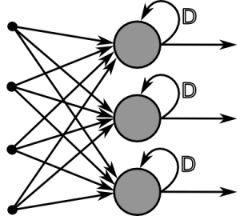

# 5.2.3.     대표적인 딥러닝 모델

심층 신경망의 기본 단위는 퍼셉트론이라고 하였습니다. 바로 앞에서는 다층 퍼셉트론 구조를 소개하였는데, 복수 개의 퍼셉트론을 서로 어떻게 연결하느냐에 따라 그와는 다른 새로운 구조를 형성할수도 있습니다.  다루고자 하는 데이터의 속성에 따라 효과적으로 적용할 수 있는 특수한 구조의 심층 신경망이 여럿 발표되었는데, 그 중 현재 가장 많이 쓰는 것 3가지를 소개해 드리고자 합니다.

**1\)    완전 연결 신경망**

완전 연결 신경망\(fully-connected neural network\)은, 사실 앞서 소개했던 다층 퍼셉트론을 지칭하는 또 다른 용어입니다. 다만 여러 구조의 심층 신경망이 추가로 발표되면서 기존의 다층 퍼셉트론이라는 표현을 사용하기 다소 애매해졌고, 이에 따라 오늘날에는 완전 연결 신경망이라는 표현을 널리 사용하고 있습니다.

완전 연결 신경망은, 위의 다층 퍼셉트론의 일반적 구조에서와 같이 노드 간에 횡적/종적으로 2차원적 연결을 이룹니다. 이 때, 서로 같은 층에 위치한 노드 간에는 연결 관계가 존재하지 않으며, 바로 인접한 층에 위치한 노드들 간에만 연결 관계가 존재한다는 것이 핵심적인 특징입니다.

**2\)    컨볼루션 신경망, 합성곱 신경망\(CNN, Convolutional Neural Network\)**

완전연결 신경망은 이름에서도 알 수 있듯이 각 유닛\(뉴런\)이 앞 계층의 모든 유닛과 연결되어 있습니다. 반면, 합성곱\(Convolution\) 계층에서는 각각의 유닛은 이전 계층에서 근접해 있는 몇 개의 유닛들에만 연결됩니다. 또한 모든 유닛은 이전 계층에 동일한 방법으로 연결되어 있으므로 같은 값의 가중치와 구조를 공유합니다. 그리고 이 연결 사이에 합성곱 연산이 들어 있어 이 신경망을 합성곱 신경망이라 부릅니다. 가장 많이 알려진 딥러닝 방법으로 특히 이미지 처리에 적합합니다. 입력을 필터로 합성곱하여 특징을 추출하고 이런 합성곱 레이어를 여러 계층으로 연결합니다.

합성곱 레이어를 지날때마다 저수준의 특징들이 점차 고수준의 특징들로 만들어집니다. 그리고 마지막에는 완전연결 레이어로 최종 결과를 학습합니다.

Convolution 작업은 CNN의 핵심이며 이를 사용하는 방법은 네트워크 성능의 중요한 결정 요소가됩니다. 예를 들어 CNN에서 3x3 크기보다 큰 것을 사용하는 것은 별로 의미가 없습니다. 예를 들어 네트워크에서 5x5, 7x7 등을 사용하지 마십시오. 반복적으로 VGGNet과 ResNet을 사용하여 3x3 컨볼루션을 순차적으로 스태킹하면 더 큰 크기의 컨볼루션과 동일한 수용 필드를 효과적으로 구현하고 계산 효율성은 더 높일 수 있습니다.

CNN의 일반적인 구조는 다음 그림과 같습니다.

합성곱 신경망의 경우에도 여태까지의 신경망과 마찬가지로 여러 계층을 조합하여 만들어진다. 다만 일반적인 신경망과는 다르게, 합성곱 계층\(Convolution Layer\)와 풀링 계층\(Pooling Layer\)이 추가됩니다.

**3\)    순환 신경망**

순환 신경망 **RNN**\(Recurrent Neural Network\)은 자연어\(NL, Natural Language\)나 음성신호, 주식과 같은 연속적인\(sequential\) **시계열**\(time series\) 데이터에 적합한 모델입니다.

RNN에서 R은 Recurrent라는 단어로 반복적인, 되풀이되는 등의 뜻입니다.

RNN은 위 그림과 같은 방식으로 과거 자신의 정보\(가중치\)를 기억하고 이를 학습에 반영합니다. 즉 RNN은 은닉층의 뉴런이 활성화 함수를 통해 나온 결과값을 출력층 방향으로도 보내면서, 다시 자기 자신의 다음 계산의 입력으로 보내는 특징을 갖고 있습니다. 가운데 은닉층의 뉴런에 자기 자신을 가리키는 화살표가 있는데 이 화살표를 Recurrent Weight라고 합니다. 이 Recurrent Weight는 과거의 데이터에 대한 정보를 기억할수 있는 기능을 제공합니다. RNN에서 은닉층의 뉴런은 각각의 시점\(time-step\)에서 바로 이전 시점\(time step\)에서의 은닉층의 뉴런에서 나온 값들을 계속해서 자신의 입력으로 보내는 재귀적 활동을 하고 있습니다. 이는 현재 시점에서의 은닉층의 뉴런이 갖고있는 값은 과거의 은닉층의 뉴런들의 값에 영향을 받은 것임을 의미합니다. 이는 이전의 값을 기억하려고 하는 일종의 메모리 역할을 하고 있는 것이므로 은닉층의 뉴런을 메모리 셀이라고 부르기도 합니다.

그리고 은닉층의 뉴런이 다음 시점에 다시 자신에게 보내는 이 값을 은닉 상태\(hidden state\)라고 합니다. 즉, 다시 말해, 현재 시점의 은닉층의 뉴런은 이전 시점에서의 은닉층의 뉴런이 보낸 은닉 상태값을 다시 계산을 위한 입력값으로 사용합니다.

