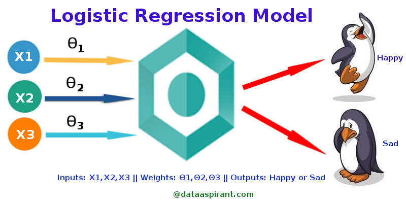

# 5.3.5  로지스틱 회귀

**로지스틱 회귀\(Logistic Regression\)**

로지스틱 회귀분석이란 분석하고자 하는 대상들이 두 집단 혹은 그 이상의 집단으로 나누어진 경우에 개별 관측치들이 어느 집단에 분류될 수 있는가를 분석하고 이를 예측하는 모형을 개발하는데 사용되는 통계기법입니다. 예측변수 세트의 값을 기준으로 결정되는 특성이나 결과가 있는지 여부를 예측하려는 상황에서 유용합니다. 예를 들어 비흡연가들보다 흡연가들에게 관상동맥성심장병 가 발병할 가능성이 얼마나 더 많은지를 예측하려면 로지스틱 회귀 분석을 사용해야 합니다.

Logistic Regression Model \([http://dataaspirant.com/2017/03/02/how-logistic-regression-model-works/](http://dataaspirant.com/2017/03/02/how-logistic-regression-model-works/)\)

위의 그림에서 입력은 X1, X2, X3 등 다양하고 가중치도 θ1,θ2,θ3 다양하지만 출력은 2가지 뿐입니다. 로지스틱 회귀는 매우 효율적인 확률 계산 메커니즘입니다.

로지스틱 회귀 분석의 결과는 이분법적 변수로 측정됩니다. 이것은 독립 변수들의 집합에서 이진 결과 \(1/0, 예/아니오, 참/거짓\)를 예측하는 데 사용됩니다. 이진형 결과를 나타 내기 위해 더미 변수를 사용합니다. 또한, 결과 변수가 범주 형 일 때 선형 회귀의 특수한 경우로 로지스틱 회귀를 생각할 수 있습니다. 여기서 우리는 확률 로그를 종속 변수로 사용합니다. 간단히 말하면, 데이터를 로짓 함수에 맞추어 이벤트의 발생 확률을 예측합니다.

전자 메일이 스팸인지 아닌지를 분류해야하는 시나리오를 생각해봅시다. 이 문제에 대해 선형 회귀 분석을 사용하면 분류를 수행할 기준을 설정해야 할 필요가 있습니다. 실제로 메일이 악성인지 아닌지에 대한 기준값을 연속값으로 정하고 분류하는 것은 심각한 결과를 초래할 수 있다고 합니다. 이러한 예에서 선형 회귀는 분류 문제에 적합하지 않다고 추측할 수 있습니다.

시그모이드 함수는 바이너리 로지스틱 회귀를 할 때 사용됩니다. 즉 0, 1 두가지의 결과값으로 분류할때 굉장히 유용합니다. 선형회귀는 직선모양의 그래프를 만들어 분류하였는데 로지스틱 회귀는 시그모이드 함수를 사용하여 S자 형태를 띄고 있기 때문에 비교적 더 정확한 예측이 가능합니다.

Sigmoid의 표현은 아래와 같습니다.

`z`가 로지스틱 회귀를 사용하여 학습된 모델의 선형 레이어의 출력을 나타내는 경우 sigmoid\(z\)는 0과 1 사이의 값\(확률\)을 생성합니다. 수학적 표현으로는 왼쪽과 같습니다.

여기서

-       y'는 특정 예에 관한 로지스틱 회귀 모델의 출력입니다.

-       z = b + w1x1 + w2x2 + ... wNxN

-       w 값은 모델의 학습된 가중치이고, b는 편향입니다.

-       x 값은 특정 예에 대한 특성 값입니다.

z는 z를 '1' 라벨\(예: '스팸'\)의 확률을 '0' 라벨\(예: '스팸 아님'\)의 확률로 나눈 값의 로그로 정의할 수 있는 시그모이드 상태의 역수이므로 로그 오즈\(log-odds\)라고도 합니다.

로그 오즈는 어떤 이벤트가 일어날 가능성의 로그입니다.

이벤트가 이진 확률을 의미하는 경우의 **가능성**은 성공 확률\(p\) 대 실패 확률\(1-p\)의 비율을 의미합니다. 특정 이벤트의 성공 확률이 90%, 실패 확률이 10%라고 가정해 보겠습니다. 이 경우의 가능성은 다음과 같이 계산됩니다.

가능성=p\(1-p\)=.9.1=9

로그 오즈는 가능성의 로그입니다. 관례에 따르면 '로그'란 자연 로그를 나타내지만 로그의 밑은 사실 1보다 큰 임의의 수가 될 수 있습니다. 관례를 따르면, 앞에서 든 예의 로그 오즈는 다음과 같이 나타낼 수 있습니다.

로그 오즈=ln\(9\) =2.2

로그 오즈는 [**시그모이드 함수**](https://developers.google.com/machine-learning/crash-course/glossary?hl=ko#sigmoid_function)의 역함수입니다.

다음과 같은 편향과 가중치를 학습한 특성이 세 개인 로지스틱 회귀 모델이 있다고 가정합니다.

b = 1, w1 = 2, w2 = -1, w3 = 5

또한 지정된 예의 특성 값이 다음과 같다고 가정합니다.

x1 = 0, x2 = 10, x3 = 2

따라서 로그 오즈는 b+w1x1+w2x2+w3x3 이며, 다음과 같습니다.

  \(1\) + \(2\)\(0\) + \(-1\)\(10\) + \(5\)\(2\) = 1

결과적으로 이 특정 예의 로지스틱 회귀 예측값은 0.731입니다.

승산\(Odds\)이란 임의의 사건 A가 발생하지 않을 확률 대비 일어날 확률의 비율을 뜻하는 개념입니다. 아래와 같은 식으로 쓸 수가 있습니다.

만약 P\(A\)가 1에 가까울 수록 승산은 치솟을 겁니다. 반대로 P\(A\)가 0이라면 0이 될 겁니다. 바꿔 말하면 승산이 커질수록 사건 A가 발생할 확률이 커진다고 이해해도 될 겁니다. 

**로지스틱** **회귀는** **결과에** **따라** **다음과** **같이** **분류됩니다.**

**-**       **이항 로지스틱 회귀\(Binary Logistic Regression\): 두 가지 결과만 있는 경우 \(예: 스팸 여부\)**

**-**       **다항 로지스틱 회귀 분석\(Multinomial Logistic Regression\):** **예측하고자 하는 분류가 두 개가 아니라 여러 개가 될 수 있는 경우 \(예: 어느 음식이 더 많이 먹는 지 예측 \(Veg, Non-Veg, Vegan\)\)**

**-**       **순서형 로지스틱 회귀\(Ordinal Logistic Regression\): 순서가 있는 3 개 이상의 분류. \(예: 1에서 5까지의 영화 등급\)**

**이항 로지스틱 회귀에서** **데이터가** **속한** **분류를** **예측하기** **위해** **임계** **값을** **설정할** **수** **있습니다.** **이** **임계치에** **기초하여,** **획득된** **추정** **확률로** **분류됩니다.** **의사** **결정** **경계\(Decision Boundary\)는** **선형** **또는** **비선형** **일** **수** **있습니다.** **복잡한** **의사** **결정** **경계를** **얻기** **위해** **여러** **개의** **이항** **로지스틱이** **필요합니다.** **즉** **다항** **로지스틱** **회귀분석이** **필요** **합니다.**

softmax는 데이터를 2개 이상의 그룹으로 나누기 위해 binary classification을 확장한 모델입니다. 소프트맥스는 다항 로지스틱 회귀 분석중 하나입니다.  softmax는 binary classification을 여러 번 결합한 결과입니다. 예측 결과가 A, B, C 중의 하나가 되어야 한다면, 동일한 x에 대해 A가 될 확률, B가 될 확률, C가 될 확률을 모두 구해야 한다는 뜻입니다.

**이제** **소프트맥스를** **사용해서** **MNIST를** **이용해** **숫자** **이미지를** **인식하는** **모델을** **구현하고** **테스트해봅시다.  MNIST에** **대해서는** **이전** **설명을** **참고하십시오.**

**소프트맥스** **회귀는** **들어온** **값이** **어떤** **분류인지** **구분해주는** **알고리즘이다.** **로지스틱** **회귀는** **두** **가지로만** **분류가** **가능하지만,** **소프트맥스** **회귀는** **n** **개의** **분류로** **구분이** **가능합니다.**

**소프트맥스로** **분류를** **할때, x라는** **값이** **들어** **왔을때,** **분류를** **하려고** **가정했을때,** **모델에서** **사용하는** **가설은** **다음과** **같습니다.** 

**y = softmax \(W\*x + b\)**

**W는** **weight,** **그리고** **b는** **bias** **값입니다. y는** **최종적으로** **10개의** **숫자를** **감별하는** **결과가** **나와야** **하기** **때문에,** **크기가** **10인** **행렬이** **되고, 10개의** **결과를** **만들기** **위해서** **W역시** **10개가** **되어야** **하며,** **이미지** **하나는** **784개의** **숫자로** **되어** **있기** **때문에, 10개의** **값을** **각각** **784개의** **숫자에** **적용해야** **하기** **때문에, W는** **784x10** **행렬이** **됩니다.** **그리고, b** **는** **10개의** **값에** **각각** **더하는** **값이기** **때문에,** **크기가** **10인** **행렬이** **됩니다.**

**이를** **텐서플로우** **코드로** **표현하면** **다음과** **같습니다.**

**x = tf.placeholder\(tf.float32, \[None, 784\]\)**

**W = tf.Variable\(tf.zeros\(\[784, 10\]\)\)**

**b = tf.Variable\(tf.zeros\(\[10\]\)\)**

**k = tf.matmul\(x, W\) + b**

**y = tf.nn.softmax\(k\)**

**우리가** **구하고자** **하는** **값은** **x** **값으로** **학습을** **시켜서** **0~9를** **가장** **잘** **구별해내는** **W와** **b의** **값을** **찾는** **일입니다.**

**x의** **데이타는** **총** **55000개로, 55000x784** **행렬이** **되고, W는** **784x10** **행렬이다.** **이** **둘을** **곱하면, 55000x10** **행렬이** **되는데, b는** **1x10** **행렬로** **차원이** **달라서** **합이** **되지** **않는다.**

**텐서플로우와** **파이썬에서는** **이렇게** **차원이** **다른** **행렬을** **큰** **행렬의** **크기로** **늘려주는** **기능이** **있는데,** **이를** **브로드캐스팅이라고** **합니다.** **브로드** **캐스팅에** **의해서** **b는** **55000x10** **사이즈로** **자동으로** **늘어나고** **각** **행에는** **첫행과** **같은** **데이타들로** **채워지게** **됩니다.**

**소프트맥스** **알고리즘을** **이해하고** **사용해도** **좋지만,** **텐서플로우에는** **이미** **tf.nn.softmax** **라는** **함수로** **만들어져** **있고,** **대부분** **많이** **알려진** **머신러닝** **모델들은** **샘플들이** **많이** **있기** **때문에,** **대략적인** **원리만** **이해하고** **가져다** **쓰는** **것을** **권장합니다.** **보통** **모델을** **다** **이해하려고** **하다가** **수학에서** **부딪혀서** **포기하는** **경우가** **많은데,** **디테일한** **모델을** **이해하기** **힘들면,** **그냥** **함수나** **예제코드를** **가져다** **쓰는** **방법으로** **접근하자.** **우리가** **일반적인** **프로그래밍에서도** **해쉬테이블이나** **트리와** **같은** **자료구조에** **대해서** **대략적인** **개념만** **이해하고** **미리** **정의된** **라이브러리를** **사용하지** **직접** **해쉬** **테이블등을** **구현하는** **경우는** **드물다.**

**코스트\(비용\) 함수**

**이** **소프트맥스** **함수에** **대한** **코스트** **함수는** **크로스엔트로피** **\(Cross entropy\)** **함수의** **평균을** **이용하는데,** **복잡한** **산식** **없이** **그냥** **외워서** **쓰자.** **다행이도** **크로스엔트로피** **함수역시** **함수로** **구현이** **되어있다.**

**Cost = tf.reduce\_mean\(tf.nn.softmax\_cross\_entropy\_with\_logits\(tf.matmul\(x, W\) + b, y\_\)\)**

**가설에** **의해** **계산된** **값** **y를** **넣지** **않고** **tf.matmul\(x, W\) + b** **를** **넣은** **이유는  tf.nn.softmax\_cross\_entropy\_with\_logits** **함수** **자체가** **softmax를** **포함하기** **때문이다.**

**y\_은** **학습을** **위해서** **입력된** **값이다.**

자 그럼 학습을 위한 전체 코드를 보자. 이 예제 코드는 [https://github.com/aymericdamien/TensorFlow-Examples/blob/master/examples/2\_BasicModels/logistic\_regression.py](https://github.com/aymericdamien/TensorFlow-Examples/blob/master/examples/2_BasicModels/logistic_regression.py) 을 발췌하였다.

**import** tensorflow **as** tf  
  
 \# Import MNIST data  
 **from** tensorflow.examples.tutorials.mnist **import** input\_data  
 mnist = input\_data.read\_data\_sets\(**"/tmp/data/"**, one\_hot=**True**\)  
  
 \# Parameters  
 learning\_rate = 0.1  
  
 \# tf Graph Input  
 x = tf.placeholder\(tf.float32, \[**None**, 784\]\) \# mnist data image of shape 28\*28=784  
 y = tf.placeholder\(tf.float32, \[**None**, 10\]\) \# 0-9 digits recognition =&gt; 10 classes  
  
 \# Set model weights  
 W = tf.Variable\(tf.zeros\(\[784, 10\]\)\)  
 b = tf.Variable\(tf.zeros\(\[10\]\)\)  
  
 \# Construct model  
 pred = tf.nn.softmax\(tf.matmul\(x, W\) + b\) \# Softmax  
  
 \# Minimize error using cross entropy  
 cost = tf.reduce\_mean\(-tf.reduce\_sum\(y\*tf.log\(pred\), reduction\_indices=1\)\)  
  
 \# Gradient Descent  
 optimizer = tf.train.GradientDescentOptimizer\(learning\_rate\).minimize\(cost\)  
  
 \# Initialize the variables \(i.e. assign their default value\)  
 init = tf.global\_variables\_initializer\(\)  
  
 \# Start training  
 **with** tf.Session\(\) **as** sess:  
     \# Run the initializer  
     sess.run\(init\)  
  
     \# Training cycle  
     **for** epoch **in** range\(100\):    \# 100번씩, 전체 데이타에서 100개씩 뽑아서 트레이닝을 함.  
         avg\_cost = 0.  
         total\_batch = int\(mnist.train.num\_examples/100\)  
         \# Loop over all batches  
         **for** i **in** range\(total\_batch\):  
             batch\_xs, batch\_ys = mnist.train.next\_batch\(100\)  
             \# Run optimization op \(backprop\) and cost op \(to get loss value\)  
             \_, c = sess.run\(\[optimizer, cost\], feed\_dict={x: batch\_xs, y: batch\_ys}\)  
             \# Compute average loss  
             avg\_cost += c / total\_batch  
         \# Display logs per epoch step  
         **if** \(epoch+1\) % 10 == 0:  
             print\(**"Epoch:"**, **'%04d'** % \(epoch+1\), **"cost="**, **"{:.9f}"**.format\(avg\_cost\)\)  
  
     print\(**"Optimization Finished!"**\)  
     print\(**'b is '**, sess.run\(b\)\)  
     print\(**'W is'**, sess.run\(W\)\)  
  
     \# Test model  
     correct\_prediction = tf.equal\(tf.argmax\(pred, 1\), tf.argmax\(y, 1\)\)  
     \# Calculate accuracy  
     accuracy = tf.reduce\_mean\(tf.cast\(correct\_prediction, tf.float32\)\)  
     print\(**"Accuracy:"**, accuracy.eval\({x: mnist.test.images, y: mnist.test.labels}\)\)

코드를 세부적으로 설명하면 다음과 같습니다.

**import** tensorflow **as** tf  
  
 \# Import MNIST data  
 **from** tensorflow.examples.tutorials.mnist **import** input\_data  
 mnist = input\_data.read\_data\_sets\(**"/tmp/data/"**, one\_hot=**True**\)

앞에서 데이타에 대해서 설명한것과 같이 데이타를 로딩하는 부분이다. read\_data\_sets에 들어가 있는 디렉토리는 샘플데이타를 온라인에서 다운 받는데, 그 데이타를 임시로 저장해놓을 위치이다.

다음은 소프트맥스를 이용하여 모델을 정의합니다.

\# tf Graph Input  
 x = tf.placeholder\(tf.float32, \[**None**, 784\]\) \# mnist data image of shape 28\*28=784  
 y = tf.placeholder\(tf.float32, \[**None**, 10\]\) \# 0-9 digits recognition =&gt; 10 classes  
  
 \# Set model weights  
 W = tf.Variable\(tf.zeros\(\[784, 10\]\)\)  
 b = tf.Variable\(tf.zeros\(\[10\]\)\)  
  
 \# Construct model  
 pred = tf.nn.softmax\(tf.matmul\(x, W\) + b\) \# Softmax

x는 트레이닝 데이타를 저장하는 스테이크홀더, W는 Weight, b는 bias 값이고, 모델은 pred = tf.nn.softmax\(tf.matmul\(x, W\) + b\) 이 됩니다.

모델을 정의했으면 학습을 위해서, 코스트 함수를 정의합니다.

\# Minimize error using cross entropy  
 cost = tf.reduce\_mean\(-tf.reduce\_sum\(y\*tf.log\(pred\), reduction\_indices=1\)\)  
  
 \# Gradient Descent  
 optimizer = tf.train.GradientDescentOptimizer\(learning\_rate\).minimize\(cost\)

이 코스트 함수를 가지고 코스트가 최소화가 되는 W와 b를 구해야 하는데, 옵티마이져를 사용합니다. 여기서는 경사 하강법\(Gradient Descent Optimizer\)를 사용하였다.

GradientDescent에서 learning rate는 학습속도이다. 여기서는 0.1로 정하였다.

세션 초기화  

\# Initialize the variables \(i.e. assign their default value\)  
 init = tf.global\_variables\_initializer\(\)  
  
 \# Start training  
 **with** tf.Session\(\) **as** sess:  
     \# Run the initializer  
     sess.run\(init\)

tf.Session\(\) 을 이용해서 세션을 만들고, global\_variable\_initializer\(\)를 이용하여, 변수들을 모두 초기화한후, 초기화 값을 sess.run에 넘겨서 세션을 초기화 합니다.

세션이 생성되었으면 이제 트레이닝을 시작합니다.

**for** epoch **in** range\(100\):    \# 100번씩, 전체 데이타에서 100개씩 뽑아서 트레이닝을 함.  
     avg\_cost = 0.  
     total\_batch = int\(mnist.train.num\_examples/100\)  
     \# Loop over all batches  
     **for** i **in** range\(total\_batch\):  
         batch\_xs, batch\_ys = mnist.train.next\_batch\(100\)  
         \# Run optimization op \(backprop\) and cost op \(to get loss value\)  
         \_, c = sess.run\(\[optimizer, cost\], feed\_dict={x: batch\_xs, y: batch\_ys}\)  
         \# Compute average loss  
         avg\_cost += c / total\_batch  
     \# Display logs per epoch step  
     **if** \(epoch+1\) % 10 == 0:  
         print\(**"Epoch:"**, **'%04d'** % \(epoch+1\), **"cost="**, **"{:.9f}"**.format\(avg\_cost\)\)

결과값 출력

print\(**"Optimization Finished!"**\)  
 print\(**'b is '**, sess.run\(b\)\)  
 print\(**'W is'**, sess.run\(W\)\)

마지막으로 학습에서 구해진 W와 b를 출력해보자

다음은 실행 결과 스크린 샷이다.

Extracting /tmp/data/train-images-idx3-ubyte.gz

먼저 앞에서 데이타를 로딩하도록 지정한 디렉토리에, 학습용 데이타를 다운 받아서 압축 받는 것을 확인할 수 있습니다. 그 다음 학습이 끝난후에, b와 W 값이 출력되었습니다.

이제 모델을 만들고 학습을 시켰으니, 이 모델이 얼마나 정확하게 작동하는지를 테스트해보자.  mnist.test.image 와 mnist.test.labels 데이타셋을 이용하여 테스트를 진행하는데, 앞에서 나온 모델에 mnist.test.image 데이타를 넣어서 예측을 한 후에, 그 결과를 mnist.test.labels \(정답\)과 비교해서 정답률이 얼마나 되는지를 비교합니다.

다음은 모델 테스팅 코드이다. 이 코드를 위의 코드 뒤에 붙여서 실행하면 됩니다.

모델 검증 코드

\# Test model  
 correct\_prediction = tf.equal\(tf.argmax\(pred, 1\), tf.argmax\(y, 1\)\)  
 \# Calculate accuracy  
 accuracy = tf.reduce\_mean\(tf.cast\(correct\_prediction, tf.float32\)\)  
 print\(**"Accuracy:"**, accuracy.eval\({x: mnist.test.images, y: mnist.test.labels}\)\)

correct\_prediction = tf.equal\(tf.argmax\(y, 1\), tf.argmax\(y\_, 1\)\)

코드를 보자, tf.argmax 함수를 이해해야 하는데, argmax\(y,1\)은 행렬 y에서 몇번째에 가장 큰 값이 들어가 있는지를 리턴해주는 함수이다. 아래 예제 코드를 보면

session = tf.InteractiveSession\(\)

data = tf.constant\(\[9,2,11,4\]\)

idx = tf.argmax\(data,0\)

print idx.eval\(\)

session.close\(\)

\[9,2,11,4\] 에서 최대수는 11이고, 이 위치는 두번째 \(0 부터 시작합니다.\)이기 때문에 0을 리턴합니다. 두번째 변수는 어느축으로 카운트를 할것인지를 선택합니다. 1차원 배열의 경우에는 0을 사용합니다. 여기서 y는 2차원 행렬인데, 0이면 같은 열에서 최대값인 순서, 1이면 같은 행에서 최대값인 순서를 리턴합니다.

그럼 원래 코드로 돌아오면 tf.argmax\(y,1\)은 y의 각행에서 가장 큰 값의 순서를 찾는다. y의 각행을 0~9으로 인식한 이미지의 확률을 가지고 있습니다.

아래는 4를 인식한 y 값인데, 4의 값이 0.7로 가장높기 \(4일 확률이 70%, 3일 확률이 10%, 1일 확률이 20%로 이해하면 됩니다.\) 때문에, 4로 인식됩니다.

여기서 tf.argmax\(y,1\)을 사용하면, 행별로 가장 큰 값을 리턴하기 때문에, 위의 값에서는 4가 리턴이됩니다. 테스트용 데이타에서 원래 정답이 4로 되어 있다면, argmax\(y\_,1\)도 4를 리턴하기 때문에, tf.equal\(tf.argmax\(y, 1\), tf.argmax\(y\_, 1\)\)는 tf.equals\(4,4\)로 True를 리턴하게 됩니다.

모든 테스트 셋에 대해서 검증을 하고 나서 그 결과에서 True만 더해서, 전체 트레이닝 데이타의 수로 나눠 주면 결국 정확도가 나오는데, tf.cast\(boolean, tf.float32\)를 하면 텐서플로우의 bool 값을 float32 \(실수\)로 변환해줍니다. True는 1.0으로 False는 0.0으로 변환해줍니다. 이렇게 변환된 값들의 전체 평균을 구하면 되기 때문에, tf.reduce\_mean을 사용합니다.

이렇게 정확도를 구하는 함수가 정의되었으면 이제 정확도를 구하기 위해 데이타를 넣어보자

accuracy.eval\({x: mnist.test.images, y: mnist.test.labels}\)

x에 mnist.test.images 데이타셋으로 이미지 데이타를 입력받아서  y \(예측 결과\)를 계산하고, y\_에는 mnist.test.labels 정답을 입력 받아서, y와 y\_로 정확도 accuracy를 구해서 출력합니다. 최종 출력된 accuracy 정확도는 0.9272 로 대략 92% 정도가 나온다.

