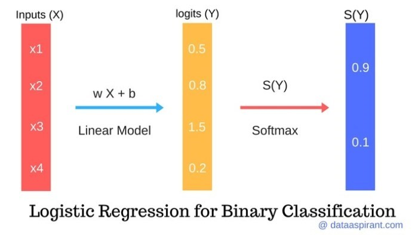
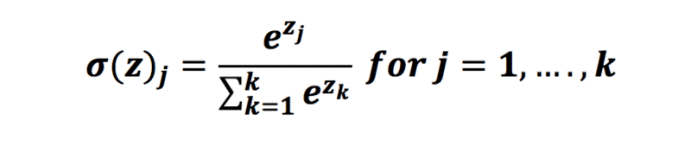
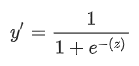
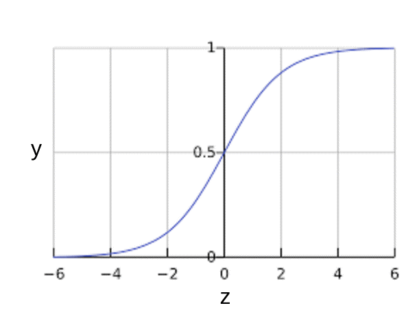
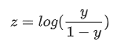
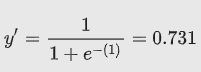
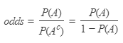
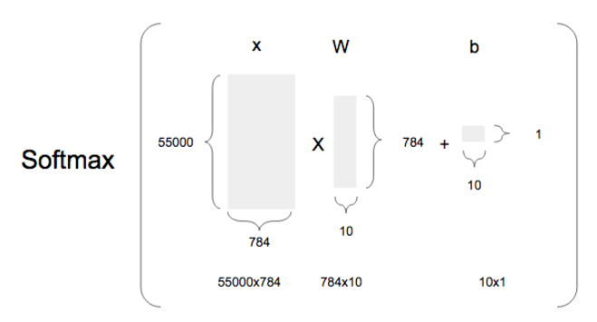
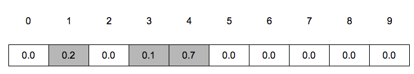

# 5.3.5  로지스틱 회귀

**로지스틱 회귀\(Logistic Regression\)**

로지스틱 회귀분석이란 분석하고자 하는 대상들이 두 집단 혹은 그 이상의 집단으로 나누어진 경우에 개별 관측치들이 어느 집단에 분류될 수 있는가를 분석하고 이를 예측하는 모형을 개발하는데 사용되는 통계기법입니다. 예측변수 세트의 값을 기준으로 결정되는 특성이나 결과가 있는지 여부를 예측하려는 상황에서 유용합니다. 예를 들어 비흡연가들보다 흡연가들에게 관상동맥성심장병 가 발병할 가능성이 얼마나 더 많은지를 예측하려면 로지스틱 회귀 분석을 사용해야 합니다.

**1\)   로지스틱 회귀 예제**

Penguin의 일상 생활을 기반으로 행복할 가능성을 알고 싶어한다고 가정합니다. 펭귄이 일상 활동을 기반으로 행복을 예측하는 로지스틱 회귀 모델을 만들고 싶다면 펭귄들이 어떤 활동을 했을 때 행복하고 슬픈지에 대한 데이터가 필요합니다. 머신러닝 용어에서 이러한 활동을 입력 매개변수라고합니다.

그래서 펭귄 활동과 그 활동의 결과가 행복하거나 슬픈 표를 만들어 봅시다.

| No. | Penguin Activity | Penguin Activity Description | How Penguin felt \( Target \) |
| :--- | :--- | :--- | :--- |
| 1 | X1 | Eating squids | Happy |
| 2 | X2 | Eating small Fishes | Happy |
| 3 | X3 | Hit by other Penguin | Sad |
| 4 | X4 | Eating Crabs | Sad |

Logistic Regression Model \([http://dataaspirant.com/2017/03/02/how-logistic-regression-model-works/](http://dataaspirant.com/2017/03/02/how-logistic-regression-model-works/)\)


위의 그림에서 입력은 X1, X2, X3 등 다양하고 가중치도 θ1, θ2, θ3 다양하지만 출력은 2가지뿐입니다. 로지스틱 회귀는 매우 효율적인 확률 계산 메커니즘입니다.

위의 활동을 데이터로 사용하여 펭귄들의 행복감에 대한 로지스틱 회귀 모델을 트레이닝 하도록 합니다. 나중에 훈련된 로지스틱 회귀 모델로 펭귄이 새로운 펭귄 활동에 대해 어떻게 느끼는지 예측할 것입니다.

위의 범주형 데이터 테이블을 사용하여 로지스틱 회귀를 구축할 수 없으므로 위의 활동 데이터 테이블을 수치로 된 활동 점수, 가중치 및 해당 목표로 변환해야합니다.

펭귄 활동 데이터 테이블

| No. | Penguin Activity | Activity Score | Weights | Target | Target Description |
| :--- | :--- | :--- | :--- | :--- | :--- |
| 1 | X1 | 6 | 0.6 | 1 | Happy |
| 2 | X2 | 3 | 0.4 | 1 | Happy |
| 3 | X3 | 7 | -0.7 | 0 | Sad |
| 4 | X4 | 3 | -0.3 | 0 | Sad |

업데이트 된 데이터 세트는 위와 같습니다. 학습을 더 진행하기 전에 위의 데이터 표에 대해 더 자세히 이해합시다.

-       펭귄 활동: 펭귄 활동은 매일 작은 물고기를 먹거나, 게를 먹는 것처럼 행동합니다.

-       활동 점수: 활동 점수는 펭귄 활동과 동일한 수치입니다. 오징어를 먹기 위해서는 해당 활동 점수가 6이고 다른 활동의 경우 점수는 4, 7, 3입니다.

-       가중치:

* 가중치는 특정 목표에 해당하는 가중치와 비슷합니다.
* 활동 X1에 대해 가중치가 0.6이라고 가정합니다.
* 펭귄이 X1 활동을 수행한다면 펭귄이 행복 할 것이라고 60 % 확신할 수 있습니다.
* 목표 클래스에 대한 가중치가 양수이면 행복을 나타내며 목표 클래스에 대한 가중치가 음수이면 행복하지 않다는 것을 의미합니다.

-       Target: 이것은 이진 분류로 구분해야 하기 때문에 0,1로 구분됩니다. 값 1은 행복, 값 0은 슬픔을 나타냅니다.

이제 각 활동의 활동 점수와 해당 가중치를 수치적으로 알 수 있습니다. 펭귄이 활동에 어떻게 기분이 좋을지 예측하려면 활동 점수와 가중치를 곱하여 점수를 얻어야합니다. 계산된 점수는 logits이라고 합니다.

logit \(Score\)는 softmax 함수로 전달되어 각 대상 클래스의 확률을 구합니다. 이 경우, softmax 함수를 통해 logit을 전달하면 대상의 행복 클래스와 슬픔 클래스의 확률을 얻습니다.

실제로, 우리는이 경우에 계산된 로그 \(점수\)로 펭귄이 행복하거나 슬프다는 것을 예측할 수 있습니다. 우리는 Logit이 0보다 크면 목표 클래스가 만족스럽다고 Logit이 0보다 작으면 목표 클래스가 슬프다고 말할 수 있습니다.



위의 Penguin 예제에서 우리는 로지스틱 회귀 모델에 대한 활동 점수와 가중치를 사전 할당했습니다. 이것은 실제 문제에 대한 로지스틱 회귀 모델을 모델링하는 동안 단순하지 않습니다. 가중치는 학습 데이터 세트를 통해 계산됩니다. 계산된 가중치를 사용하여 Logits가 계산됩니다. 여기서 모델은 선형 회귀 모델과 유사합니다.

softmax는 제공되는 조건으로 가장 확률이 큰 값을 찾는 개념을 말합니다. 소프트맥스는 classification 알고리즘중의 하나로, 들어온 값이 어떤 분류인지 구분해주는 알고리즘입니다.  Softmax\(소프트맥스\)는 입력받은 값을 출력으로 0~1사이의 값으로 모두 정규화하며 출력 값들의 총합은 항상 1 이 되는 특성을 가진 함수입니다.

softmax 함수는 각 대상 클래스에 대한 확률을 반환합니다. 높은 확률의 목표 클래스는 예측된 목표 클래스입니다.

펭귄 예제에서 두 개의 대상 클래스 \(Happy 및 Sad\)가 있습니다. 예 또는 아니요와 같은 이진 목표를 예측하기 위해 로지스틱 회귀 모델을 사용하는 경우 이진 분류로 알려진 1 또는 0을 사용합니다.

지금까지 softmax 함수에 대해 계산된 점수를 취하여 확률을 반환하는 블랙 박스로 이야기했습니다. 이제 softmax 함수가 어떻게 확률을 계산하는지 설명하겠습니다. 다음으로 간단한 softmax 함수를 구현하여 주어진 Logits \(점수\)에 대한 확률을 계산합니다.

**2\)    소프트맥스 함수**

Softmax 함수는 이벤트의 확률을 계산하는 인기있는 함수입니다. softmax 함수를 사용하는 다른 수학적 장점은 출력 범위입니다. Softmax 기능 출력 값은 항상 \(0, 1\) 범위입니다. 출력 값의 합은 항상 1과 같습니다. Softmax는 정규화 지수 함수라고도합니다.



위의 수식은 softmax 공식입니다. 각 값\(Logits\)을 취하여 확률을 구합니다. 소프트맥스 함수를 파이썬으로 표현하면 다음과 같습니다.

```python
# Required Python Packages
import numpy as np
def softmax(scores):
    """
    Calculate the softmax for the given scores
    :param scores:
    :return:
    """
    return np.exp(scores) / np.sum(np.exp(scores), axis=0)
scores = [8, 5, 2]
if __name__ == "__main__":
    logits = [8, 5, 2]
    print("Softmax :: ", softmax(logits))
```

softmax 기능을 구현하기 위해 Softmax 공식을 파이썬으로 구현했습니다.

1. softmax 기능에 대한 입력은 목록 또는 배열의 로그입니다.
2. 분자는 배열의 각 Logit의 지수 값을 계산합니다.
3. 분모는 모든 지수 값의 합을 계산합니다.
4. 마지막으로, 분자와 분모 값의 비율을 반환합니다.

위의 코드 실행 결과는 다음과 같습니다.

`Softmax ::  [ 0.95033021  0.04731416  0.00235563]`

**3\)    시그모이드 함수**

앞의 예에서 Happy, Sad 로 분류 했듯이 로지스틱 회귀 분석의 결과는 이분법적 변수로 측정됩니다. 이것은 독립 변수들의 집합에서 이진 결과 \(1/0, 예/아니오, 참/거짓\)를 예측하는 데 사용됩니다. 이진형 결과를 나타 내기 위해 Dummy 변수를 사용합니다. 또한, 결과 변수가 범주형 일 때 선형 회귀의 특수한 경우로 로지스틱 회귀를 생각할 수 있습니다. 여기서 우리는 확률 로그를 종속 변수로 사용합니다. 간단히 말하면, 데이터를 Logit 함수에 맞추어 이벤트의 발생 확률을 예측하는 것입니다.

시그모이드 함수는 바이너리 로지스틱 회귀를 할 때 사용됩니다. 즉 0, 1 두가지의 결과값으로 분류할때 굉장히 유용합니다. 선형회귀는 직선모양의 그래프를 만들어 분류하였는데 로지스틱 회귀는 시그모이드 함수를 사용하여 S자 형태를 띄고 있기 때문에 비교적 더 정확한 예측이 가능합니다.

Sigmoid의 표현은 아래와 같습니다.





`z`가 로지스틱 회귀를 사용하여 학습된 모델의 선형 레이어의 출력을 나타내는 경우 sigmoid\(z\)는 0과 1 사이의 값\(확률\)을 생성합니다. 

여기서

*  y'는 특정 예에 관한 로지스틱 회귀 모델의 출력입니다.
* $$z=b + w1x1 + w2x2 + ... + wnxn$$ ``
* w 값은 모델의 학습된 weight이고, b는 biase입니다.
* x 값은 특정 예에 대한 입력 특성 값입니다.

z는 z를 '1' 라벨\(예: '스팸'\)의 확률을 '0' 라벨\(예: '스팸 아님'\)의 확률로 나눈 값의 로그로 정의할 수 있는 시그모이드 상태의 역수이므로 로그 오즈\(log-odds\)라고도 합니다.

로그 오즈는 어떤 이벤트가 일어날 가능성의 로그입니다.



이벤트가 이진 확률을 의미하는 경우의 **가능성**은 성공확률\(p\) 대 실패확률\(1-p\)의 비율을 의미합니다. 특정 이벤트의 성공 확률이 90%, 실패 확률이 10%라고 가정해 보겠습니다. 이 경우의 가능성은 다음과 같이 계산됩니다.

`가능성=p(1-p)=.9.1=9`

로그 오즈는 가능성의 로그입니다. 관례에 따르면 '로그'란 자연 로그를 나타내지만 로그의 밑은 사실 1보다 큰 임의의 수가 될 수 있습니다. 관례를 따르면, 앞에서 든 예의 로그 오즈는 다음과 같이 나타낼 수 있습니다.

`로그 오즈=ln(9) =2.2`

로그 오즈는 [**시그모이드 함수**](https://developers.google.com/machine-learning/crash-course/glossary?hl=ko#sigmoid_function)의 역함수입니다.

다음과 같은 편향과 가중치를 학습한 특성이 세 개인 로지스틱 회귀 모델이 있다고 가정합니다.

`b = 1, w1 = 2, w2 = -1, w3 = 5`

또한 지정된 예의 특성 값이 다음과 같다고 가정합니다.

`x1 = 0, x2 = 10, x3 = 2`

따라서 로그 오즈는 b+w1x1+w2x2+w3x3 이며, 다음과 같습니다.

  `(1) + (2)(0) + (-1)(10) + (5)(2) = 1`

결과적으로 이 특정 예의 로지스틱 회귀 예측값은 0.731입니다.



승산\(Odds\)이란 임의의 사건 A가 발생하지 않을 확률 대비 일어날 확률의 비율을 뜻하는 개념입니다. 아래와 같은 식으로 쓸 수가 있습니다. 



만약 P\(A\)가 1에 가까울 수록 승산은 치솟을 겁니다. 반대로 P\(A\)가 0이라면 0이 될 겁니다. 바꿔 말하면 승산이 커질수록 사건 A가 발생할 확률이 커진다고 이해해도 될 겁니다. 

**4\)    로지스틱 회귀의 분류**

로지스틱 회귀는 결과에 따라 다음과 같이 분류됩니다.

-       이항 로지스틱 회귀\(Binary Logistic Regression\): 두 가지 결과만 있는 경우 \(예: 스팸 여부\)

-       다항 로지스틱 회귀 분석\(Multinomial Logistic Regression\): 예측하고자 하는 분류가 두 개가 아니라 여러 개가 될 수 있는 경우 \(예: 어느 음식이 더 많이 먹는 지 예측 \(Veg, Non-Veg, Vegan\)\)

-       순서형 로지스틱 회귀\(Ordinal Logistic Regression\): 순서가 있는 3 개 이상의 분류. \(예: 1에서 5까지의 영화 등급\)

이항 로지스틱 회귀에서 데이터가 속한 분류를 예측하기 위해 임계 값을 설정할 수 있습니다. 이 임계치에 기초하여, 획득된 추정 확률로 분류됩니다. 의사 결정 경계\(Decision Boundary\)는 선형 또는 비선형 일 수 있습니다. 복잡한 의사 결정 경계를 얻기 위해 여러 개의 이항 로지스틱이 필요합니다. 즉 다항 로지스틱 회귀분석이 필요 합니다.

softmax는 데이터를 2개 이상의 그룹으로 나누기 위해 binary classification을 확장한 모델입니다. 소프트맥스는 다항 로지스틱 회귀 분석중 하나입니다.  softmax는 binary classification을 여러 번 결합한 결과입니다. 예측 결과가 A, B, C 중의 하나가 되어야 한다면, 동일한 x에 대해 A가 될 확률, B가 될 확률, C가 될 확률을 모두 구해야 한다는 뜻입니다.

**5\)    MNIST 예제**

이제 소프트맥스를 사용해서 MNIST를 이용해 숫자 이미지를 인식하는 모델을 구현하고 테스트해봅시다.  MNIST에 대해서는 이전 설명을 참고하십시오.

소프트맥스 회귀는 들어온 값이 어떤 분류인지 구분해주는 알고리즘입니다. 로지스틱 회귀는 두 가지로만 분류가 가능하지만, 소프트맥스 회귀는 n 개의 분류로 구분이 가능합니다.


소프트맥스로 분류를 할때, x라는 값이 들어 왔을때, 분류를 하려고 가정했을때, 모델에서 사용하는 가설은 다음과 같습니다. 

$$
y = softmax (W*x + b)
$$

W는 weight, 그리고 b는 bias 값입니다. y는 최종적으로 10개의 숫자를 감별하는 결과가 나와야 하기 때문에, 크기가 10인 행렬이 되고, 10개의 결과를 만들기 위해서 W역시 10개가 되어야 하며, 이미지 하나는 784개의 숫자로 되어 있기 때문에, 10개의 값을 각각 784개의 숫자에 적용해야 하기 때문에, W는 784x10 행렬이 됩니다. 그리고, b 는 10개의 값에 각각 더하는 값이기 때문에, 크기가 10인 행렬이 됩니다.



이를 텐서플로우 코드로 표현하면 다음과 같습니다.

```python
x = tf.placeholder(tf.float32, [None, 784])
W = tf.Variable(tf.zeros([784, 10]))
b = tf.Variable(tf.zeros([10]))
k = tf.matmul(x, W) + b
y = tf.nn.softmax(k)
```

우리가 구하고자 하는 값은 x 값으로 학습을 시켜서 0~9를 가장 잘 구별해내는 W와 b의 값을 찾는 일입니다. x의 데이타는 총 55000개로, 55000x784 행렬이 되고, W는 784x10 행렬이다. 이 둘을 곱하면, 55000x10 행렬이 되는데, b는 1x10 행렬로 차원이 달라서 합이 되지 않습니다.

텐서플로우와 파이썬에서는 이렇게 차원이 다른 행렬을 큰 행렬의 크기로 늘려주는 기능이 있는데, 이를 브로드캐스팅이라고 합니다. 브로드 캐스팅에 의해서 b는 55000x10 사이즈로 자동으로 늘어나고 각 행에는 첫행과 같은 데이타들로 채워지게 됩니다.

소프트맥스 알고리즘을 이해하고 사용해도 좋지만, 텐서플로우에는 이미 tf.nn.softmax 라는 함수로 만들어져 있고, 대부분 많이 알려진 머신러닝 모델들은 샘플들이 많이 있기 때문에, 대략적인 원리만 이해하고 가져다 쓰는 것을 권장합니다. 보통 모델을 다 이해하려고 하다가 수학에서 부딪혀서 포기하는 경우가 많은데, 디테일한 모델을 이해하기 힘들면, 그냥 함수나 예제코드를 가져다 쓰는 방법으로 접근하겠습니다.

**Cost\(비용\) 함수**

이 소프트맥스 함수에 대한 코스트 함수는 크로스엔트로피 \(Cross entropy\) 함수의 평균을 이용하는데, 복잡한 계산식 없이 그냥 함수로 구현된 것을 사용하면 됩니다.

`Cost = tf.reduce_mean(tf.nn.softmax_cross_entropy_with_logits(tf.matmul(x, W) + b, y_))`

가설에 의해 계산된 값 y를 넣지 않고 tf.matmul\(x, W\) + b 를 넣은 이유는  tf.nn.softmax\_cross\_entropy\_with\_logits 함수 자체가 softmax를 포함하기 때문입니다.

y\_은 학습을 위해서 입력된 값입니다.

자 그럼 학습을 위한 전체 코드를 보자. 이 예제 코드는 [https://github.com/aymericdamien/TensorFlow-Examples/blob/master/examples/2\_BasicModels/logistic\_regression.py](https://github.com/aymericdamien/TensorFlow-Examples/blob/master/examples/2_BasicModels/logistic_regression.py) 을 발췌하였습니다.

```python
import tensorflow as tf

 # Import MNIST data
 from tensorflow.examples.tutorials.mnist import input_data
 mnist = input_data.read_data_sets("/tmp/data/", one_hot=True)

 # Parameters
 learning_rate = 0.1

 # tf Graph Input
 x = tf.placeholder(tf.float32, [None, 784]) # mnist data image of shape 28*28=784
 y = tf.placeholder(tf.float32, [None, 10]) # 0-9 digits recognition => 10 classes

 # Set model weights
 W = tf.Variable(tf.zeros([784, 10]))
 b = tf.Variable(tf.zeros([10]))

 # Construct model
 pred = tf.nn.softmax(tf.matmul(x, W) + b) # Softmax

 # Minimize error using cross entropy
 cost = tf.reduce_mean(-tf.reduce_sum(y*tf.log(pred), reduction_indices=1))

 # Gradient Descent
 optimizer = tf.train.GradientDescentOptimizer(learning_rate).minimize(cost)

 # Initialize the variables (i.e. assign their default value)
 init = tf.global_variables_initializer()

 # Start training
 with tf.Session() as sess:
     # Run the initializer
     sess.run(init)

     # Training cycle
     for epoch in range(100):    # 100번씩, 전체 데이타에서 100개씩 뽑아서 트레이닝을 함.
         avg_cost = 0.
         total_batch = int(mnist.train.num_examples/100)
         # Loop over all batches
         for i in range(total_batch):
             batch_xs, batch_ys = mnist.train.next_batch(100)
             # Run optimization op (backprop) and cost op (to get loss value)
             _, c = sess.run([optimizer, cost], feed_dict={x: batch_xs, y: batch_ys})
             # Compute average loss
             avg_cost += c / total_batch
         # Display logs per epoch step
         if (epoch+1) % 10 == 0:
             print("Epoch:", '%04d' % (epoch+1), "cost=", "{:.9f}".format(avg_cost))

     print("Optimization Finished!")
     print('b is ', sess.run(b))
     print('W is', sess.run(W))

     # Test model
     correct_prediction = tf.equal(tf.argmax(pred, 1), tf.argmax(y, 1))
     # Calculate accuracy
     accuracy = tf.reduce_mean(tf.cast(correct_prediction, tf.float32))
     print("Accuracy:", accuracy.eval({x: mnist.test.images, y: mnist.test.labels}))
```

코드를 세부적으로 설명하면 다음과 같습니다.

```python
import tensorflow as tf

 # Import MNIST data
 from tensorflow.examples.tutorials.mnist import input_data
 mnist = input_data.read_data_sets("/tmp/data/", one_hot=True)
```

앞에서 데이타에 대해서 설명한것과 같이 데이타를 로딩하는 부분입니다. read\_data\_sets에 들어가 있는 디렉토리는 샘플데이타를 온라인에서 다운 받는데, 그 데이타를 임시로 저장해놓을 위치입니다.

다음은 소프트맥스를 이용하여 모델을 정의합니다.

```python
# tf Graph Input
 x = tf.placeholder(tf.float32, [None, 784]) # mnist data image of shape 28*28=784
 y = tf.placeholder(tf.float32, [None, 10]) # 0-9 digits recognition => 10 classes

 # Set model weights
 W = tf.Variable(tf.zeros([784, 10]))
 b = tf.Variable(tf.zeros([10]))

 # Construct model
 pred = tf.nn.softmax(tf.matmul(x, W) + b) # Softmax
```

x는 트레이닝 데이타를 저장하는 스테이크홀더, W는 Weight, b는 bias 값이고, 모델은 pred = tf.nn.softmax\(tf.matmul\(x, W\) + b\) 이 됩니다.

모델을 정의했으면 학습을 위해서, 코스트 함수를 정의합니다.

```python
# Minimize error using cross entropy
 cost = tf.reduce_mean(-tf.reduce_sum(y*tf.log(pred), reduction_indices=1))

 # Gradient Descent
 optimizer = tf.train.GradientDescentOptimizer(learning_rate).minimize(cost)
```

이 코스트 함수를 가지고 코스트가 최소화가 되는 W와 b를 구해야 하는데, 옵티마이져를 사용합니다. 여기서는 경사 하강법\(Gradient Descent Optimizer\)를 사용하였습니다.

GradientDescent에서 learning rate는 학습속도이다. 여기서는 0.1로 정하였습니다.

```python
# Initialize the variables (i.e. assign their default value)
 init = tf.global_variables_initializer()

 # Start training
 with tf.Session() as sess:
     # Run the initializer
     sess.run(init)
```

tf.Session\(\) 을 이용해서 세션을 만들고, global\_variable\_initializer\(\)를 이용하여, 변수들을 모두 초기화한후, 초기화 값을 sess.run에 넘겨서 세션을 초기화 합니다.

세션이 생성되었으면 이제 트레이닝을 시작합니다.

```python
for epoch in range(100):    # 100번씩, 전체 데이타에서 100개씩 뽑아서 트레이닝을 함.
     avg_cost = 0.
     total_batch = int(mnist.train.num_examples/100)
     # Loop over all batches
     for i in range(total_batch):
         batch_xs, batch_ys = mnist.train.next_batch(100)
         # Run optimization op (backprop) and cost op (to get loss value)
         _, c = sess.run([optimizer, cost], feed_dict={x: batch_xs, y: batch_ys})
         # Compute average loss
         avg_cost += c / total_batch
     # Display logs per epoch step
     if (epoch+1) % 10 == 0:
         print("Epoch:", '%04d' % (epoch+1), "cost=", "{:.9f}".format(avg_cost))
```

결과값을 출력합니다.

```python
print("Optimization Finished!")
print('b is ', sess.run(b))
print('W is', sess.run(W))
```

마지막으로 학습에서 구해진 W와 b를 출력해보면 다음과 같은 결과를 구할 수 있습니다.

Extracting /tmp/data/train-images-idx3-ubyte.gz


먼저 앞에서 데이타를 로딩하도록 지정한 디렉토리에, 학습용 데이타를 다운 받아서 압축 받는 것을 확인할 수 있습니다. 그 다음 학습이 끝난후에, b와 W 값이 출력되었습니다.

이제 모델을 만들고 학습을 시켰으니, 이 모델이 얼마나 정확하게 작동하는지를 테스트해보겠습니다.  mnist.test.image 와 mnist.test.labels 데이타셋을 이용하여 테스트를 진행하는데, 앞에서 나온 모델에 mnist.test.image 데이타를 넣어서 예측을 한 후에, 그 결과를 mnist.test.labels \(정답\)과 비교해서 정답률이 얼마나 되는지를 비교합니다.

다음은 모델 테스팅 코드입니다. 이 코드를 위의 코드 뒤에 붙여서 실행하면 됩니다.

**모델 검증 코드**

```python
# Test model
correct_prediction = tf.equal(tf.argmax(pred, 1), tf.argmax(y, 1))
 # Calculate accuracy
accuracy = tf.reduce_mean(tf.cast(correct_prediction, tf.float32))
 print("Accuracy:", accuracy.eval({x: mnist.test.images, y: mnist.test.labels}))
correct_prediction = tf.equal(tf.argmax(y, 1), tf.argmax(y_, 1))
```

코드를 보자, tf.argmax 함수를 이해해야 하는데, argmax\(y,1\)은 행렬 y에서 몇번째에 가장 큰 값이 들어가 있는지를 리턴해주는 함수입니다. 아래 예제 코드를 보면

```python
session = tf.InteractiveSession()
data = tf.constant([9,2,11,4])
idx = tf.argmax(data,0)
print idx.eval()
session.close()
```

\[9,2,11,4\] 에서 최대수는 11이고, 이 위치는 두번째 \(0 부터 시작합니다.\)이기 때문에 0을 리턴합니다. 두번째 변수는 어느축으로 카운트를 할것인지를 선택합니다. 1차원 배열의 경우에는 0을 사용합니다. 여기서 y는 2차원 행렬인데, 0이면 같은 열에서 최대값인 순서, 1이면 같은 행에서 최대값인 순서를 리턴합니다.

그럼 원래 코드로 돌아오면 tf.argmax\(y,1\)은 y의 각행에서 가장 큰 값의 순서를 찾는다. y의 각행을 0~9으로 인식한 이미지의 확률을 가지고 있습니다.

아래는 4를 인식한 y 값인데, 4의 값이 0.7로 가장높기 \(4일 확률이 70%, 3일 확률이 10%, 1일 확률이 20%로 이해하면 됩니다.\) 때문에, 4로 인식됩니다.



여기서 tf.argmax\(y,1\)을 사용하면, 행별로 가장 큰 값을 리턴하기 때문에, 위의 값에서는 4가 리턴이됩니다. 테스트용 데이타에서 원래 정답이 4로 되어 있다면, argmax\(y\_,1\)도 4를 리턴하기 때문에, tf.equal\(tf.argmax\(y, 1\), tf.argmax\(y\_, 1\)\)는 tf.equals\(4,4\)로 True를 리턴하게 됩니다.

모든 테스트 셋에 대해서 검증을 하고 나서 그 결과에서 True만 더해서, 전체 트레이닝 데이타의 수로 나눠 주면 결국 정확도가 나오는데, tf.cast\(boolean, tf.float32\)를 하면 텐서플로우의 bool 값을 float32 \(실수\)로 변환해줍니다. True는 1.0으로 False는 0.0으로 변환해줍니다. 이렇게 변환된 값들의 전체 평균을 구하면 되기 때문에, tf.reduce\_mean을 사용합니다.

이렇게 정확도를 구하는 함수가 정의되었으면 이제 정확도를 구하기 위해 데이타를 넣어보겠습니다.

`accuracy.eval({x: mnist.test.images, y: mnist.test.labels})`

x에 mnist.test.images 데이타셋으로 이미지 데이타를 입력받아서  y \(예측 결과\)를 계산하고, y\_에는 mnist.test.labels 정답을 입력 받아서, y와 y\_로 정확도 accuracy를 구해서 출력합니다. 최종 출력된 accuracy 정확도는 0.9272 로 대략 92% 정도가 나옵니다.

