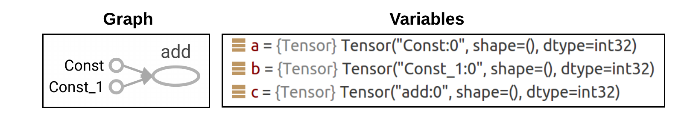
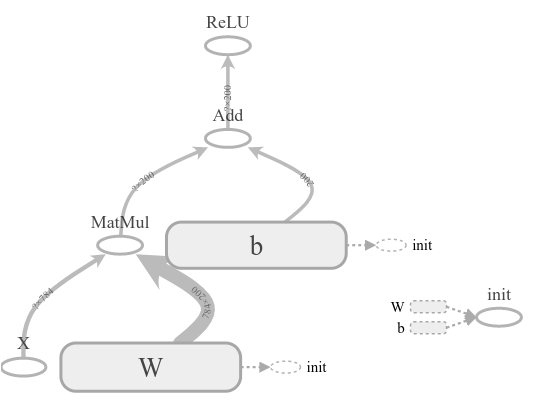

# 5.3.2.     Tensorflow Types

TensorFlow는 성능과 사용 편의성을 위해 자체 데이터 구조를 가지고 있습니다. Tensor는 Tensorflow에서 사용되는 데이터 구조입니다. TensorFlow는 computational graph에서 텐서의 흐름\(flow of tensors\) 이라는 것을 기억하십시오. TensorFlow의 핵심은 TensorFlow입니다. TensorFlow 프로그램은 텐서 데이터 구조를 사용하여 모든 데이터를 나타냅니다. computational graph의 연산 간에는 오직 텐서만 전달됩니다. TensorFlow에서 Tensor는  n 차원 배열 또는리스트로 생각할 수 있습니다.

텐서플로우에는 세 가지의 핵심 데이터 구조인 상수\(Constant\), 변수\(Variable\), 플레이스홀더\(Placeholder\)가 있습니다.

**1\)    Constant**

이름 constant 그 자체로 말하듯이 상수는 상수로 사용됩니다. 그들은 값을 가지며 변경되지 않는 노드를 만듭니다. 단순히 tf.constant를 사용하여 상수 텐서를 만들 수 있습니다. 텐서플로우 상수는 다섯 가지 인수를 받아들일 수 있습니다:

```text
tf.constant(value, dtype=None, shape=None, name='Const', verify_shape=False)
```

앞에서 사용했던 두 개의 상수를 만들고 그것을 더하는 예제를 다시 살펴봅시다. 상수 텐서는 값으로 정의할 수 있습니다.

```python
# create graph
a = tf.constant(2)
b = tf.constant(3)
c = a + b
# launch the graph in a session
with tf.Session() as sess:
    print(sess.run(c))
```



위의 그림에서 우리는 "Python Name" a, b 및 c로 3 개의 텐서를 만들었습니다. "TensorFlow-Name"을 정의하지 않았으므로 TensorFlow는 그래프에서 처리 할 수있는 일반적인 기본 이름으로 처리합니다. const 및 const\_1을 입력 상수에 할당하고 더하기 연산의 출력을 추가합니다. 그러나 이 코드를 수정해서 아래와 같이 사용자 정의 이름 A, B로 다시 정의할 수 있습니다.

```python
# create graph
a = tf.constant(2, name='A')
b = tf.constant(3, name='B')
c = tf.add(a, b, name='Sum')
# launch the graph in a session
with tf.Session() as sess:
    print(sess.run(c))
```


상수는 다른 유형 \(정수, 부동 소수점 등\) 및 모양 \(벡터, 행렬 등\)으로 정의할 수도 있습니다. 다음 예는 32bit float type 상수와 2X2 shape의 상수를 사용하는 예입니다.

```python
s = tf.constant(2.3, name='scalar', dtype=tf.float32)
m = tf.constant([[1, 2], [3, 4]], name='matrix')
# launch the graph in a session
with tf.Session() as sess:
    print(sess.run(s))
    print(sess.run(m))
```

```text
2.3
[[1 2]
 [3 4]]
```

**2\)    VARIABLE**

변수는 현재 값을 출력하는 상태 저장 노드입니다. 이는 graph의 다양한 실행에 대한 값를 유지할 수 있음을 의미합니다.

상수는 graph 정의에 저장되어 메모리를 사용합니다. 즉, 수백만 개의 상수가 있다면 그래프를 느리게하고 리소스를 많이 사용합니다. 변수를 만드는 것은 하나의 operation입니다. 우리는 session에서 이러한 operation을 실행하고 operation의 출력 값을 가져옵니다.

변수를 만들려면 tf.Variable을 다음과 같이 사용해야합니다.

```python
# Create a variable.
w = tf.Variable(<initial-value>, name=<optional-name>)
```

스칼라 및 행렬 변수를 만드는 몇 가지 예는 다음과 같습니다.

```python
s = tf.Variable(2, name="scalar")
m = tf.Variable([[1, 2], [3, 4]], name="matrix")
W = tf.Variable(tf.zeros([784,10]))
```

위에 정의된 변수 W은 784 개의 행과 10 개의 열이있는 행렬을 생성하며이 열은 0으로 초기화됩니다. 이것은 784 개의 뉴런이있는 레이어에서 10 개의 뉴런이있는 레이어로의 feed-forward neural network \(또는 선형 회귀 모델\)의 가중치 행렬로 사용할 수 있습니다. tf.Variable \(\)에는 대문자 "V"를 사용하고 tf.constant에는 소문자 "c"를 사용합니다. 그 이유를 반드시 알 필요는 없지만 단순히 tf.constant가 연산이므로 tf.Variable은 여러 연산을 갖는 클래스라고 생각 하시면 됩니다.

TensorFlow에서는 tf.get\_variable을 사용하는 것이 좋습니다. tf.get\_variable은 인수로 이름, 모양 등을 다음과 같이 더 많이 받아들일 수 있습니다.

```python
tf.get_variable(name,
                shape=None,
                dtype=None,
                initializer=None,
                regularizer=None,
                trainable=True,
                collections=None,
                caching_device=None,
                partitioner=None,
                validate_shape=True,
                use_resource=None,
                custom_getter=None,
                constraint=None)
```

이전 예제를 tf.get\_variable 를 사용하여 수정하면 다음과 같이 됩니다.

```python
s = tf.get_variable("scalar", initializer=tf.constant(2))
m = tf.get_variable("matrix", initializer=tf.constant([[0, 1], [2, 3]]))
W = tf.get_variable("weight_matrix", shape=(784, 10), initializer=tf.zeros_initializer())
```

대부분의 프로그래밍 언어와 마찬가지로 변수는 사용하기 전에 초기화해야합니다. 변수를 초기화하려면 변수 초기화 작업을 호출하고 세션에서 작업을 실행해야합니다. 

```python
a = tf.get_variable(name="var_1", initializer=tf.constant(2))
b = tf.get_variable(name="var_2", initializer=tf.constant(3))
c = tf.add(a, b, name="Add1")
# launch the graph in a session
with tf.Session() as sess:
    # now let's evaluate their value
    print(sess.run(a))
    print(sess.run(b))
    print(sess.run(c))
```


위의 그림은 두 개의 파란색 상자 A,B ****가 생성되어 변수를 나타냅니다 \(앞 설명의 상수 노드와 비교\). 이 두 변수는 "Add" operation을 사용하여 함께 더해집니다.

변수는 일반적으로 신경망에서 biases 및 weights에 사용됩니다. weights는 일반적으로 tf.truncated\_normal\_initializer\(\)를 사용하여 정규 분포에서 초기화됩니다. biases는 일반적으로 tf.zeros\_initializer \(\)를 사용하여 0으로 초기화됩니다.

적절한 초기화를 통해 weight 와 bias 변수를 만드는 간단한 예제를 살펴 보겠습니다.

다 예제는 3 개의 뉴런을 가진 다른 레이어에 2 개의 뉴런이있는 fully-connected 레이어에 대한 weight 및 bias 매트릭스를 만듭니다. 이 시나리오에서 가중치 및 바이어스 변수는 각각 크기 \[2, 3\] 및 3이어야합니다.

```python
# create graph
weights = tf.get_variable(name="W", shape=[2,3], initializer=tf.truncated_normal_initializer(stddev=0.01))
biases = tf.get_variable(name="b", shape=[3], initializer=tf.zeros_initializer())

# add an Op to initialize global variables
init_op = tf.global_variables_initializer()

# launch the graph in a session
with tf.Session() as sess:
    # run the variable initializer
    sess.run(init_op)
    # now we can run our operations
    W, b = sess.run([weights, biases])
    print('weights = {}'.format(W))
    print('biases = {}'.format(b))
```

```text
weights = [[-0.00376599 -0.00506956  0.00082394]
 [ 0.0016487   0.00981423 -0.00226094]]
biases = [0. 0. 0.]
```

**3\)    Placeholder**

Placeholder는 변수보다 더 기본적인 데이터 유형입니다. 그것은 미래의 시간에 데이터 유형를 결정하는 변수입니다. Placeholder는 실행 시간에 값이 공급되는 node입니다. 외부 데이터에 의존하는 네트워크에 대한 입력이 있고 그래프를 개발하는 동안 그래프가 실제 어떤 값에 의존하는 것을 원하지 않는다면 사용할 수ㅜ 있는 데이터 유형이 Placeholder입니다. 사실, 우리는 아무런 데이터 없이도 graph를 만들 수 있습니다. 따라서 Placeholder에는 초기 값이 필요하지 않습니다.  그래프는 데이터 유형 Placeholder와 텐서만으로 저장된 값을 가지고 있지 않아도 무엇을 계산할 지 알고 있게 됩니다.

Placeholder를 만드는 몇 가지 예는 다음과 같습니다.

```python
a = tf.placeholder(tf.float32, shape=[5])
b = tf.placeholder(dtype=tf.float32, shape=None, name=None)
X = tf.placeholder(tf.float32, shape=[None, 784], name='input')
Y = tf.placeholder(tf.float32, shape=[None, 10], name='label')
```

다음의 예제를 봅시다.

```python
a = tf.constant([5, 5, 5], tf.float32, name='A')
b = tf.placeholder(tf.float32, shape=[3], name='B')
c = tf.add(a, b, name="Add")
with tf.Session() as sess:
      print(sess.run(c))
```

위의 코드를 실행하면 오류가 발생합니다. Placeholder "b"가 비어 있으므로, "Add" 작업에서 상수 텐서 "a"에 비어있는 텐서를 add할 수 있는 방법이 없으므로 에러가 발생합니다. 이를 해결하기 위해 텐서 "b"에 입력 값을 공급해야합니다.  코드를 다음과 같이 수정해야합니다.

```python
a = tf.constant([5, 5, 5], tf.float32, name='A')
b = tf.placeholder(tf.float32, shape=[3], name='B')
c = tf.add(a, b, name="Add")
with tf.Session() as sess:
    # create a dictionary:
    d = {b: [1, 2, 3]}
    # feed it to the placeholder
    print(sess.run(c, feed_dict=d))
```

Placeholder로 전달되는 값을 가진 dictionary\(d\)를을 작성하고 이를 Placeholder로 전달해야 합니다 . 위의 예에서는 " feed\_dict " \[1, 2, 3\]을 Placeholder로 전달합니다.


**4\)신경망\(Neural Network\)의 생성**

지금까지 하나의 hidden 레이어와 200 개의 hidden 유닛\(뉴런\)으로 피드 포워드 \(feed-forward\) 신경망을 구축하기 위해 필요한 모든 자료를 확보했습니다. Tensorflow의 computational graph는 다음과 같이 표현할 수 있습니다.


위의 그래프에서 몇 개의 op\(또는 node\)를 확인할 수 있습니까? 세 개의 원 \(X, W, b\)과 세 개의 직사각형이므로 6개 입니까? 지금까지 배운 텐서플로우의 지식으로 각각을 검토하고 그것을 구현하는 가장 좋은 방법을 논의할 것입니다.

‌입력 X는 이미지, 신호 등과 같이 현실 세계에서 발생하는 모든 유형의 입력이 될 수 있습니다.

‌일반적인 머신러닝 접근법으로 생각해 보면, 네트워크에 모든 입력 X를 공급하고 오류 신호를 역 전파하여 학습 가능한 매개 변수\(여기서는 W 및 b\)를 훈련시키는 것 입니다. 이상적으로는 모든 입력을 함께 공급하고 오류를 계산하고 매개 변수를 업데이트해야합니다. 이 과정을 "경사하강법\(Gradient Descent\)"이라고 합니다. 이전 공부했던 5.2 섹션을 기억 하십시요.

‌`참고 사항 : 위의 식에 현실세계 문제를 실제로 대입하려면 수천 수백만 개의 입력 값 X를 필요로 합니다. 그러한 계산을 한꺼번에 하려면 많은 컴퓨터 자원(프로세서, 메모리 등)이 필요하기 때문에 이러한 "경사하강법"은 비용이 많이 들어 갑니다. 그래서 입력 세트를 크기 B (mini-batch size라고 함) 입력의 몇 가지 작은 조각 (mini-batch라고 함)으로 분할하여 하나씩 차례로 공급하는 것입니다. 이것은 "확률적 경사 하강법(Stochastic Gradient Descent)"이라고 부릅니다. 크기 B의 각 미니 배치를 네트워크에 공급하고, 오류를 역 전파하고, 매개 변수 (가중치 및 바이어스)를 업데이트하는 프로세스를 반복(iteration)이라고합니다.`

‌context에서 실제 값없이 graph 를 만들 수 있도록 일반적으로 입력 X에 Placeholder를 사용합니다. 유일하게 고려해야 할 점은 입력에 알맞은 크기를 선택해야한다는 것입니다. 여기서는 피드 포워드 \(feed-forward\) 신경망을 사용하고 784 크기의 입력 \(MNIST 데이터의 28x28 이미지와 유사\)을 가정 해 봅시다. 입력 Placeholder는 다음과 같이 작성할 수 있습니다.

```text
# create the input placeholder
X = tf.placeholder(tf.float32, shape=[None, 784], name="X")
```

왜 shape = \[None, 784\] 일까요?

각 학습 iteration에서 784 개의 B 이미지를 하나의 배치로 네트워크에 공급해야 한다면 placeholder는 shape = \[B, 784\] 라고 써야 합니다. placeholder shape를 \[None, 784\]로 정의하면 크기가 784인 이미지를 여러가지로 제공할 수 있음을 의미합니다. 이는 특히 네트워크에 모든 유효성 검사 또는 테스트 이미지를 제공하고 모든 이미지의 성능을 계산해야하는 평가에 유용합니다.

네트워크 매개 변수인 W 및 b를 생각해 봅시다. 위의 변수 섹션에서 설명한 것처럼 W 및 b는 변수로 정의해야 합니다. Tensorflow에서는 그라디언트 업데이트가 기본적으로 그래프 변수에 적용됩니다. 앞에서 언급했듯이 변수를 초기화해야합니다.

`* 참고 : 일반적으로 weight (W)는 무작위로 초기화됩니다. 이는 평균 분포가 0이고 표준 편차가 0.01 인 정규 분포에서 가장 간단한 형식입니다. biase(b)는 작은 상수 값 (예 : 0)으로 초기화 할 수 있습니다.`

입력 차원이 784이고 200 개의 숨겨진 단위가 있으므로 weight 행렬의 크기는 \[784, 200\]입니다. 우리는 또한 hidden 유닛마다 하나씩 200 개의 biase이 필요합니다. 코드는 다음과 같이 작성할 수 있습니다.

```python
# create weight matrix initialized randomely from N(0, 0.01)
weight_initer = tf.truncated_normal_initializer(mean=0.0, stddev=0.01)
W = tf.get_variable(name="Weight", dtype=tf.float32, shape=[784, 200], initializer=weight_initer)
# create bias vector of size 200, all initialized as zero
bias_initer =tf.constant(0., shape=[200], dtype=tf.float32)
b = tf.get_variable(name="Bias", dtype=tf.float32, initializer=bias_initer)
```

텐서 크기 \[None, 200\]에 입력 X \_ {\[None, 784\]}와 weight 행렬 W \_ {\[784, 200\]}을 곱해야하고, bias 벡터 b \_ {\[200\]}를 더하고 최종적으로 ReLU non-linearity 으로부터 최종 텐서를 전달해야 합니다.

```python
# create MatMul node
x_w = tf.matmul(X, W, name="MatMul")
# create Add node
x_w_b = tf.add(x_w, b, name="Add")
# create ReLU node
h = tf.nn.relu(x_w_b, name="ReLU")
```

이를 그림으로 표현하면 다음과 같을 것입니다.



임의의 픽셀 값에 의해 생성된 100 개의 이미지를 사용하여 세션을 실행하고 hidden 유닛 \(h\)의 출력을 얻어야 합니다. 전체 코드는 다음과 같습니다.

```python
# import the tensorflow library
import tensorflow as tf
import numpy as np
# create the input placeholder
X = tf.placeholder(tf.float32, shape=[None, 784], name="X")
weight_initer = tf.truncated_normal_initializer(mean=0.0, stddev=0.01)
# create network parameters
W = tf.get_variable(name="Weight", dtype=tf.float32, shape=[784, 200], initializer=weight_initer)
bias_initer =tf.constant(0., shape=[200], dtype=tf.float32)
b = tf.get_variable(name="Bias", dtype=tf.float32, initializer=bias_initer)
# create MatMul node
x_w = tf.matmul(X, W, name="MatMul")
# create Add node
x_w_b = tf.add(x_w, b, name="Add")
# create ReLU node
h = tf.nn.relu(x_w_b, name="ReLU")
# Add an Op to initialize variables
init_op = tf.global_variables_initializer()
# launch the graph in a session
with tf.Session() as sess:
    # initialize variables
    sess.run(init_op)
    # create the dictionary:
    d = {X: np.random.rand(100, 784)}
    # feed it to placeholder a via the dict
    print(sess.run(h, feed_dict=d))
```

이 코드를 실행하면 100 개의 이미지에 대한 응답으로 200 개의 hidden 유닛의 출력 인 h\_ {\[100, 200\]}이 출력됩니다. 즉 100 개의 이미지에서 200 개의 features가 추출됩니다.

```text
[[-0.         -0.          0.08865427 ... -0.         -0.
  -0.        ]
 [-0.         -0.          0.16590588 ... -0.          0.06318514
  -0.        ]
 [-0.         -0.          0.24886328 ...  0.03363053  0.27378294
  -0.        ]
 ...
 [-0.         -0.          0.3085611  ...  0.07188627  0.12707354
  -0.        ]
 [ 0.02798695 -0.          0.06878183 ...  0.06135564  0.04096585
  -0.        ]
 [-0.         -0.          0.11959157 ...  0.0788087   0.09157152
  -0.        ]]

```


Reference: [https://www.easy-tensorflow.com/tf-tutorials/basics/tensor-types](https://www.easy-tensorflow.com/tf-tutorials/basics/tensor-types)

