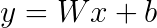
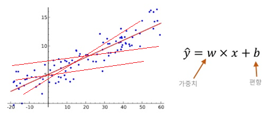
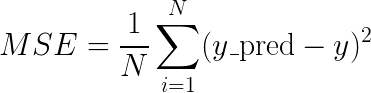
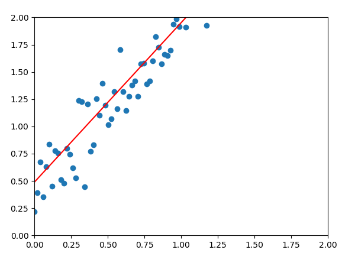

# 5.3.4.     선형 회귀

딥러닝을 이해하기 위해 가장 기본적인 두가지 수학 계산 원리를 반드시 이해해야 합니다. 그 두가지가 선형 회귀와 로지스틱 회귀입니다. 통계학에서, 회귀 분석\(regression analysis\)은 관찰된 연속형 변수들에 대해 두 변수 사이의 모형을 구한뒤 적합도를 측정해 내는 분석 방법입니다. 통계학에서, 회귀분석이란 관찰된 연속형 변수들에 대해 두 변수 사이의 모형을 구한뒤 적합도를 측정해 내는 분석 방법입니다. 회귀 분석\(regression analysis\)은 입력 자료\(독립 변수\) x 와 이에 대응하는 출력 자료\(종속 변수\) y 간의 관계를 정량화 하기 위한 작업입니다.

회귀분석은 시간에 따라 변화하는 데이터나 어떤 영향, 가설적 실험, 인과 관계의 모델링등의 통계적 예측에 이용될 수 있습니다.

**1\)    선형 회귀\(Linear Regression\)**

**선형** **회귀** **분석**은 종속 변수 y와 한 개 이상의 독립 변수 X와의 선형 상관 관계를 모델링하는 회귀분석 기법입니다. 선형 회귀 분석은 머신러닝의 기초로서 다양한 분야에 적용할 수 있습니다. 예를들어 몸무게와 나이 데이터로 고혈압과의 상관 관계를 구하거나, 집의 평수와 건축 년도등의 데이터로 집 값을 예측하는 분석 시스템에 사용됩니다. 일반적으로 선형 회귀는 다음과 같은 방정식과 그림으로 표현됩니다.





위의 선형 회귀 방정식을 보면 여러 반복을 통해 slope\(weight\)\(W\)와 bias\(b\)의 기울기를 학습하는 그래프를 작성하는 것으로 시작합니다. 회귀분석을 한다는 것은 x 변수, y 변수를 지정하고 통계 툴이 최소제곱법을 이용해 회귀식 y = wx + b에서 w와 b를 구하는 과정을 말합니다. 회귀식에서 w를 회귀계수, b를 y절편이라고 부릅니다. w는 가중치의 역할을 하기 때문에 x가 y에 얼마나 영향을 주는지 그 크기와 방향을 알 수 있게 해주고, b는 절편의 역할을 하기 때문에 y = wx 라는 회귀선을 얼마나 위 또는 아래로 평행이동 시키는지를 정합니다. 여기서 y는 종속 변수이고 x는 독립 변수입니다. 따라서 선형 회귀 분석에서 변수 x의 변화는 변수 y의 변화를 일으키므로 기울기 w과 절편 값 b의 적절한 값을 찾아 모든 x에 대해 y의 정확한 예측 값을 얻는 것이 목표입니다. 각 반복에서 실제 입력 y와 예측된 y를 비교하여 차이를 줄이는 것을 목표로 합니다. 즉 선형 회귀 분석이란 x의 입력이 우리에게 원하는 y를 제공하도록 W와 b를 수정하여 최상의 적합한 선을 찾는 것입니다.

잔차란 관측값의 y와 예측값의 y 간의 차이를 잔차라고 하는데 예를 들어 A\(1, 4\)과 B\(2, 3\)라는 2개의 점이 있다고 하고, 회귀식이 y = 2x + 1 이라면 점 A의 관측값 y는 4, 예측값 y는 3이고 점 B의 관측값 y는 3, 예측값 y는 5입니다. 이때 A의 잔차는 4 - 3 = 1이고 B의 잔차는 3 - 5 = -2 가 됩니다. 최소제곱법은 잔차의 제곱의 합이 최소가 되도록 하는 직선을 회귀선으로 한다는 것을 의미합니다. 그렇다면 위의 예에서 잔차의 제곱의 합은 5입니다. 이 방법은 Cost\(오차\)를 구하는데 효과적입니다. 회귀식을 바꿔가면서 잔차의 제곱의 합이 최소가 되게 하는 직선을 찾는 것이 선형 회귀분석입니다.

다음의 예제를 실습해 보면서 선형회귀를 이해해 봅시다.

**Generating Dataset**

```python
def generate_dataset():
  x_batch = np.linspace(0, 2, 100)
  y_batch = 1.5 * x_batch + np.random.randn(*x_batch.shape) * 0.2 + 0.5
  return x_batch, y_batch
```

우선 x와 y라는 데이터 세트를 생성합니다. x와 y의 각 값을 그래프상의 점으로 생각할 수 있습니다.

x\_batch에 입력 값을 제공 합니다.  numpy에서 지원하는 np.linspace를 사용하여  0과 2 사이의 값으로 100개의 점을 생성하고 균등하게 분산 시킵니다. W\(가중치\) 값과 b\(바이어스\) 값을 지정 해야 하는데 임의로 W = 1.5, b = 0.5로 지정합니다. 함수 y의 결과 값 y\_batch는은 np.random.randn\(\)을 사용하여 1.5\(W\)의 그래디언트와 임의의 그래디언트를 갖도록 y를 생성합니다.

파이썬에서 Asterisk\(\*\)는 다음과 같은 상황에서 사용되는데 크게 4가지의 경우가 있습니다.

* 곱셈 및 거듭제곱 연산으로 사용할 때
* 리스트형 컨테이너 타입의 데이터를 반복 확장하고자 할 때
* 가변인자 \(Variadic Arguments\)를 사용하고자 할 때
* 컨테이너 타입의 데이터를 Unpacking 할 때

위에서 사용된 np.random.randn\(\*x\_batch.shape\)에서 \*의미는 가변 인자를 의미합니다. 즉 100개의 난수를 발생시키라는 의미입니다.

리턴값은 numpy 배열 x\_batch와 y\_batch입니다. 생성되는 데이터가 궁금하다면 다음 코드를 실행 해 봅니다.

```python
import numpy as np
import tensorflow as tf
import matplotlib.pyplot as plt

def generate_dataset():
  x_batch = np.linspace(0, 2, 100)
  y_batch = 1.5 * x_batch + np.random.randn(*x_batch.shape) * 0.2 + 0.5
  return x_batch, y_batch


x_batch, y_batch = generate_dataset()
plt.scatter(x_batch, y_batch)
plt.show()
```


우리가 원하는 형태로 입력, 출력 값들이 분포되었습니다.


**Constructing the TensorFlow Graph**

다음으로 W와 b를 계산하는 데 사용되는 TensorFlow graph를 linear\_regression\(\) 함수로 만듭니다. 

수식 y = Wx + b에서 x와 y는 TensorFlow의 placeholder로 표현된 노드입니다.

```python
def linear_regression():
     x = tf.placeholder(tf.float32, shape=(None,), name='x')
     y = tf.placeholder(tf.float32, shape=(None,), name='y')

     with tf.variable_scope('lreg') as scope:
         w = tf.Variable(np.random.normal(), name='W')
         b = tf.Variable(np.random.normal(), name='b')
         y_pred = tf.add(tf.multiply(w, x), b)
         loss = tf.reduce_mean(tf.square(y_pred - y))

     return x, y, y_pred, loss
```

2행 tf.placeholder의 첫 번째 인수에서 데이터 유형을 placeholder의 공통 데이터 유형 인 float32로 정의합니다. 두 번째 인수는 placeholder의 shape=\(None,\) 으로 설정하여 training time 중에 그 값을 결정하도록 합니다. 세 번째 인수는 placeholder의 이름을 w, b로 설정합니다.

with tf.variable\_scope\('lreg'\) as scope:

5 행은 w, b 변수에 대한 변수 범위\(Variable scope\)를 정의합니다. 즉, 변수 범위\(Variable scope\)를 사용하면 이름 충돌을 피하기 위해 변수의 이름을 계층 구조로 지정할 수 있습니다.

변수가 정의되더라도 해당 값을 사용하여 연산을 실행하려면 먼저 변수를 명시적으로 초기화해야합니다. W가 실제로하는 일은 우리가 가장 잘 맞는 선의 그라디언트를 찾는 것입니다. 이전 챕터의 Gradient Descent을 확인해 보십시오. 선형 회귀 분석에서 최적의 경사도\(Gradient\)를 찾는 것이 주 목적이므로 W를 초기화하는 위치에 관계없이 Cost 함수가 항상 최소 Cost 값 하나를 산출해야 합니다.

b = tf.Variable \(np.random.normal \(\), name = 'b'\)

7행에서 W가 아닌 bias b 를 training 시켜야 합니다.

y\_pred = tf.add \(tf.multiply \(w, x\), b\)

8행에서 x, y 및 W를 개별적으로 정의한 후에 이제 이들을 결합합니다. 수식 y = Wx + b을 구현하기 위해 tf.add 와 tf.multiply를 사용하여 정의합니다. y\_pred는 예측된 y 값을 나타냅니다.

loss = tf.reduce\_mean \(tf.square \(y\_pred - y\)\)



y\_pred를 계산한 후 예측된 y가 생성된 y와 얼마나 멀리 떨어져 있는지 알기 위해 차이를 계산하는 손실\(loss, cost\) 함수를 설계 해야합니다. 여기서는 MSE \(Mean Squared Error\) L2 손실 함수를 " scoring mechanism "으로 선택했습니다.

MSE의 구현을 이해하기 위해 먼저 y\_pred - y를 사용하여 y\_pred와 y에 대한 100 개의 점 사이의 차이를 구하고 그것들을 제곱하여 \(tf.square\) 그들의 차이를 증폭시켜 차이를 크게 만듭니다.

tf.reduce\_mean을 사용하여 100 개의 모든 값의 평균을 찾고 이를 손실로 정합니다.


**Computing the Graph**

이제 전체 프로그램 소스 코드를 확인해 봅시다.

```python
 import numpy as np
 import tensorflow as tf
 import matplotlib.pyplot as plt

 def generate_dataset():
  x_batch = np.linspace(0, 2, 100)
  y_batch = 1.5 * x_batch + np.random.randn(*x_batch.shape) * 0.2 + 0.5
  return x_batch, y_batch


 def linear_regression():
     x = tf.placeholder(tf.float32, shape=(None,), name='x')
     y = tf.placeholder(tf.float32, shape=(None,), name='y')

     with tf.variable_scope('lreg') as scope:
         w = tf.Variable(np.random.normal(), name='W')
         b = tf.Variable(np.random.normal(), name='b')
         y_pred = tf.add(tf.multiply(w, x), b)
         loss = tf.reduce_mean(tf.square(y_pred - y))

     return x, y, y_pred, loss


 def run():
     x_batch, y_batch = generate_dataset()
     x, y, y_pred, loss = linear_regression()

     optimizer = tf.train.GradientDescentOptimizer(0.1)
     train_op = optimizer.minimize(loss)

     with tf.Session() as session:
         session.run(tf.global_variables_initializer())
         feed_dict = {x: x_batch, y: y_batch}

         for i in range(30):
             session.run(train_op, feed_dict)
             print(i, "loss:", loss.eval(feed_dict))

         print('Predicting')
         y_pred_batch = session.run(y_pred, {x: x_batch})

     plt.scatter(x_batch, y_batch)
     plt.plot(x_batch, y_pred_batch, color='red')
     plt.xlim(0, 2)
     plt.ylim(0, 2)
     plt.show()
     #plt.savefig('plot.png')


 if __name__ == "__main__":
     run()
```

generate\_dataset \(\) 및 linear\_regression \(\)을 사용하여 이제 프로그램을 실행하고 최적의 gradient W 및 bias b를 찾을 준비가되었습니다.

```python
 x_batch, y_batch = generate_dataset()
 x, y, y_pred, loss = linear_regression()
 optimizer = tf.train.GradientDescentOptimizer(0.1)
 train_op = optimizer.minimize(loss)
```

손실\(loss, cost\)를 최소화하기 위해 optimiser를 정의합니다. 선택할 수있는 몇 가지 최적화 도구 중에 Gradient Descent 알고리즘을 선택하고 학습 속도를 0.1로 설정했습니다. GradientDescentOptimizer의 인수는 사용할 learning rate입니다.

간단히 말해서 optimiser의 임무는 cost를 최소화하는 것입니다. 실행될 때마다 최적 솔루션의 방향으로 학습 가능한 변수 \(W 및 b\)를 업데이트함으로써 동작 합니다.

Minimize\(\) 함수를 호출하면 그라디언트가 계산되어 변수에 적용됩니다. 이는 기본 동작이며 var\_list 인수를 사용하여 자유롭게 변경할 수 있습니다.

`with tf.Session() as session:`

`session.run(`[tf.global\_variables\_initializer\(\)](https://www.tensorflow.org/api_docs/python/tf/initializers/global_variables)`)`

그런 다음 모든 변수를 초기화하여 첫 번째 세션을 시작합니다.

`feed_dict = {x: x_batch, y: y_batch}`

실제 TensorFlow의 session.run 은 다음과 같은 인수들을 받을 수 있습니다.

```text
run(
     fetches,
     feed_dict=None,
     options=None,
     run_metadata=None
 )
```

실제 실행이 되는 시점의 sess.run\(\)에서 feed\_dict 인수로 데이터를 feed 하여 사용하게 됩니다. feed\_dict 인수를 사용하면 그래프의 텐서 값 \(스칼라, 문자열, 목록, 숫자 배열 또는 tf.placeholder, 예 : x 및 y\)을 무시할 수 있습니다. x와 y는 placeholder이고 x\_batch와 y\_batch는 session이 실행 되는 중에 placeholder를 채울 준비가 된 값입니다.

fetches는 텐서플로우 graph의 operation을 session에서 실행 하기 위해 넘겨주는 opration, tensor 등이 될 수 있습니다.

`for i in range(30):`

변수를 초기화하고 feed\_dict를 사용하여 placeholder에 대한 값을 준비한 후 이제 스크립트의 핵심 부분으로 이동하여 weight\(W\)와 bias\(b\)를 train 하려는 횟수를 정의합니다.

하나의 전체 사이클에서 훈련 데이터 \(x 및 y\)를 통과하는 횟수를 epoch 또는 training step 라고도합니다. 하나의 전체주기는 하나의 feed forward 및 하나의 back propagation 으로 정의됩니다.


Feedforward neural network 및 Backpropagation에 대해서는 위키피디아를 참고하기 바랍니다.

Feedforward neural network: [https://en.wikipedia.org/wiki/Backpropagation](https://en.wikipedia.org/wiki/Backpropagation)

Backpropagation: [https://en.wikipedia.org/wiki/Feedforward\_neural\_network](https://en.wikipedia.org/wiki/Feedforward_neural_network)


feedforward 중에 x, w 및 b의 값을 전달하여 예측된 y를 얻습니다. 이것은 숫자로 표현되는 loss\(cost\)를 계산한 것입니다.

이 그래프의 목적은 optimiser가 트레이닝 가능한 변수 \(W 및 b\)를 "조정"하기 위해 backpropagation를 수행하여 다음 feedforward를 수행할 때 손실\(loss\)를 낮추는 것입니다.

이 코드에서는 30번 학습을 시키지만 자유롭게 변경할 수 있습니다. 이값이 커질수록 손실\(loss\)값이 작아지는 것을 확인 할 수 있습니다.

session.run\(train\_op, feed\_dict\)

이제 session을 실행합니다. Operation 은 train\_op이고 제공되는 데이터는 feed\_dict에 들어 있습니다.

`print(i, “loss:”, loss.eval(feed_dict))`

각 training step 마다 손실\(loss\)을 화면에 출력합니다. 손실 값은 loss.eval\(\) 및 feed\_dict를 인수로 사용하여 계산됩니다. TensorFlow에는 그래프 목록을 평가하는 두 가지 방법이 있습니다. 변수 목록의 Session.run과 Tensor.eval입니다. Tensor.eval\(\)을 호출하는 것은 tf.get\_default\_session\(\).run \(tensor\)을 호출하는 것과 같습니다. 그러나 eval\(\)은 현재 단계에서의 값을 가져올 수 있다는 것입니다.

print\('Predicting'\)  
 y\_pred\_batch = session.run\(y\_pred, {x : x\_batch}\)

30 번의 학습 후에, 처음 값과 달라진 추론\(Inference\)된 W와 b를 가지게 됩니다. 트레이닝과 마찬가지로 추론은 session.run\(\)을 사용하여 동일한 그래프로 수행할 수 있지만 이번에는 페치가 train\_op 대신 y\_pred가되고 x를 입력하면 됩니다. W와 b는 이미 훈련되었고 예측된 y는 x로 계산될 수 있기 때문에 이렇게 수행합니다.

y\_pred 를 구하는 tf.add\(tf.multiply\(w, x\), b\)에 y가 없다는 것을 생각 하십시오.

지금까지 3 개의 session.run\(\)을 선언했는데 다시 한번 session.run\(\)을 어떻게 사용했는지 정리해 보겠습니다. 처음으로 우리가 한 일은 우리의 변수를 초기화하는 것이 었습니다. 두 번째는 feed\_dict를 전달하고 세 번째는 예측을 실행하는 것입니다.

```text
plt.scatter(x_batch, y_batch)
plt.plot(x_batch, y_pred_batch, color='red')
plt.xlim(0, 2)
plt.ylim(0, 2)
plt.show()
#plt.savefig('plot.png')
```

**Predicting**

생성된 x\_batch 및 y\_batch와 예측된 선 \(x\_batch 및 y\_pred\_batch 포함\)으로 차트를 그립니다

학습이 반복될수록 loss 값이 줄어 드는 것을 확인 할 수 있습니다.

```text
20 loss: 0.043225072
21 loss: 0.043008752
22 loss: 0.042805683
23 loss: 0.04261506
24 loss: 0.042436123
25 loss: 0.042268157
26 loss: 0.04211048
27 loss: 0.041962486
28 loss: 0.041823555
29 loss: 0.04169314
```



그러나 실생활에서 모든 원인과 결과가 직선에 그래프에 알맞게 나타나지는 않습니다. 그래서 정확도가 떨어질 수 있습니다. 이 부분을 보완할 수 있는 것이 로지스틱 회귀입니다.

\*\*\*\*

