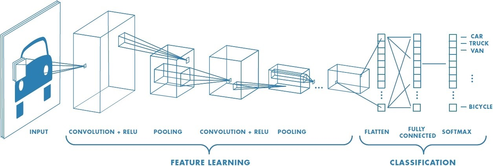

# 5.4.2. 	CNN\(Convolutional Neural Network\)

CNN을 사용하여 Keras로 MNIST 손글씨 인식 예제를 풀어 봅니다. CNN \(convolutional neural network\)은 딥러닝은 한 종류로 주로 이미지를 인식하는데 사용됩니다.

CNN은 이미지에서 객체, 얼굴, 장면을 인식하기 위해 패턴을 찾는 데 특히 유용합니다. CNN은 데이터에서 직접 학습하며, 패턴을 사용하여 이미지를 분류하고 특징을 수동으로 추출할 필요가 없습니다.

자율 주행 자동차, 얼굴 인식 애플리케이션과 같이 객체 인식과 컴퓨터 비전이 필요한 분야에서 CNN을 많이 사용합니다. 응용 분야에 따라 CNN을 처음부터 만들 수도 있고, 데이터셋으로 사전 학습된 모델을 사용할 수도 있습니다.

CNN은 이미지 인식과 패턴 감지를 위한 최적의 아키텍처를 제공합니다. CNN은 발전을 거듭해 온 GPU와 병렬 컴퓨팅과 함께 활용되어 자율 주행과 얼굴 인식 기술이 새롭게 등장하는 발판을 마련했습니다. 일례로 딥러닝 애플리케이션은 CNN을 통해 수천 개의 병리학 보고서를 분석하여 암세포를 시각적으로 검출합니다. 자율 주행 자동차가 객체를 감지하고 도로 표지판과 보행자의 차이를 구분할 수 있는 것도 바로 CNN 덕분입니다.

CNN은 다른 신경망과 마찬가지로 입력 계층, 출력 계층 및 두 계층 사이의 여러 은닉 계층으로 구성됩니다.


각 계층은 해당 데이터만이 갖는 특징을 학습하기 위해 데이터를 변경하는 계산을 수행합니다. 가장 자주 사용되는 계층으로는 컨벌루션, 활성화/ReLU, 풀링이 있습니다.

**컨벌루션**은 각 이미지에서 특정 특징을 활성화하는 컨벌루션 필터 집합에 입력 이미지를 통과시킵니다.

**ReLU\(Rectified Linear Unit\)**는 음수 값을 0에 매핑하고 양수 값을 유지하여 더 빠르고 효과적인 학습을 가능하게 합니다. 이때 활성화된 특징만 다음 계층으로 전달되기 때문에 이 과정을 활성화라 부르기도 합니다.

**풀링**은 비선형 다운샘플링을 수행하고 네트워크에서 학습해야 하는 매개 변수 수를 줄여서 출력을 간소화합니다.

이러한 작업이 수십 개 또는 수백 개의 계층에서 반복되어 각 계층이 여러 특징을 검출하는 방법을 학습하게 됩니다.



여러 개의 컨벌루션 계층으로 구성된 네트워크의 예. 필터는 각 학습 이미지에 서로 다른 해상도로 적용되고, 필터의 출력은 다음 계층의 입력으로 활용됩니다.

Keras 를 사용하는 코드 순서도 위의 CNN구조와 일치 합니다. 직관적이어서 이해가 빠릅니다.

```python
 import sys
 import tensorflow as tf
 import keras
 from keras.models import Sequential
 from keras.layers import Dense, Dropout, Flatten
 from keras.layers.convolutional import Conv2D, MaxPooling2D
 import numpy as np

 img_rows = 28
 img_cols = 28

 (x_train, y_train), (x_test, y_test) = keras.datasets.mnist.load_data()

 input_shape = (img_rows, img_cols, 1)
 x_train = x_train.reshape(x_train.shape[0], img_rows, img_cols, 1)
 x_test = x_test.reshape(x_test.shape[0], img_rows, img_cols, 1)

 x_train = x_train.astype('float32') / 255.
 x_test = x_test.astype('float32') / 255.

 print('x_train shape:', x_train.shape)
 print(x_train.shape[0], 'train samples')
 print(x_test.shape[0], 'test samples')

 batch_size = 128
 num_classes = 10
 epochs = 12  #여러번 학습하면 좋겠지만 시간관계상 3번만 학습하고 결과를 확인합니다.

 y_train = keras.utils.to_categorical(y_train, num_classes)
 y_test = keras.utils.to_categorical(y_test, num_classes)

 model = Sequential()
 model.add(Conv2D(32, kernel_size=(5, 5), strides=(1, 1), padding='same', activation='relu', input_shape=input_shape))
 model.add(MaxPooling2D(pool_size=(2, 2), strides=(2, 2)))
 model.add(Conv2D(64, (2, 2), activation='relu', padding='same'))
 model.add(MaxPooling2D(pool_size=(2, 2)))
 model.add(Dropout(0.25))
 model.add(Flatten())
 model.add(Dense(1000, activation='relu'))
 model.add(Dropout(0.5))
 model.add(Dense(num_classes, activation='softmax'))
 model.summary()

 model.compile(loss='categorical_crossentropy', optimizer='adam', metrics=['accuracy'])
 hist = model.fit(x_train, y_train, batch_size=batch_size, epochs=epochs, verbose=1, validation_data=(x_test, y_test))

 score = model.evaluate(x_test, y_test, verbose=0)
 print('Test loss:', score[0])
 print('Test accuracy:', score[1])
```

60,000개 전체를 12번 학습하는데 많은 시간이 소요됩니다.

결과는 99.14% 정확도가 나옵니다.

`Test loss: 0.02729845507494465`

`Test accuracy: 0.9914`

학습의 결과를 그림으로 확인해 보고 싶다면 위의 코드 아래에 다음과 같은 코드를 추가합니다. 16개의 학습 결과를 비교합니다.

```python
 import random
 import matplotlib.pyplot as plt

 predicted_result = model.predict(x_test)
 predicted_labels = np.argmax(predicted_result, axis=1)

 test_labels = np.argmax(y_test, axis=1)

 count = 0

 plt.figure(figsize=(12,8))
 for n in range(16):
     count += 1
     plt.subplot(4, 4, count)
     plt.imshow(x_test[n].reshape(28, 28), cmap='Greys', interpolation='nearest')
     tmp = "Label:" + str(test_labels[n]) + ", Prediction:" + str(predicted_labels[n])
     plt.title(tmp)

 plt.tight_layout()
 plt.show()
```


