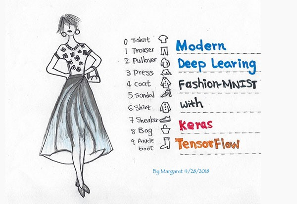

# 5.4.3. 	Fashion MNIST with Keras

이 예제에서는 Fashion MNIST 데이터 세트에 Keras를 사용하여 단순한 Convolutional Neural Network \(CNN\)를 교육하여 패션 이미지와 카테고리를 분류하는 방법을 학습합니다.

물론 이 소스도 다음 주소의 사이트에서 발췌 해 왔습니다.

[https://www.pyimagesearch.com/2019/02/11/fashion-mnist-with-keras-and-deep-learning/](https://www.pyimagesearch.com/2019/02/11/fashion-mnist-with-keras-and-deep-learning/)

Fashion MNIST 데이터 세트는 MNIST 데이터 세트와 유사한 학습도구입니다.

Fashion MNIST 데이터 세트는 다음을 포함합니다:

* 60,000 training examples
* 10,000 testing examples
* 10 classes
* 28×28 grayscale/single channel images

10개의 패션 클라스는 다음과 같이 분류되어 있습니다:

1. T-shirt/top
2. Trouser/pants
3. Pullover shirt
4. Dress
5. Coat
6. Sandal
7. Shirt
8. Sneaker
9. Bag
10. Ankle boot

Fashion MNIST 데이터 세트는 전자 상거래 회사 인 Zalando에 의해 만들어졌습니다. 그들이 패션 MNIST 데이터 세트에 대한 공식 GitHub에서 언급했듯이, 표준 MNIST 숫자 인식 데이터 세트에는 몇 가지 문제점이 있습니다.

MNIST 데이터로 표준 머신러닝 알고리즘을 사용하여 97 % 이상의 정확도를 얻는 것은 너무 쉽습니다. 딥러닝 모델이 99 % 이상의 정확도를 달성하는 것도 쉽습니다. 즉 데이터 세트가 남용되었습니다. 또한 MNIST는 최신 컴퓨터 비전 작업을 표현할 수 없습니다.

따라서 Zalando는 MNIST의 대체품으로 Fashion MNIST 데이터 세트를 만들었습니다.

Fashion MNIST 데이터 세트는 교육 세트 크기, 테스트 세트 크기, 클래스 라벨 수 및 이미지 크기 등이 MNIST 데이터 세트와 동일합니다.

MNIST 숫자 데이터 세트를 테스트한 적이 있다면, 기본적으로 한두 줄의 코드를 변경하고 Fashion MNIST 데이터 세트에서 동일한 네트워크를 교육할 수 있습니다.

이전 MNIST 숫자 인식과 달리 본 예제에서는 OpenCV를 사용할 것입니다.

OpenCV\(Open Source Computer Vision\)은 인텔에서 개발한 실시간 컴퓨터 비전을 목적으로 한 프로그래밍 라이브러리입니다. 기초 영상처리서부터 고급 수준의 영상처리 까지 상당한 량의 알고리즘들이 함수로 구현되어 있는 실시간 이미지 프로세싱에 중점을 둔 라이브러리입니다.

만일 OpenCV가 설치되어 있지 않다면 pip 명령으로 설치하시기 바랍니다. Imutils도 설치해야 합니다. 반드시 onebook 가상환경에 설치하는 것을 기억하십시오.

`(onebook)C:\users\nains>pip install opencv-contrib-python`

`(onebook)C:\users\nains>pip install imutils`

Fashion MNIST 데이터 세트를 얻는 방법에는 두 가지가 있습니다.

Keras 딥러닝 라이브러리를 사용하는 경우, Fashion MNIST 데이터 세트는 실제로 Keras의 데이터 세트 모듈에 직접 빌드됩니다. 다른 방법으로는 공식 Fashion MNIST GitHub 저장소에서 디렉토리를 다운로드 할 수 있습니다.



이 예제는 2개의 Python파일로 이루어져 있습니다.

-       pyimagesearch/minivggnet.py: VGGNet 기반의 간단한 CNN이 포함되어 있는 파일

-       fashion\_mnist.py: Keras를 사용한 딥러닝으로 Fashion MNIST 분류를 위한 Python 스크립트. 이 스크립트는 데이터를 로드하고 MiniVGGNet 모델을 교육합니다. 트레이닝이 끝나면 분류 보고서와 몽타주가 생성됩니다.

**간단한 Convolutional Neural Network \(CNN\)** **정의**

Fashion MNIST 데이터 세트에 대해 훈련할 수있는 매우 간단한 CNN을 정의 할 것입니다. 간략하게 이 CNN을 "MiniVGGNet"이라고 부릅니다. 이 모델에는 다음과 같은 VGGNet 특성이 있습니다.

-       3 × 3 CONV 필터 만 사용

-       Max-Pooling 작업을 적용하기 전에 여러 CONV 레이어 Stacking

새 파일을 열고 이름을 minivggnet.py로 지정하고 다음 코드를 삽입하십시오.

```python
# import the necessary packages
 from keras.models import Sequential
 from keras.layers.normalization import BatchNormalization
 from keras.layers.convolutional import Conv2D
 from keras.layers.convolutional import MaxPooling2D
 from keras.layers.core import Activation
 from keras.layers.core import Flatten
 from keras.layers.core import Dropout
 from keras.layers.core import Dense
 from keras import backend as K

 class MiniVGGNet:
    @staticmethod
    def build(width, height, depth, classes):
       # initialize the model along with the input shape to be
       # "channels last" and the channels dimension itself
       model = Sequential()
       inputShape = (height, width, depth)
       chanDim = -1

       # if we are using "channels first", update the input shape
       # and channels dimension
       if K.image_data_format() == "channels_first":
          inputShape = (depth, height, width)
          chanDim = 1
```

Convolutional Neural Network 모델은 비교적 간단하지만, 권장하는 두 가지 방법 인 batch normalization 및 dropout을 활용할 것입니다.

MiniVGGNet 클래스의 빌드 함수는 4 개의 매개 변수를 허용합니다.

-       width: 이미지 폭 \(픽셀 단위\).

-       height: 이미지 높이 \(픽셀 단위\).

-       depth: 채널 수. 일반적으로 color의 경우 이 값은 3이고 grayscale의 경우 값은 1입니다 \(Fashion MNIST 데이터 세트는 grayscale입니다\).

-       classes: 패션 물품 유형의 수. 클래스의 수는 최종 완전 연결된 출력 레이어에 영향을줍니다. Fashion MNIST 데이터 세트에는 총 10 개의 클래스가 있습니다.

학습 모델은 Sequential\(\) 함수를 사용하여 초기화됩니다.

그 다음 inputShape가 정의됩니다. 백엔드가 TensorFlow라면 “channel\_last”, 아니라면 "channels\_first" 를 사용하기 위해 if 문을 사용했습니다.

이제 CNN에 레이어를 추가해 보겠습니다. 위의 코드에 다음 코드를 추가해 주십시요.

```python
# first CONV => RELU => CONV => RELU => POOL layer set
 model.add(Conv2D(32, (3, 3), padding="same", input_shape=inputShape))
 model.add(Activation("relu"))
 model.add(BatchNormalization(axis=chanDim))
 model.add(Conv2D(32, (3, 3), padding="same"))
 model.add(Activation("relu"))
 model.add(BatchNormalization(axis=chanDim))
 model.add(MaxPooling2D(pool_size=(2, 2)))
 model.add(Dropout(0.25))

 # second CONV => RELU => CONV => RELU => POOL layer set
 model.add(Conv2D(64, (3, 3), padding="same"))
 model.add(Activation("relu"))
 model.add(BatchNormalization(axis=chanDim))
 model.add(Conv2D(64, (3, 3), padding="same"))
 model.add(Activation("relu"))
 model.add(BatchNormalization(axis=chanDim))
 model.add(MaxPooling2D(pool_size=(2, 2)))
 model.add(Dropout(0.25))

 # first (and only) set of FC => RELU layers
 model.add(Flatten())
 model.add(Dense(512))
 model.add(Activation("relu"))
 model.add(BatchNormalization())
 model.add(Dropout(0.5))

 # softmax classifier
 model.add(Dense(classes))
 model.add(Activation("softmax"))

 # return the constructed network architecture
 return model
```

위에서 제시한 학습 모델은 \(CONV =&gt; RELU =&gt; BN\) \* 2 =&gt; POOL 레이어의 두 세트를 가지고 있습니다. 이 레이어 세트에는 batch normalization 및 dropout 도 포함됩니다.

Pooling 레이어는 입력 볼륨의 공간 차원을 점차적으로 줄이는 데 도움이됩니다.

이름에서 알 수 있듯이 batch normalization는 지정된 입력 볼륨의 활성화를 다음 계층으로 전달하기 전에 표준화하려고 시도합니다. 그것은 학습 주기\(epoch\)에서 약간의 학습 시간을 늘리지만 CNN을 훈련시키는데 필요한 학습 주기\(epoch\)의 수를 줄이는 데 효과적 인 것으로 나타났습니다.

Dropout은 overfitting 방지를 목표로하는 regularization의 한 형태입니다. 네트워크의 단일 노드가 주어진 패턴으로 제시될 때 Random connection들이 활성화되지 않도록 제거하는 겁니다.

다음은 fully-connected 레이어와 softmax classifier입니다. softmax classifier는 output classification 확률을 구하는데 사용됩니다. 그런 다음 학습 모델을 반환합니다.

**Keras로 Fashion MNIST training** **스크립트** **구현하기**

다음에 해야할 작업은

-       Fashion MNIST 데이터 세트를로드합니다.

-       Fashion MNIST에서 MiniVGGNet를 학습시키고 training history를 생성합니다.

-       결과 모델을 평가하고 분류 보고서를 출력합니다.

-       시각적으로 우리의 결과를 볼 수 있도록 몽타주 시각화를 생성합니다.

fashion\_mnist.py라는 이름의 새 파일을 만들고 파일을 연 다음 다음 코드를 삽입하십시오.

```python
 # set the matplotlib backend so figures can be saved in the background
 import matplotlib
 matplotlib.use("Agg")

 # import the necessary packages
 from pyimagesearch.minivggnet import MiniVGGNet
 from sklearn.metrics import classification_report
 from keras.optimizers import SGD
 from keras.datasets import fashion_mnist
 from keras.utils import np_utils
 from keras import backend as K
 from imutils import build_montages
 import matplotlib.pyplot as plt
 import numpy as np
 import cv2

 # initialize the number of epochs to train for, base learning rate,
 # and batch size
 NUM_EPOCHS = 25
 INIT_LR = 1e-2
 BS = 32
```

먼저 필요한 패키지, 모듈 및 함수를 가져옵니다.

* "Agg" 백엔드는 Matplotlib에 사용되어 training plot을 저장할 수 있게 합니다.
* MiniVGGNet은 바로 직전에 설명한 minivggnet.py을 가져오는 것입니다.
* scikit-learn의 classification\_report를 사용하여 최종적인 분류의 통계/정확성을 인쇄합니다.
* fashion\_mnist 데이터 세트를 포함한 Keras imports
* imutils의 build\_montages 함수는 시각화에 사용됩니다.
* matplotlib, numpy 및 OpenCV \(cv2\)도 가져옵니다.

그다음 세 가지 하이퍼 매개 변수를 설정합니다.

-       Learning rate

-       Batch size

-       Number of epochs we’ll train for\(우리가 훈련할 학습주기의 수\)

Fashion MNIST 데이터 셋을 로딩하고 필요하다면 재구성하십시오.

```python
# grab the Fashion MNIST dataset (if this is your first time running
# this the dataset will be automatically downloaded)
 print("[INFO] loading Fashion MNIST...")
 ((trainX, trainY), (testX, testY)) = fashion_mnist.load_data()

 # if we are using "channels first" ordering, then reshape the design matrix
# such that the matrix is: num_samples x depth x rows x columns
 if K.image_data_format() == "channels_first":
    trainX = trainX.reshape((trainX.shape[0], 1, 28, 28))
    testX = testX.reshape((testX.shape[0], 1, 28, 28))
  
 # otherwise, we are using "channels last" ordering, so the design matrix shape should be:
# num_samples x rows x columns x depth
 else:
    trainX = trainX.reshape((trainX.shape[0], 28, 28, 1))
    testX = testX.reshape((testX.shape[0], 28, 28, 1))
```

우리가 사용하고 있는 Fashion MNIST 데이터 세트는 fashion\_mnist.load\_data\(\) 함수로 디스크에서 로드됩니다. 처음으로 Fashion MNIST 데이터 세트를 사용한 경우 Keras는 자동으로 Fashion MNIST를 다운로드하고 캐시합니다.

거기에서 "channels\_first"또는 "channels\_last" 이미지 데이터 형식을 기반으로 데이터를 다시 정렬합니다. 순서는 주로 백엔드에 따라 다릅니다. Keras의 백엔드로 TensorFlow를 사용하고 있는 경우 순서는 "channels\_last"입니다.

```python
# scale data to the range of [0, 1]
 trainX = trainX.astype("float32") / 255.0
 testX = testX.astype("float32") / 255.0

 # one-hot encode the training and testing labels
 trainY = np_utils.to_categorical(trainY, 10)
 testY = np_utils.to_categorical(testY, 10)

 # initialize the label names
 labelNames = ["top", "trouser", "pullover", "dress", "coat", "sandal", "shirt", "sneaker", "bag", "ankle boot"]
```

여기서 픽셀의 intensities는 \[0, 1\] 범위로 조정됩니다. 그런 다음 레이블을 one-hot 인코딩합니다. 다음 예제는 Fashion MNIST의 labelNames를 기반으로한 one-hot 인코딩의 예입니다.

`“T-shirt/top”: [1, 0, 0, 0, 0, 0, 0, 0, 0, 0]  à labelNames에 첫번째에 위치`

`“bag”:       [0, 0, 0, 0, 0, 0, 0, 0, 1, 0]  à labelNames에 아홉번째에 위치`

이제 앞에서 만든 모델을 적합하게 합시다.

```python
# initialize the optimizer and model
 print("[INFO] compiling model...")
 opt = SGD(lr=INIT_LR, momentum=0.9, decay=INIT_LR / NUM_EPOCHS)
 model = MiniVGGNet.build(width=28, height=28, depth=1, classes=10)
 model.compile(loss="categorical_crossentropy", optimizer=opt, metrics=["accuracy"])

 # train the network
 print("[INFO] training model...")
 H = model.fit(trainX, trainY,  validation_data=(testX, testY), batch_size=BS, epochs=NUM_EPOCHS)
```

SGD \(Stochastic Gradient Descent\) 옵티 마이저 및 학습 속도 감소로 모델이 초기화되고 컴파일됩니다. 거기에서 모델은 model.fit 호출을 통해 학습됩니다. NUM\_EPOCHS에 대한 교육을 마친 후 네트워크를 평가하고 트레이닝 plot을 생성합니다.

```python
# make predictions on the test set
 preds = model.predict(testX)

 # show a nicely formatted classification report
 print("[INFO] evaluating network...")
 print(classification_report(testY.argmax(axis=1), preds.argmax(axis=1), target_names=labelNames))

 # plot the training loss and accuracy
 N = NUM_EPOCHS
 plt.style.use("ggplot")
 plt.figure()
 plt.plot(np.arange(0, N), H.history["loss"], label="train_loss")
 plt.plot(np.arange(0, N), H.history["val_loss"], label="val_loss")
 plt.plot(np.arange(0, N), H.history["acc"], label="train_acc")
 plt.plot(np.arange(0, N), H.history["val_acc"], label="val_acc")
 plt.title("Training Loss and Accuracy on Dataset")
 plt.xlabel("Epoch #")
 plt.ylabel("Loss/Accuracy")
 plt.legend(loc="lower left")
 plt.savefig("plot.png")
```

네트워크를 평가하기 위해 테스트 세트에 대한 예측을 수행 한 다음 터미널에 classification\_report를 그립니다. Training history 를 플롯하여 디스크에 저장합니다. 이제 결과를 시각화 할 것입니다!

```python
# initialize our list of output images
 images = []

 # randomly select a few testing fashion items
 for i in np.random.choice(np.arange(0, len(testY)), size=(16,)):
    # classify the clothing
    probs = model.predict(testX[np.newaxis, i])
    prediction = probs.argmax(axis=1)
    label = labelNames[prediction[0]]
  
    # extract the image from the testData if using "channels_first"
    # ordering
    if K.image_data_format() == "channels_first":
       image = (testX[i][0] * 255).astype("uint8")
     # otherwise we are using "channels_last" ordering
    else:
       image = (testX[i] * 255).astype("uint8")
```

결과를 시각화하기 위해 무작위 샘플링을 통해 테스트 이미지 집합을 샘플링하고 개별적으로 반복합니다. 임의의 테스트 이미지 각각에 대해 예측을하고 라벨 이름을 결정합니다.

채널 순서에 따라 이미지 자체를 가져옵니다. 이제 각 이미지에 컬러 레이블을 추가하고 몽타주에 배열합니다.

```python
# initialize the text label color as green (correct)
    color = (0, 255, 0)

    # otherwise, the class label prediction is incorrect
    if prediction[0] != np.argmax(testY[i]):
       color = (0, 0, 255)
  
    # merge the channels into one image and resize the image from
    # 28x28 to 96x96 so we can better see it and then draw the predicted label on the image
    image = cv2.merge([image] * 3)
    image = cv2.resize(image, (96, 96), interpolation=cv2.INTER_LINEAR)
    cv2.putText(image, label, (5, 20), cv2.FONT_HERSHEY_SIMPLEX, 0.75, color, 2)

    # add the image to our list of output images
    images.append(image)

 # construct the montage for the images
 montage = build_montages(images, (96, 96), (4, 4))[0]

 # show the output montage
 cv2.imshow("Fashion MNIST", montage)
 cv2.waitKey(0)
```

" correct "라벨은 녹색으로, " incorrect "분류는 빨간색으로 초기화 합니다. 그레이스케일 이미지를 세 번 병합하여 3 채널 이미지를 만듭니다. 이미지를 확대하고 레이블을 그립니다.

이미지 목록에 각 이미지 추가하고 이미지에 for 루프의 단계를 통해 주석이 추가되면 OpenCV 몽타주를 통해 빌드됩니다. 마지막으로 키 누르기가 감지 될 때까지 표시됩니다.

**Fashion MNIST** **결과**

이제 패션 MNIST 데이터 세트에서 Keras CNN을 트레이닝할 준비가되었습니다! 실행 결과는 다음과 같습니다.

```text
59712/60000 [============================>.] - ETA: 4s - loss: 0.3726 - acc: 0.8648
59744/60000 [============================>.] - ETA: 3s - loss: 0.3727 - acc: 0.8648
59776/60000 [============================>.] - ETA: 3s - loss: 0.3726 - acc: 0.8648
59808/60000 [============================>.] - ETA: 2s - loss: 0.3728 - acc: 0.8647
59840/60000 [============================>.] - ETA: 2s - loss: 0.3730 - acc: 0.8647
59872/60000 [============================>.] - ETA: 1s - loss: 0.3731 - acc: 0.8646
59904/60000 [============================>.] - ETA: 1s - loss: 0.3732 - acc: 0.8646
59936/60000 [============================>.] - ETA: 0s - loss: 0.3732 - acc: 0.8646
59968/60000 [============================>.] - ETA: 0s - loss: 0.3732 - acc: 0.8646
60000/60000 [==============================] - 897s 15ms/step - loss: 0.3733 - acc: 0.8646 - val_loss: 0.3079 - val_acc: 0.8877
[INFO] evaluating network...
              precision    recall  f1-score   support
         top       0.85      0.83      0.84      1000
     trouser       0.99      0.97      0.98      1000
    pullover       0.87      0.78      0.82      1000
       dress       0.89      0.90      0.89      1000
        coat       0.73      0.91      0.81      1000
      sandal       0.98      0.97      0.98      1000
       shirt       0.70      0.63      0.66      1000
     sneaker       0.94      0.96      0.95      1000
         bag       0.98      0.97      0.97      1000
  ankle boot       0.97      0.95      0.96      1000
   micro avg       0.89      0.89      0.89     10000
   macro avg       0.89      0.89      0.89     10000
weighted avg       0.89      0.89      0.89     10000
```


