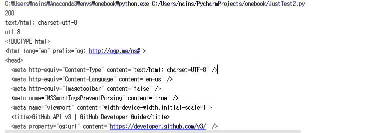
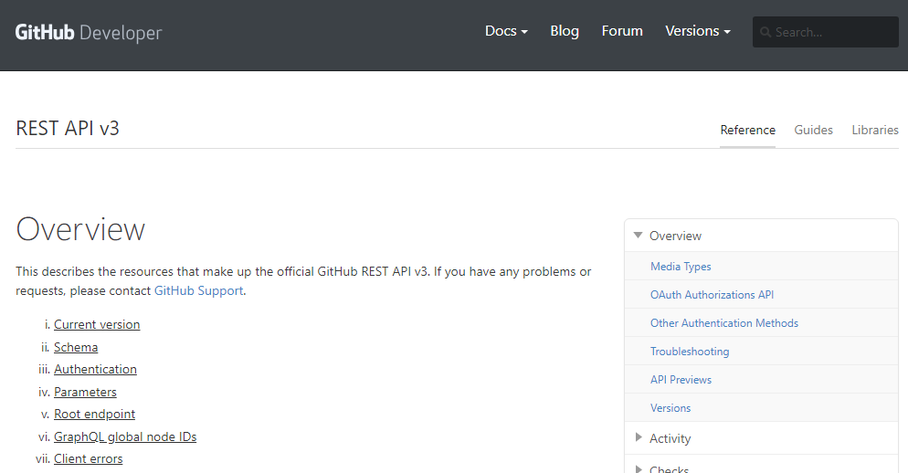
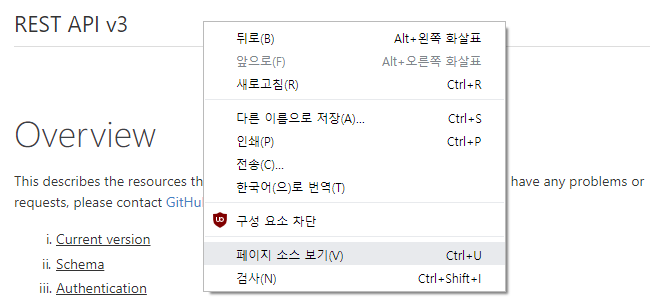
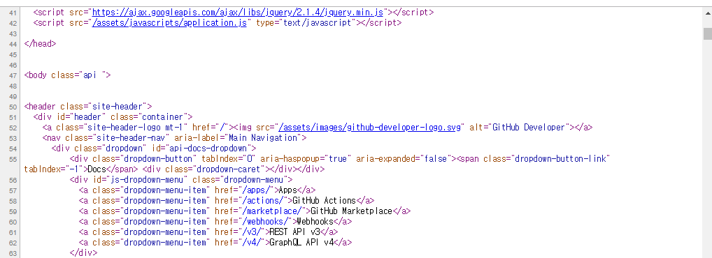
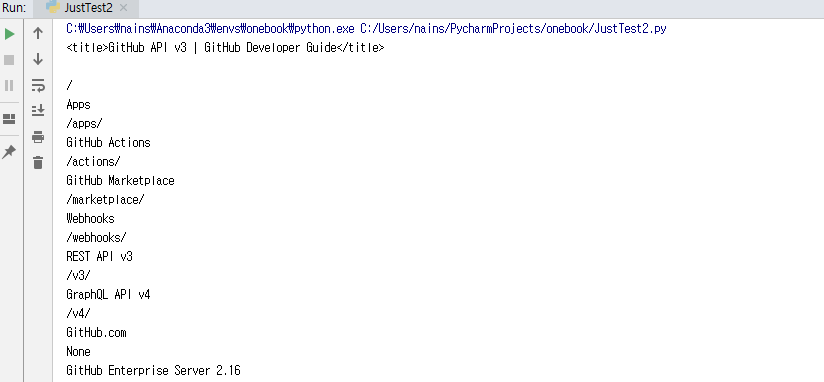

# 5.5.1. 	requests와 BeautifulSoup으로 웹 크롤러 만들기

http request를 다루기 위해서 requests모듈이 있습니다. 파이썬에 내장된 urllib 모듈을 편하게 사용하도록 만든 것인데 설치하는 방법은 pip를 이용하면 됩니다.

`(onebook)>`**`pip install requests`**

Requests의 설명은 공식 홈페이지 [http://docs.python-requests.org/en/master/](http://docs.python-requests.org/en/master/) 에서 확인하십시오.

```python
import requests
r = requests.get('https://developer.github.com/v3', auth=('user', 'pass'))     # HTTP GET Request
print(r.status_code)                                                                                             # 실행 결과
print(r.headers['content-type'])                                                                          # HTTP Header 가져오기
print(r.encoding)                                                                                                   # HTML 소스 가져오기
print(r.text)
print(r.json())
```

위의 코드를 실행하면 아래와 같이 status code = 200 등등을 출력합니다.



웹 브라우저에서 위의 [https://developer.github.com/v3](https://developer.github.com/v3) 싸이트를 열어보면 다음과 같이 표시됩니다. 



Requests는 단순하게 html 문서를 문자열로 가져옵니다.

웹브라우저에서 페이지 소스보기를 선택해 실제 이페이지의 소스가 어떻게 구성 되어 있는지 확인해 봅시다.



실제 위 페이지의 소스는 다음과 같습니다.



다음은 BeautifulSoup을 설치합니다.

위의 예제에서 확인했듯이 Requests는 html을 '의미있는', 즉 Python이 이해하는 객체 구조로 만들어주지는 못합니다. 위에서 req.text는 python의 문자열을 반환할 뿐이기 때문에 정보를 추출하기가 어렵습니다.

BeautifulSoup은 html 코드를 Python이 이해하는 객체 구조로 변환하는 Parsing을 처리합니다. BeautifulSoup을 사용하면 제대로 된 '의미있는' 정보를 추출해 낼 수 있습니다. BeautifulSoup의 자세한 설명은 공식 홈페이지[https://www.crummy.com/software/BeautifulSoup/bs4/doc/](https://www.crummy.com/software/BeautifulSoup/bs4/doc/)에서 확인하십시오.

`(onebook)>`**`pip install bs4`**

BeautifulSoup을 이용하여 위의 Requests 예제에서 가져온 html에서 title과 header에 포함된 Anchor를 추출하는 코드를 만들어 보겠습니다.

먼저 실습할 코드를 살펴보겠습니다.

```python
import requests
from bs4 import BeautifulSoup

req = requests.get('https://developer.github.com/v3', auth=('user', 'pass')) 
html = req.text
 
soup = BeautifulSoup(html, 'html.parser')
print(soup.find('title'))

my_anchor = soup.select('div > a')
for title in my_anchor:
    print(title.text)
    print(title.get('href'))
```

위의 코드를 분석해 보겠습니다.

4행에서는 HTTP GET Request 를 사용해서 HTML 소스를 가져 왔습니다. 7행에서 BeautifulSoup으로 html소스를 python객체로 변환하였습니다. BeautifulSoup 에서 첫번째 인수는 html 소스코드를 두번째 인수는 어떤 Parser를 이용할지 표시합니다.  이 코드에서는 Python내장 html.parser를 이용했습니다.

8행에서는 find함수를 사용하여 HTML의 title을 출력하였습니다.

BeautifulSoup을 사용하여 html 문서에서 원하는 부분을 선택할 때에는 find와 select를 사용 할수 있습니다. select는 만족하는 여러 인스턴스를 찾고, find는 첫 번째 인스턴스를 반환합니다.

find\('찾고자 하는 정보'\) , select\('찾고자 하는 정보'\) 와 같이 사용하면 됩니다. '찾고자 하는 정보'를 표현 할 때에 '태그명', '.클래스명', '상위태그명 &gt; 하위 태그명', '\#아이디명' 등과 같이 사용 할 수 있습니다.

10행은 'div' 태그 다음 'a' 태그를 모두 선택 하라는 것입니다.

11행~13행은 select한 내용을 출력 하는 것입니다. 위의 코드를 실행하면 다음과 같이 표시 됩니다.




