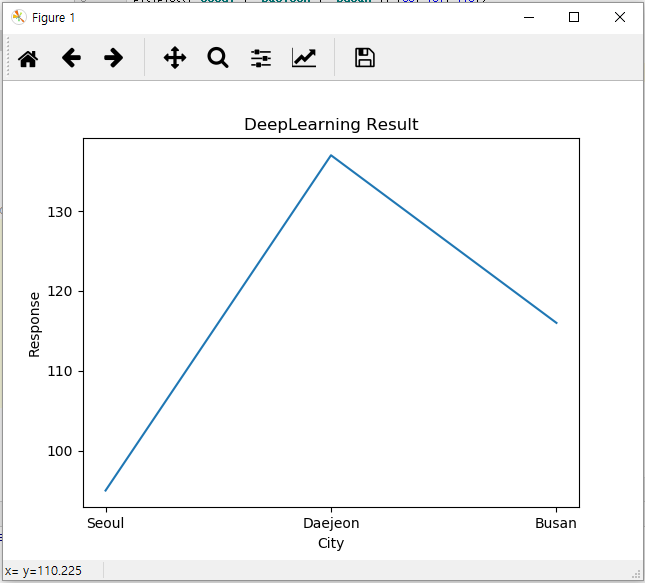
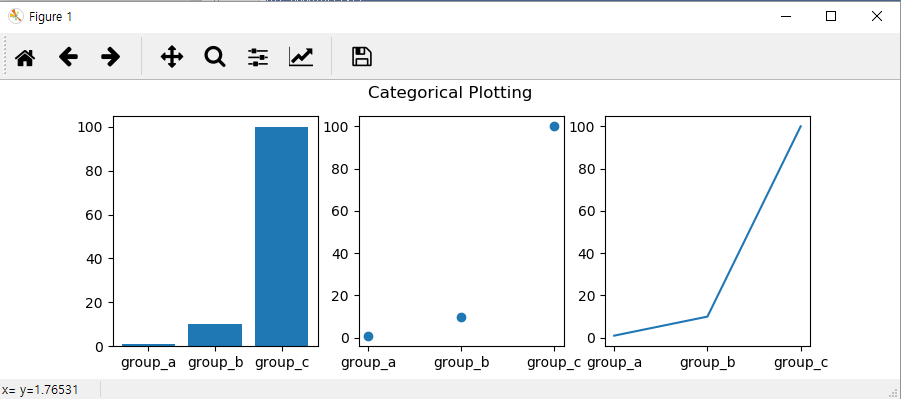
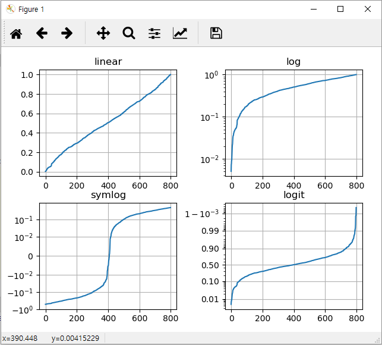

# 4.2 Matplotlib

Matplotlib는 파이썬에서 자료를 차트나 plot으로 데이터 시각화 패키지입니다. Matplotlib는 다음과 같은 정형화된 차트나 플롯 이외에도 다양한 시각화 기능을 제공합니다.

*        라인 플롯\(line plot\)
*        스캐터 플롯\(scatter plot\)
*        컨투어 플롯\(contour plot\)
*        서피스 플롯\(surface plot\)
*        바 차트\(bar chart\)
*        히스토그램\(histogram\)
*        박스 플롯\(box plot\)

Matplotlib를 사용하기 위해서는 먼저 matplotlib.pyplot 을 import 합니다. pyplot을 다른 이름으로 사용할 수 있지만 통상 plt 라는 alias를 사용합니다. 다음 plt.plot\(\)은 라인 플롯을 그리는 함수인데, 아래는 X축값 1,2,3과 Y축값 110,130,120을 가지고 라인 플롯을 그리는 예제입니다. 마지막으로 실제 그림을 표시하는 함수인 plt.show\(\)을 호출합니다.

```python
 from matplotlib import pyplot as plt

 plt.plot(["Seoul", "Daejeon", "Busan"], [95, 137, 116])
 plt.xlabel('City')
 plt.ylabel('Response')
 plt.title('DeepLearning Result')
 plt.show()
```

위의 코드를 실행하면 다음과 같은 결과를 출력합니다.



모든 x, y 쌍의 인수에 대해 선택적인 세 번째 인수가 있습니다. 이 인수는 플롯의 색상과 선 유형을 나타내는 형식 문자열입니다. 형식 문자열의 문자와 기호는 MATLAB에서 가져온 것이므로 색상 문자열을 선 스타일 문자열과 연결합니다. 기본 형식 문자열은 'b-'이며, 이는 청색 선입니다. 예를 들어 위의 내용을 빨간색 원으로 그리려면 다음과 같이 사용합니다.

```python
 from matplotlib import pyplot as plt

 plt.plot(["Seoul", "Daejeon", "Busan"], [95, 137, 116], ‘ro’)
 plt.xlabel('City')
 plt.ylabel('Response')
 plt.title('DeepLearning Result')
 plt.show()
```

matplotlib는 수치 처리를 위해 일반적으로 numpy 배열을 사용합니다. 아래 예제는 배열을 사용하여 하나의 명령에서 다른 형식 스타일을 가진 여러 줄을 플로팅하는 것을 보여줍니다.

Matplotlib는 위에서 예시한 라인 플롯 이외에 여러 다양한 차트/플롯을 그릴 수 있는데, 각 차트/플롯마다 다른 함수들을 사용합니다. 예를 들어, Bar 차트를 그리기 위해서는 plt.bar\(\) 함수를 사용하고, Pie 차트를 그리기 위해서는 plt.pie\(\)를, 히스토그램을 그리기 위해선 plt.hist\(\) 함수를 사용합니다.

```python
 from matplotlib import pyplot as plt

 names = ['group_a', 'group_b', 'group_c']
 values = [1, 10, 100]

 plt.figure(1, figsize=(9, 3))

 plt.subplot(131)
 plt.bar(names, values)
 plt.subplot(132)
 plt.scatter(names, values)
 plt.subplot(133)
 plt.plot(names, values)
 plt.suptitle('Categorical Plotting')
 plt.show()
```



다음 예제를 통해 다양한 Matplotlib의 표현을 학습해 보십시요.

```python
 import numpy as np
 from matplotlib import pyplot as plt
 from matplotlib.ticker import NullFormatter  # useful for `logit` scale

 # Fixing random state for reproducibility
 np.random.seed(19680801)

 # make up some data in the interval ]0, 1[
 y = np.random.normal(loc=0.5, scale=0.4, size=1000)
 y = y[(y > 0) & (y < 1)]
 y.sort()
 x = np.arange(len(y))

 # plot with various axes scales
 plt.figure(1)

 # linear
 plt.subplot(221)
 plt.plot(x, y)
 plt.yscale('linear')
 plt.title('linear')
 plt.grid(True)


 # log
 plt.subplot(222)
 plt.plot(x, y)
 plt.yscale('log')
 plt.title('log')
 plt.grid(True)


 # symmetric log
 plt.subplot(223)
 plt.plot(x, y - y.mean())
 plt.yscale('symlog', linthreshy=0.01)
 plt.title('symlog')
 plt.grid(True)

 # logit
 plt.subplot(224)
 plt.plot(x, y)
 plt.yscale('logit')
 plt.title('logit')
 plt.grid(True)
 # Format the minor tick labels of the y-axis into empty strings with
 # `NullFormatter`, to avoid cumbering the axis with too many labels.
 plt.gca().yaxis.set_minor_formatter(NullFormatter())
 # Adjust the subplot layout, because the logit one may take more space
 # than usual, due to y-tick labels like "1 - 10^{-3}"
 plt.subplots_adjust(top=0.92, bottom=0.08, left=0.10, right=0.95, hspace=0.25,
                     wspace=0.35)

 plt.show()
```



