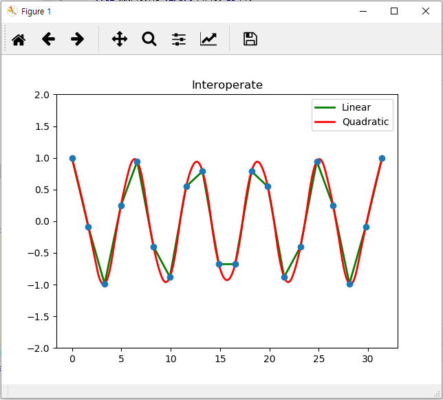

# 4.3.1.     Interpolation

보간법\(interpolation\)이란 통계적 혹은 실험적으로 구해진 데이터들\(xi\)로부터, 주어진 데이터를 만족하는 근사 함수\(f\(x\)\)를 구하고,  이 식을 이용하여 주어진 변수에 대한 함수 값을 구하는 일련의 과정을 의미합니다. 예를 들어, \(0, 0\), \(1, 10\), \(2, 20\)이 주어졌을 때, 이들에 대한 근사 함수를 f\(x\) = 10x로 구하고, 1.5에 대한 함수 값으로 15를 구하는 것입니다.

사인\(sine\) 함수에 가까운 실험 데이터를 생각해 보겠습니다. 다음 예제는 NumPy, Matplotlib, SciPy를 종합적으로 사용합니다.

```python
 import numpy as np
 from scipy.interpolate import interp1d
 from matplotlib import pyplot as plt

 # Cosine 함수를 0부터 10pi까지 20개 만든다.
 x = np.linspace(0,10*np.pi, 20)
 y = np.cos(x)

 #interoperate 함수로 보간법을 적용하여 linear(선형보정) quadratic(부드러운 보정) 두가지 방법으로 만든다
 fl = interp1d(x,y,kind = 'linear')
 fq = interp1d(x,y,kind = 'quadratic')

 xint = np.linspace(x.min(), x.max(), 1000)
 yintl = fl(xint)
 yintq = fq(xint)

 # Plot the data and the interpolation
 plt.plot(xint, yintl, color = 'green', linewidth=2)
 plt.plot(xint, yintq, color = 'red', linewidth=2)
 plt.legend(['Linear','Quadratic'])
 plt.plot(x,y,'o')    #값의 위치를 점으로 표현
 plt.ylim(-2,2)

 plt.title('Interoperate')
 plt.show()
```

6행의 코드는 시작점 0부터 10\*np.pi 까지 균등하게 나뉘어진 20개 값을 만들어 냅니다. 즉 다음과 같은 값이 만들어 집니다.

\[ 0. 1.65346982 3.30693964 4.96040945 6.61387927 8.26734909 9.92081891 11.57428872 13.22775854 14.88122836 16.53469818 18.18816799 19.84163781 21.49510763 23.14857745 24.80204727 26.45551708 28.1089869 29.76245672 31.41592654\]

7행의 cosine 함수를 실행 하면 다음과 같은 값이 구해 집니다.

\[ 1. -0.08257935 -0.9863613 0.24548549 0.94581724 -0.40169542 -0.87947375 0.54694816 0.78914051 -0.67728157 -0.67728157 0.78914051 0.54694816 -0.87947375 -0.40169542 0.94581724 0.24548549 -0.9863613 -0.08257935 1. \]

10행과 11행은 SciPy interpolation\(보간법\)을 사용하는 부분입니다.  scipy.interpolate의 interp1d 클래스는 선형 보간법을 사용하여 주어진 데이터로 정의된 도메인 내 어디에서나 평가할 수있는 고정된 데이터 포인트를 기반으로 함수를 만드는 편리한 방법입니다. 이 클래스의 인스턴스는 데이터를 구성하는 1-d 벡터를 전달하여 만들어집니다.  interp1d 에서 지원하는 보간법의 종류는 ‘linear’, ‘nearest’, ‘zero’, ‘slinear’, ‘quadratic’, ‘cubic’, ‘previous’, ‘next’, where ‘zero’, ‘slinear’, ‘quadratic’, ‘cubic’ 등이 있습니다.

13행, 14행은  xint 를 x의 최소값 부터 x의 최대값까지 1000개로 세분화 하고 linear, quadratic 보간법으로 yint 값을 구하는 부분입니다.

18행 부터는 matplotlib를 사용하여 플롯하는 부분입니다.

위의 코드를 실행하면 다음과 같은 그래프가 출력 됩니다.



주어진 점들을 가지고 붉은색의 그래프를 그렸습니다. X축의 어떠한 위치에서도 Y값을 예상 할 수 있습니다.

