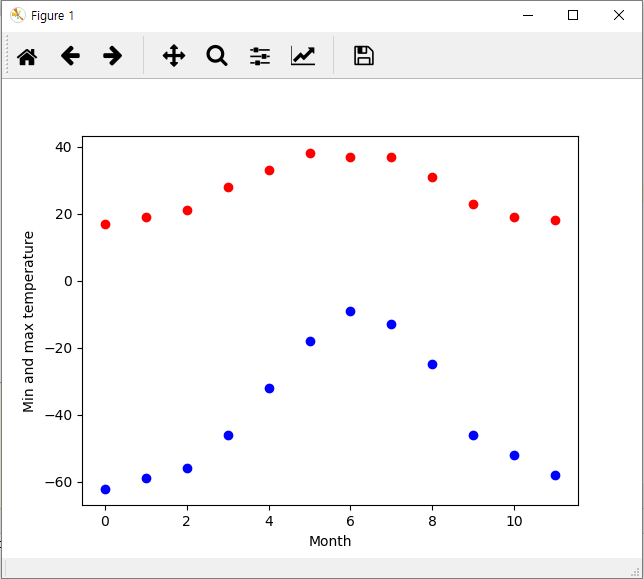
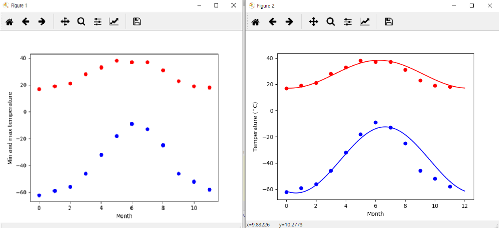

# 4.3.2. 	Optimization

Optimization\(최적화\)는 최소화 또는 평형에 대한 수치 솔루션을 찾는 문제입니다. scipy.optimize 모듈은 함수 최소화 \(스칼라 또는 다차원\), 커브 피팅 및 루트 찾기를위 한 알고리즘을 제공합니다.

이 모듈의 함수들을 이해하려면 많은 수학적인 이론들이 필요합니다. 너무 어려워서 저도 대부분을 이해하지 못합니다. 사용법만 확인해 봅니다.

데이터를 수식\(함수\)로 만드는 과정을 Curve fitting 혹은 Data fitting이라고 합니다.

예제를 풀어보겠습니다. 1월부터 시작되는 매월 알래스카의 기온은 섭씨로 다음과 같습니다.

우리는 알래스카의 최소 및 최대 기온을 매달에 측정하여 매년 변화하는 것을 나타내는 함수를 찾으려고 합니다. 이를 위해 우리는 주기적 함수를 적용할 것입니다.

```text
max:  17,  19,  21,  28,  33,  38, 37,  37,  31,  23,  19,  18
min: -62, -59, -56, -46, -32, -18, -9, -13, -25, -46, -52, -58
```

위의 데이터를 그래프로 표시하는 코드는 다음과 같습니다.

```python
 import numpy as np
 import matplotlib.pyplot as plt

 temp_max = np.array([17,  19,  21,  28,  33,  38, 37,  37,  31,  23,  19,  18])
 temp_min = np.array([-62, -59, -56, -46, -32, -18, -9, -13, -25, -46, -52, -58])

 months = np.arange(12)
 plt.plot(months, temp_max, 'ro')
 plt.plot(months, temp_min, 'bo')
 plt.xlabel('Month')
 plt.ylabel('Min and max temperature')

 plt.show()
```

위의 코드를 실행하면 다음과 같은 그래프가 나타납니다. 붉은 점은 최대온도, 파란 점은 최저 온도를 나타내는 것입니다.



이 데이터에 주기적 함수를 적용해 보겠습니다.

curve\_fit 함수에 제공되는 인수는 다음과 같습니다.

* **f : 모델** **함수** f\(x, …\), 독립 변수를 첫 번째 인수로 사용하고 매개 변수를 별도의 나머지 인수로 사용해야 합니다.
* **xdata :**  k 예측자를 갖는 함수의 M 길이 시퀀스 또는 \(k, M\) 모양의 배열, 데이터가 측정되는 독립 변수입니다.
* **ydata :**  M- 길이 시퀀스, 종속 데이터 - 명목상 f \(xdata, ...\)
* **p0 :**  없거나, 스칼라 또는 N 길이 시퀀스, 선택 사항입니다. 매개 변수에 대한 초기 추측 값. 없다면 초기 값은 모두 1이 됩니다.

여기서 커브 피팅에 대한 모델 함수를 구하는 방법은 상단히 복잡한 수학적 이론이 필요합니다. 여기서 함수의 사용법만 체크하고 넘어 갑니다.

위의 코드에 아래에 다음 코드를 추가해 보겠습니다.

```python
 from scipy import optimize
 def yearly_temps(times, avg, ampl, time_offset):
     return (avg + ampl * np.cos((times + time_offset) * 2 * np.pi / times.max()))

 res_max, cov_max = optimize.curve_fit(yearly_temps, months, temp_max, [20, 10, 0])
 res_min, cov_min = optimize.curve_fit(yearly_temps, months, temp_min, [-40,20,0])
```

테스트를 위해 위의 코드 아래에 다음 코드를 추가해 봅니다

```python
days = np.linspace(0, 12, num=365)

plt.figure()
plt.plot(months, temp_max, 'ro')
plt.plot(days, yearly_temps(days, *res_max), 'r-')
plt.plot(months, temp_min, 'bo')
plt.plot(days, yearly_temps(days, *res_min), 'b-')
plt.xlabel('Month')
plt.ylabel('Temperature ($^\circ$C)')
plt.show()
```

결과로 출력되는 두 플롯을 비교해 보십시요.



전체 소스 코드는 다음과 같습니다.

```python
 import numpy as np
 import matplotlib.pyplot as plt

 temp_max = np.array([17,  19,  21,  28,  33,  38, 37,  37,  31,  23,  19,  18])
 temp_min = np.array([-62, -59, -56, -46, -32, -18, -9, -13, -25, -46, -52, -58])

 months = np.arange(12)
 plt.plot(months, temp_max, 'ro')
 plt.plot(months, temp_min, 'bo')
 plt.xlabel('Month')
 plt.ylabel('Min and max temperature')


 from scipy import optimize
 def yearly_temps(times, avg, ampl, time_offset):
     return (avg
             + ampl * np.cos((times + time_offset) * 2 * np.pi / times.max()))

 res_max, cov_max = optimize.curve_fit(yearly_temps, months, temp_max, [20, 10, 0])
 res_min, cov_min = optimize.curve_fit(yearly_temps, months,  temp_min, [-40, 20, 0])

 days = np.linspace(0, 12, num=365)

 plt.figure()
 plt.plot(months, temp_max, 'ro')
 plt.plot(days, yearly_temps(days, *res_max), 'r-')
 plt.plot(months, temp_min, 'bo')
 plt.plot(days, yearly_temps(days, *res_min), 'b-')
 plt.xlabel('Month')
 plt.ylabel('Temperature ($^\circ$C)')

 plt.show()
```

