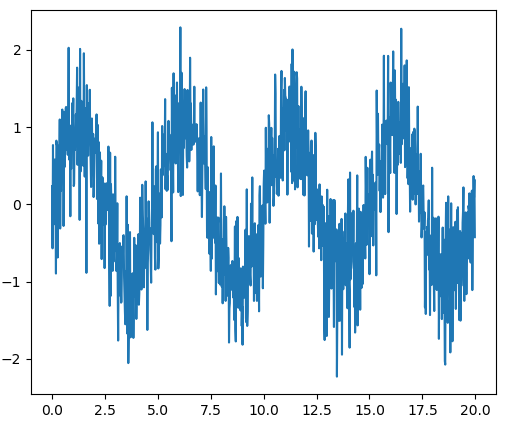
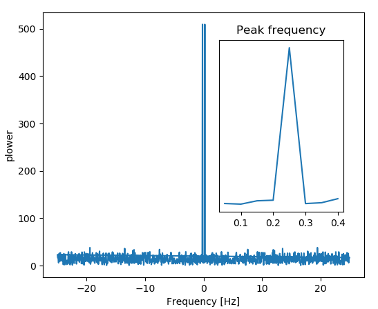
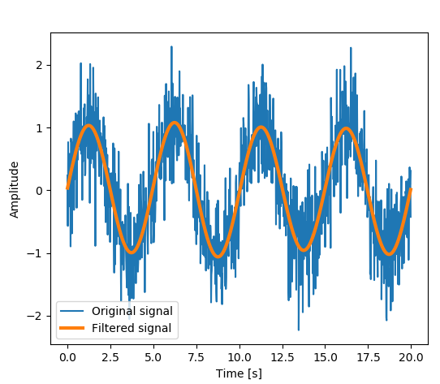
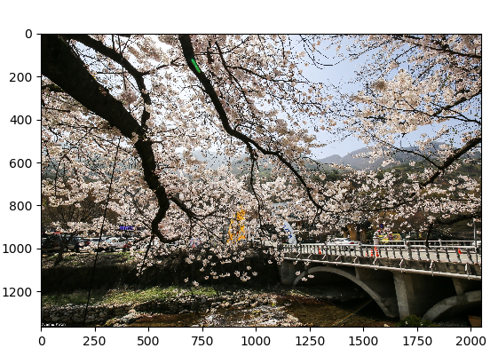
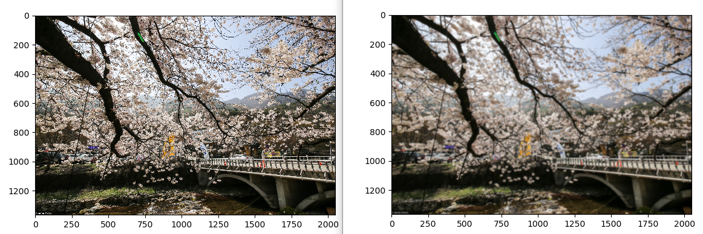

# 4.3.3. 	Fast Fourier transforms: scipy.fftpack

scipy.fftpack 모듈은 fast Fourier transforms \(FFT\)을 계산하고 이를 처리 할 수 있는 유틸리티를 제공합니다. 주요 기능은 다음과 같습니다.

* scipy.fftpack.fft \(\)를 사용하여 FFT를 계산
* scipy.fftpack.fftfreq \(\)를 사용하여 샘플링 주파수 생성
* scipy.fftpack.ifft \(\)는 주파수 공간에서 신호 공간으로 inverse FFT를 계산

다음 예제를 실습해 보겠습니다. 이 예제는 signal의 FFT의 힘을 플롯하고 inverse FFT를 사용하여 signal을 재구성하는 것입니다. 이 예제는 scipy.fftpack.fft\(\), scipy.fftpack.fftfreq\(\) 및 scipy.fftpack.ifft\(\)를 보여줍니다.

```python
 import numpy as np
 from scipy import fftpack
 from matplotlib import pyplot as plt

 #신호를 생성합니다.
 # Seed the random number generator
 np.random.seed(1234)

 time_step = 0.02
 period = 5.

 time_vec = np.arange(0, 20, time_step)
 sig = (np.sin(2 * np.pi / period * time_vec) + 0.5 * np.random.randn(time_vec.size))

 plt.figure(figsize=(6, 5))
 plt.plot(time_vec, sig, label='Original signal')

 #FFT의 Power를 계산합니다.
 # The FFT of the signal
 sig_fft = fftpack.fft(sig)

 # And the power (sig_fft is of complex dtype)
 power = np.abs(sig_fft)

 # The corresponding frequencies
 sample_freq = fftpack.fftfreq(sig.size, d=time_step)

 # Plot the FFT power
 plt.figure(figsize=(6, 5))
 plt.plot(sample_freq, power)
 plt.xlabel('Frequency [Hz]')
 plt.ylabel('plower')

 # Find the peak frequency: we can focus on only the positive frequencies
 pos_mask = np.where(sample_freq > 0)
 freqs = sample_freq[pos_mask]
 peak_freq = freqs[power[pos_mask].argmax()]

 # Check that it does indeed correspond to the frequency that we generate
 # the signal with
 np.allclose(peak_freq, 1./period)

 # An inner plot to show the peak frequency
 axes = plt.axes([0.55, 0.3, 0.3, 0.5])
 plt.title('Peak frequency')
 plt.plot(freqs[:8], power[:8])
 plt.setp(axes, yticks=[])
 # scipy.signal.find_peaks_cwt can also be used for more advanced  peak detection


 #모든 high frequencies를 제거합니다.
 high_freq_fft = sig_fft.copy()
 high_freq_fft[np.abs(sample_freq) > peak_freq] = 0
 filtered_sig = fftpack.ifft(high_freq_fft)

 plt.figure(figsize=(6, 5))
 plt.plot(time_vec, sig, label='Original signal')
 plt.plot(time_vec, filtered_sig, linewidth=3, label='Filtered signal')
 plt.xlabel('Time [s]')
 plt.ylabel('Amplitude')

 plt.legend(loc='best')

 plt.show()
```

위의 코드는 다음과 같은 그래프를 결과로 출력합니다. 먼저 아래 그래프는 signal을 생성한 후 original signal을 표시한 것입니다.



이 original signal에 fft를 사용하여 power를 표시하면 다음과 같습니다.



모든 high frequencies를 제거하면 다음과 같은 그래프를 얻을 수 있습니다.



다음 예제를 실습해 보자. 포토샵 등에서 많이 사용하는 Gaussian image blur 효과를 사진에 적용하는 것입니다.

먼저 사진 이미지를 화면에 출력하는 코드를 실행 해 보겠습니다자.

```python
 import numpy as np
 from scipy import fftpack
 import matplotlib.pyplot as plt

 # read image
 img = plt.imread('./IMG_0820.png')
 plt.figure()
 plt.imshow(img)

 plt.show()
```

IMG\_0820.png 는 대전 동학사의 벗꽃 사진입니다. 위의 코드를 실행하면 다음과 같은 이미지가 나타납니다. 굉장히 크고 해상도가 좋은 사진 원본입니다.



이제 Gaussian convolution kernel 을 준비하고 FFT를 사용하여 적용해 봅니다.

전체 소스코드는 다음과 같습니다.

```python
 import numpy as np
 from scipy import fftpack
 import matplotlib.pyplot as plt

 # read image
 img = plt.imread('./IMG_0820.png')
 plt.figure()
 plt.imshow(img)

 # First a 1-D  Gaussian
 t = np.linspace(-10, 10, 30)
 bump = np.exp(-0.1*t**2)
 bump /= np.trapz(bump) # normalize the integral to 1

 # make a 2-D kernel out of it
 kernel = bump[:, np.newaxis] * bump[np.newaxis, :]

 # Padded fourier transform, with the same shape as the image
 # We use :func:`scipy.signal.fftpack.fft2` to have a 2D FFT
 kernel_ft = fftpack.fft2(kernel, shape=img.shape[:2], axes=(0, 1))

 # convolve
 img_ft = fftpack.fft2(img, axes=(0, 1))
 # the 'newaxis' is to match to color direction
 img2_ft = kernel_ft[:, :, np.newaxis] * img_ft
 img2 = fftpack.ifft2(img2_ft, axes=(0, 1)).real

 # clip values to range
 img2 = np.clip(img2, 0, 1)

 # plot output
 plt.figure()
 plt.imshow(img2)

 plt.show()
```

출력되는 두개의 이미지를 비교해 보십시요….



