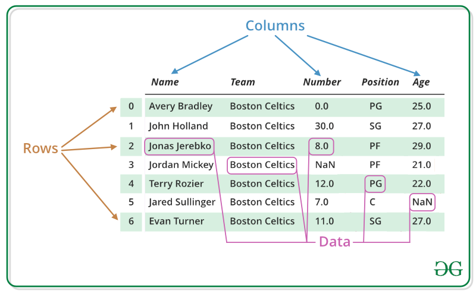

# 4.4.1 Pandas 자료구조

pandas는 크게 세가지의 자료구조를 지원하고 있는데, 1차원 자료구조인 Series, 2차원 자료구조인 DataFrame, 그리고 3차원 자료구조인 Panel을 지원합니다.

pandas 에는 효과적인 데이터 분석을 위한 고수준의 자료구조와 데이터 분석 도구를 제공합니다. pandas의 Series는 1차원 데이터를 다루는 데 효과적인 자료구조이며, DataFrame은 행과 열로 구성된 2차원 데이터를 다루는 데 효과적인 자료구조입니다.

Pandas에서 제공하는 자료 구조들이 무엇이 있는지 더 자세히 알아보시려면 pandas documentation에 있는 [Data Structure Intro section](https://pandas.pydata.org/pandas-docs/stable/getting_started/dsintro.html#dsintro)을 참고하시면 됩니다.

**Series**

Series는 value와 index의 형태를 지니는 Pandas의 자료 구조입니다.

가장 간단한 1차원 자료구조인 Series는 배열/리스트와 같은 일련의 시퀀스 데이타를 받아들이는데, 별도의 인덱스 레이블을 지정하지 않으면 자동적으로 0부터 시작되는 디폴트 정수 인덱스를 사용합니다.

```python
 import pandas as pd
 dict = {'a':1,'b':2,'c':3,'d':4}
 data = [1, 3, 5, 7, 9]
 u = pd.Series(dict)
 print(u)
 s = pd.Series(data)
 print(s)
```

위의 예제를 실행해 보면 다음과 같이 출력 됩니다.

```text
a    1
b    2
c    3
d    4
dtype: int64
0    1
1    3
2    5
3    7
4    9
dtype: int64
```

인덱스를 주면 해당 인덱스와 값으로 만들어 지고 인덱스가 없으면 자동으로 인덱스가 정렬됩니다.


**DataFrame**

pandas의 Series가 1차원 형태의 자료구조라면 DataFrame은 여러 개의 칼럼\(Column\)으로 구성된 2차원 형태의 자료구조입니다.

Pandas DataFrame은 레이블이있는 행 및 열을 사용한 2차원 테이블 형식의 데이터 구조입니다. DataFrame은 세 가지 주요 구성 요소는 데이터, 행\(rows\) 및 열\(columns\) 입니다. 즉, 데이터는 행과 열로 표 형식으로 정렬됩니다.



기존 저장 장치의 데이터 세트를 읽어서 DataFrame을 만들고 SQL 데이터베이스, CSV 파일 및 Excel 파일로 저장할 수 있습니다. DataFrame은 lists, dictionary 등에서 만들 수 있습니다.

다음은 list를 사용하여 DataFrame을 만드는 예제 입니다.

```python
# import pandas as pd
import pandas as pd
# list of strings
lst = ['Geeks', 'For', 'Geeks', 'is', 'portal', 'for', 'Geeks']
# Calling DataFrame constructor on list
df = pd.DataFrame(lst)
print(df)
```

위의 예제를 실행해 보면 다음과 같이 출력 됩니다.

```text
     0
0   Geeks
1     For
2   Geeks
3      is
4  portal
5     for
6   Geeks
```

Series와 비슷한 구조로 변환될 수있는 객체의 dict를 전달하여 DataFrame을 생성할 수도 있습니다.

```python
import pandas as pd
import numpy as np
df2 = pd.DataFrame({'A': 1.,
                    'B': pd.Timestamp('20190102'),
                    'C': pd.Series(1, index=list(range(4)), dtype='float32'),
                    'D': np.array([3] * 4, dtype='int32'),
                    'E': pd.Categorical(["test", "train", "test", "train"]),
                    'F': 'foo'})
print(df2)
```

위의 예제를 실행해 보면 다음과 같이 출력 됩니다.

```text
A          B        C   D      E    F
0  1.0 2019-01-02  1.0  3   test  foo
1  1.0 2019-01-02  1.0  3  train  foo
2  1.0 2019-01-02  1.0  3   test  foo
3  1.0 2019-01-02  1.0  3  train  foo
```

