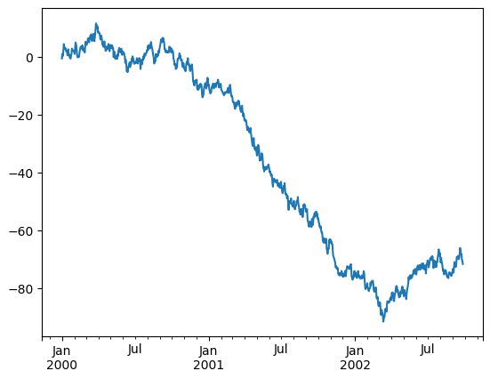
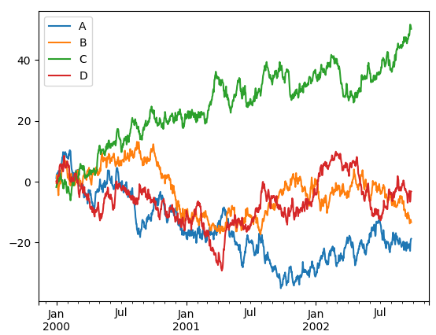

# 4.4.2 Pandas 활용하기

이 내용은 [10 Minutes to pandas](https://pandas.pydata.org/pandas-docs/stable/getting_started/10min.html)을 기초로 작성되었습니다.

**1\)    데이터 조작하기**

다음 소스코드를 실습하면서 Pandas 데이터를 조작하는 법을 실습하겠습니다.

```python
import pandas as pd  
import numpy as np  
     
dates = pd.date_range('20190101', periods=6)  
    
df = pd.DataFrame(np.random.randn(6, 4), index=dates, columns=list('ABCD'))  
   
print(df)  
print(df.head())  
print(df.tail(3))  
print(df.index)  
print(df.columns)  
print(df.values)  
print(df.describe())  
print(df.T)  
print(df.sort_index(axis=1, ascending=False))  
print(df.sort_values(by='B'))  
print(df['A'])  
print(df[0:3])  
print(df.loc[dates[0]])  
print(df.iloc[3:5, 0:2])  
print(df[df.A > 0])  
print(df.mean())  
print(df.apply(np.cumsum))  
```

4행,5행에서 pandas 데이터 구조인 DataFrame은 numpy array를 받아 생성이 가능합니다. 여기에서는 인덱스로 날짜 값을 주었고, 컬럼의 이름도 같이 넣어보았습니다. 만들어진 DataFrame df를 출력한 8행의 결과는 다음과 같습니다.

```text
                 A         B         C         D
2019-01-01  0.663299  0.151818 -1.061050 -0.371212
2019-01-02 -1.366572  2.444417  0.127165 -0.705624
2019-01-03 -1.106557  0.761649 -1.945276  1.031035
2019-01-04  0.614764 -0.806967 -0.317243  0.934984
2019-01-05 -0.413898 -0.480331 -0.255014  0.871850
2019-01-06 -1.069069  0.499700 -0.213767  0.424256
```

DataFrame에 들어있는 맨 앞이나 맨 뒤의 자료들 몇 개를 알아보고 싶다면 9행, 10행과 같이 .head\(\)와 .tail\(\) 메소드를 사용하면 됩니다. 기본적으로 5개의 자료를 보여주고, 더 적게 혹은 많이 보고 싶다면 메소드의 인자로 보고싶은 데이터의 개수를 숫자를 넣어주면 됩니다.

```text
                A        B         C        D
2019-01-01  0.663299  0.151818 -1.061050 -0.371212
2019-01-02 -1.366572  2.444417  0.127165 -0.705624
2019-01-03 -1.106557  0.761649 -1.945276  1.031035
2019-01-04  0.614764 -0.806967 -0.317243  0.934984
2019-01-05 -0.413898 -0.480331 -0.255014  0.871850
                   A         B         C         D
2019-01-04  0.614764 -0.806967 -0.317243  0.934984
2019-01-05 -0.413898 -0.480331 -0.255014  0.871850
2019-01-06 -1.069069  0.499700 -0.213767  0.424256
```

DataFrame의 인덱스를 보려면 .index 속성을, 컬럼을 보려면 .columns 속성을, 안에 들어있는 numpy 데이터를 보려면 .values 속성을 통해 확인하면 됩니다.

11행~13행의 출력 결과는 다음과 같습니다.

```text
DatetimeIndex(['2019-01-01', '2019-01-02', '2019-01-03', '2019-01-04',
               '2019-01-05', '2019-01-06'],
              dtype='datetime64[ns]', freq='D')
Index(['A', 'B', 'C', 'D'], dtype='object')
[[-0.56423413 -0.85399409 -0.31727827 -0.2457619 ]
 [ 1.87094766  0.53596149 -0.13952464 -0.83790642]
 [ 0.11521253  0.84948792 -0.75322771 -0.00697268]
 [ 1.57108028 -1.54736629 -0.51947482  3.2743979 ]
 [ 0.7834223  -0.02797148  0.87140932 -1.08610556]
 [ 0.49678189  0.94142238  0.58725135  0.82629978]]
```

14행 .describe\(\) 메소드는 생성했던 DataFrame의 간단한 통계 정보를 보여줍니다. 컬럼별로 데이터의 개수\(count\), 데이터의 평균 값\(mean\), 표준 편차\(std\), 최솟값\(min\), 4분위수\(25%, 50%, 75%\), 그리고 최댓값\(max\)들의 정보를 알 수 있습니다.

```text
        A         B         C         D
count  6.000000  6.000000  6.000000  6.000000
mean   0.712202 -0.017077 -0.045141  0.320659
std    0.907472  1.001783  0.640208  1.595599
min   -0.564234 -1.547366 -0.753228 -1.086106
25%    0.210605 -0.647488 -0.468926 -0.689870
50%    0.640102  0.253995 -0.228401 -0.126367
75%    1.374166  0.771106  0.405557  0.617982
max    1.870948  0.941422  0.871409  3.274398
```

15행 .T 속성은 DataFrame에서 index와 column을 바꾼 형태의 DataFrame 입니다.

```text
2019-01-01  2019-01-02     ...      2019-01-05  2019-01-06
A   -0.564234    1.870948     ...        0.783422    0.496782
B   -0.853994    0.535961     ...       -0.027971    0.941422
C   -0.317278   -0.139525     ...        0.871409    0.587251
D   -0.245762   -0.837906     ...       -1.086106    0.826300
```

16행, 17행은 정렬의 예입니다. .sort\_index\(\)라는 메소드로 행과 열 이름을 정렬하여 나타낼 수도 있습니다. 정렬할 대상 축을 결정할 때에는 axis를 이용합니다. axis=0라고 써주면 인덱스를 기준으로 정렬하겠다는 것이고\(기본값\), axis=1라고 써주면 컬럼을 기준으로 정렬하겠다는 것입니다. 정렬의 방향은 ascending을 이용합니다. ascending=True는 오름차순 정렬을 하겠다는 것이고\(기본값\), ascending=False는 내림차순 정렬을 하겠다는 의미입니다.

```text
                   D         C         B         A
2019-01-01  0.196948 -1.255738  0.997678 -1.104337
2019-01-02 -0.764140  0.189092 -0.298177 -1.510107
2019-01-03 -0.721188  0.043075  1.385104 -0.732341
2019-01-04  0.488364  0.876822  1.368371  0.310627
2019-01-05  1.628589 -0.195919  2.233960  1.708188
2019-01-06  0.328141  1.125429  1.750625 -0.845495
                   A         B         C         D
2019-01-02 -1.510107 -0.298177  0.189092 -0.764140
2019-01-01 -1.104337  0.997678 -1.255738  0.196948
2019-01-04  0.310627  1.368371  0.876822  0.488364
2019-01-03 -0.732341  1.385104  0.043075 -0.721188
2019-01-06 -0.845495  1.750625  1.125429  0.328141
2019-01-05  1.708188  2.233960 -0.195919  1.628589
```

18행은 데이터프레임 자체가 갖고 있는 \[\] 슬라이싱 기능을 이용하는 방법입니다. 특정 ‘컬럼’의 값들만 가져오고 싶다면 df\['A'\]와 같은 형태로 입력합니다. 이는 df.A와 동일합니다. 리턴되는 값은 Series의 자료구조를 갖고 있습니다.

```text
2019-01-01   -1.104337
2019-01-02   -1.510107
2019-01-03   -0.732341
2019-01-04    0.310627
2019-01-05    1.708188
2019-01-06   -0.845495
```

특정 ‘행 범위’를 가져오고 싶다면 19행과 같이 리스트를 슬라이싱 할 때와 같이 \[\]를 이용할 수 있습니다. df\[0:3\]라고 하면 0, 1, 2번째 행을 가져옵니다

```text
                  A         B         C         D
2019-01-01 -1.104337  0.997678 -1.255738  0.196948
2019-01-02 -1.510107 -0.298177  0.189092 -0.764140
2019-01-03 -0.732341  1.385104  0.043075 -0.721188
```

라벨의 이름을 이용하여 선택할 수 있는 .loc를 이용할 수도 있습니다. 20행은 첫 번째 인덱스의 값인 ‘2013-01-01’에 해당하는 모든 컬럼의 값 가져오기 예제입니다.

```text
A   -1.104337
B    0.997678
C   -1.255738
D    0.196948
Name: 2019-01-01 00:00:00, dtype: float64
```

위치를 나타내는 인덱스 번호를 이용하여 데이터를 선택할 수 있습니다. 여기서 인덱스 번호는 python에서 사용하는 인덱스와 같은 개념으로 이해하시면 됩니다. 인덱스 번호는 0 부터 시작하므로, 첫 번째 데이터는 인덱스 번호가 0 이고, 두 번째 데이터는 인덱스 번호가 1 이라는 뜻입니다. 인덱스 번호로 행뿐만 아니라 열도 선택할 수 있습니다. 또한 numpy나 python의 슬라이싱 기능과 비슷하게 사용할 수 있습니다. 21행은 행과 열의 인덱스를 기준으로 이용하여 데이터를 선택하는 예제입니다. 행의 인덱스는 3:5로 네 번째 행과 다섯 번째 행을 선택하며, 열의 인덱스는 0:2로 첫 번째 열과 두 번째 열을 선택합니다.

```text
                A         B
2019-01-04  0.310627  1.368371
2019-01-05  1.708188  2.233960
```

특정한 열의 값들을 기준으로 조건을 만들어 해당 조건에 만족하는 행들만 선택할 수 있는 방법이 있습니다. 22행은 A라는 열에 들어있는 값이 양수인 경우에 해당하는 행들을 선택하는 예제입니다.

```text
            A         B         C         D
2019-01-04  0.310627  1.368371  0.876822  0.488364
2019-01-05  1.708188  2.233960 -0.195919  1.628589
23행은 평균 구하기입니다.
A   -0.362244
B    1.239594
C    0.130460
D    0.192786
dtype: float64
```

데이터프레임에 함수를 적용할 수 있습니다. 기존에 존재하는 함수를 사용하거나 사용자가 정의한 람다 함수를 사용할 수도 있습니다. 24행은 np.cumsum 함수를 적용한 예제입니다.

```text
                A         B         C         D
2019-01-01 -1.104337  0.997678 -1.255738  0.196948
2019-01-02 -2.614444  0.699501 -1.066646 -0.567192
2019-01-03 -3.346785  2.084605 -1.023571 -1.288379
2019-01-04 -3.036158  3.452976 -0.146749 -0.800015
2019-01-05 -1.327970  5.686936 -0.342667  0.828574
2019-01-06 -2.173466  7.437561  0.782761  1.156714
```

**2\)    Time Series 데이터 다루기**

시계열 데이터에서 1초 마다 측정된 데이터를 5분 마다 측정된 데이터의 형태로 바꾸고 싶을 땐 어떻게 할까요? Pandas는 이렇게 시계열 단위인 주기\(frequency\)를 다시 샘플링 할 수 있는 단순하고, 강력하며, 효과적인 기능을 가지고 있습니다. 이는 특히 금융 데이터를 다룰 때 매우 흔히 하는 연산입니다.

```python
import pandas as pd  
import numpy as np  
    
rng = pd.date_range('3/6/2019 00:00', periods=5, freq='D')  
ts = pd.Series(np.random.randn(len(rng)), rng)  
    
print(ts)  
ts_utc = ts.tz_localize('UTC')  
print('===Universal Time Code===')  
print(ts_utc)  
```

```text
2019-03-06   -0.759081
2019-03-07   -0.141358
2019-03-08   -0.522444
2019-03-09    0.073374
2019-03-10    0.601500
Freq: D, dtype: float64
===Universal Time Code===
2019-03-06 00:00:00+00:00   -0.759081
2019-03-07 00:00:00+00:00   -0.141358
2019-03-08 00:00:00+00:00   -0.522444
2019-03-09 00:00:00+00:00    0.073374
2019-03-10 00:00:00+00:00    0.601500
Freq: D, dtype: float64
```

기간과 특정시간 사이의 변환에 편리한 산술적 기능들을 사용할 수 있습니다. 뒤이어 나오는 예제는 11월을 끝으로 하는 4분기 체계에서 각 분기의 마지막 달에 9시간을 더한 시각을 시작으로 하는 체계로 바꾸는 것을 보여줍니다.

```python
import pandas as pd  
 import numpy as np  
   
 prng = pd.period_range('1990Q1', '2000Q4', freq='Q-NOV')  
   
 ts = pd.Series(np.random.randn(len(prng)), prng)  
   
 ts.index = (prng.asfreq('M', 'e') + 1).asfreq('H', 's') + 9  
   
 print(ts.head())  
```

```text
1990-03-01 09:00   -0.562671
1990-06-01 09:00    0.704668
1990-09-01 09:00   -0.976534
1990-12-01 09:00   -0.182832
1991-03-01 09:00   -0.978586
Freq: H, dtype: float64
```

**3\)    그래프로 표현하기 \(Plotting\)**

다음과 같은 시계열 데이터가 있을 때, pandas에서 그래프 그리기는 다음과 같이 plot\(\) 메소드 하나만으로 완성할 수 있습니다.

```python
import pandas as pd  
import numpy as np  
import matplotlib.pyplot as plt  
   
ts = pd.Series(np.random.randn(1000), index=pd.date_range('1/1/2000', periods=1000))  
ts = ts.cumsum()  
ts.plot()  
plt.show()  
```



plot\(\) 메소드는 여러 개의 열을 한 번에 그릴 수 있는 편리함도 제공하고 있습니다. 다음과 같이 A, B, C, D의 4개의 열에 해당하는 데이터를 legend 와 함께 표시할 수 있습니다.

```python
import pandas as pd  
import numpy as np  
import matplotlib.pyplot as plt  
    
ts = pd.Series(np.random.randn(1000), index=pd.date_range('1/1/2000', periods=1000))  
ts = ts.cumsum()  
df = pd.DataFrame(np.random.randn(1000, 4), index=ts.index, columns=['A', 'B', 'C', 'D'])  
df = df.cumsum()  
df.plot()  
plt.show() 
```



**4\)    데이터 입/출력 \(Getting Data In/Out\)**

데이터를 다양한 형식의 파일에 읽고 쓰는 방법을 알아봅니다.

Pandas에서 Excel 파일을 다루기 위해서는 tables, xlrd, openpyxl 모듈의 설치가 필요 합니다.

```text
(onebook)>pip install xlrd
(onebook)>pip install tables
(onebook)>pip install openpyxl
```

아래의 코드는 데이터 프레임을 CSV 형식으로 저장하기, HDF5 형식으로 저장하기, 엑셀 파일로 저장하기의 예제 입니다.

```python
import pandas as pd
import numpy as np

ts = pd.Series(np.random.randn(1000), index=pd.date_range('1/1/2000', periods=1000))
ts = ts.cumsum()
df = pd.DataFrame(np.random.randn(1000, 4), index=ts.index, columns=['A', 'B', 'C', 'D'])
df = df.cumsum()
df.to_csv('pandas.csv')
df.to_hdf('pandas.h5', 'df')
df.to_excel('pandas.xlsx', sheet_name='Sheet1')

print(pd.read_csv('pandas.csv'))
```

위의 코드를 실행하면 다음과 같이 프로젝트 디렉토리에 3개의 파일이 생성 되는 것을 확인 할 수 잇습니다.

파일의 내용을 읽으려면 다음과 같이 사용하면 됩니다.

```text
import pandas as pd  
….
….
pd.read_csv('pandas.csv')
pd.read_hdf('foo.h5', 'df')
pd.read_excel('foo.xlsx', 'Sheet1', index_col=None, na_values=['NA'])
```

