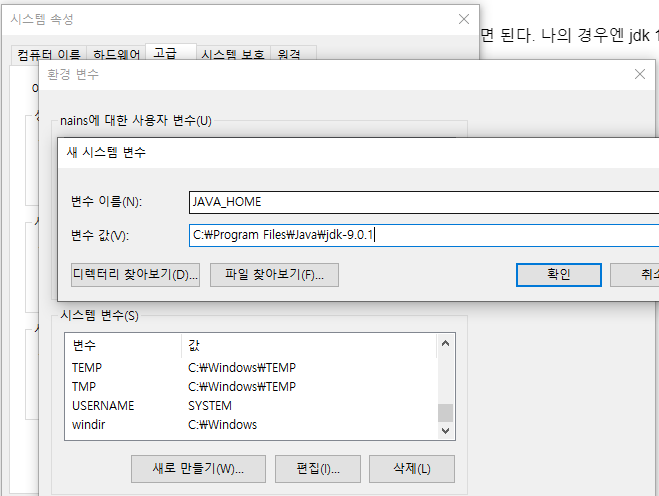
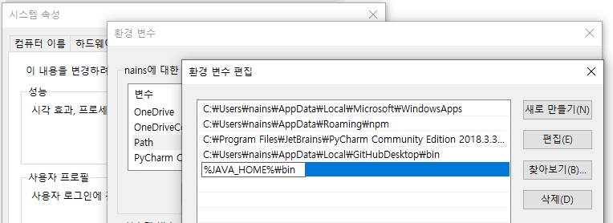
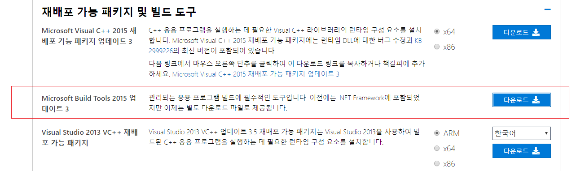
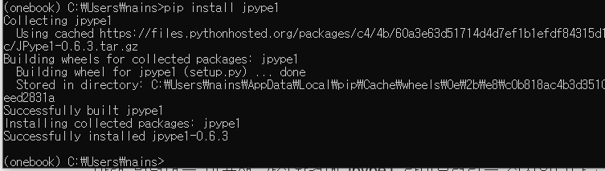

# 6.1.1. 	KoNLPy: 파이썬 한국어 NLP

KoNLPy\(“코엔엘파이”라고 읽습니다. [https://konlpy-ko.readthedocs.io/ko/v0.4.3/](https://konlpy-ko.readthedocs.io/ko/v0.4.3/)\)는 한국어 정보처리를 위한 파이썬 패키지입니다. KoNLPy는 오픈소스 소프트웨어이며, GPL v3 라이센스를 채택하고 있습니다. KoNLPy는 여러 형태소 분석기를 파이썬에서 동시에 사용할 수 있도록 해주는 프로그램입니다. 꼬꼬마 \(Kkma\), 한나눔\(Hannanum\), 자바 한국어 형태소 분석기 \(Komoran\), 은전한닢 프로젝트 \(Mecab\), Twitter 등 다양한 라이브러리를 선택하실 수 있습니다. KoNLPy는 같은 기능을 하는 또 하나의 도구를 만들려는 것이 아닙니다. 그보다는, 현존하는 도구 위에 한 층을 쌓아 더 멀리 내다보려는 것입니다. 또한 KoNLPy는 파이썬 프로그래밍 언어로 사용할 수 있도록 만들어졌는데, 그것은 파이썬이 간결하고 우아한 문법구조, 강력한 스트링 연산 기능을 가지고 있을 뿐 아니라 크롤링, 웹프로그래밍, 그리고 데이터 분석을 수행할 수 있는 다양한 패키지를 사용할 수 있는 언어이기 때문입니다.

KoNLPy는 별도의 설치과정이 필요합니다. 윈도우 버젼 기준으로 설치를 진행하겠습니다.

1. Java 1.7 이상의 version이 필요합니다. 본인의 자바 버젼을 확인하고자 한다면 C -&gt; Program Files -&gt; Java 에서 jdk 의 버젼을 확인하면 됩니다. KoNLPy를 사용하기 위해선 JDK 및 JVM\(자바 가상머신\)이 필요합니다.

2. JAVA\_HOME Path 를 별도로 설정해주어야 합니다.  
 jdk를 사전에 설치한 사람이라 할지라도, JAVA\_HOME path를 별도로 설정하지 않고 사용할 수 있습니다.  
 내컴퓨터 우클릭 -&gt; 속성 -&gt; 고급 시스템 설정 -&gt; 환경변수 -&gt; 시스템변수 새로만들기\(W\)



`변수 이름(N) : JAVA_HOME`

`변수 값(V) : C:\Program Files\Java\jdk-9.0.1`

변수값에 들어가는 파일 경로는 본인의 jdk 가 설치된 경로를 기입하면 됩니다.

환경변수를 추가하였으면 시스템변수 중에서 Path를 더블클릭해서 설정해 줍니다.



Path를 설정하는 창에서, 새로만들기를 한 다음, %JAVA\_HOME%\bin 을 추가한 후, 확인을 눌러줍니다.

‘코엔엘파이’의 경우 JAVA로 작성된 모듈을 로드하여야 하기 때문에 JPype1 0.5.7 이상이 설치되어야 합니다. 윈도우에 JPype1을 설치하려면 Microsoft Visual Studio Build Tools이 설치되어야 합니다. 다음의 주소에서 Visual Studio Build Tools을 다운로드 받아 설치합니다.

[https://visualstudio.microsoft.com/ko/downloads/](https://visualstudio.microsoft.com/ko/downloads/)

[https://visualstudio.microsoft.com/ko/vs/older-downloads/](https://visualstudio.microsoft.com/ko/vs/older-downloads/)

Python Version에 따른 Visual Studio 는 다음과 같습니다. 자신의 Python 버전에 맞는 Visual Studio Build Tools을 설치하기 바랍니다.

| Python version | Visual Studio |
| :--- | :--- |
| 2.7, 3.4 | 2010 |
| 3.5 | 2015 |
| 3.6, 3.7, 3.8 | 2017 |

Python 3.5 를 위해서는 2015 버전의 Visual Studio Build Tools 이 필요 합니다. 그 이후 버전에서는 2017 버전의 Visual Studio Build Tools을 설치해 줍니다.



그다음 아나콘다 프롬프트에서 onebook 가상환경을 activate 해주고 pip를 사용하여 jpype1을 설치합니다.

\(onebook\) &gt; pip install jpype1

만약 정상적으로 설치가 안되는 경우에는 \([http://www.lfd.uci.edu/~gohlke/pythonlibs/\#jpype](http://www.lfd.uci.edu/~gohlke/pythonlibs/#jpype)\)로 이동하여 시스템에 맞는 .whl\(윈도우 wheel 파일\)을 다운로드 받아 설치하기 바랍니다. 

만약에 LINK : fatal error LNK1158: cannot run 'rc.exe'  에러가 난다면 rc.exe 와 rcdll.dll 파일을 C:\Program Files \(x86\)\Windows Kits\8.1\bin\x86\(혹은 x64\) 에서 C:\Program Files \(x86\)\Microsoft Visual Studio 14.0\VC\bin로 복사 해 줍니다.

정상적으로 설치된 것을 확인 합니다.

그런 다음에 KoNLPy API를 설치하기 위해 아래 명령어를 입력합니다.

pip install konlpy

정상적으로 설치된 것을 확인 합니다.



설치죈 KoNLPy를 테스트 해 보겠습니다.

다음 코드를 입력해서 실행 해 봅니다.

```python
from konlpy.tag import Kkma
from konlpy.utils import pprint

kkma = Kkma()
pprint(kkma.nouns(u'명사만을 추출하여 워드클라우드를 그려봅니다'))
```

결과는 다음과 같이 명사들을 추출하였습니다.

`['명사', '추출', '워드', '워드클라우드', '클라우드']`

자연어 처리의 힘은 ‘코퍼스’\(‘말뭉치’\)에서 나옵니다. 자연어 처리의 가장 밑단, 즉 기단부 역할을 하는 게 한글 말뭉치입니다. 한글 말뭉치는 쉽게 말하면 한글 어휘와 어휘 특성의 저장소입니다. 디지털 사전에 비유될 수 있지만 그보다 훨씬 복잡합니다. 코퍼스corpus는 실제 사람들이 발화된 말이나 발간된 글을 모아놓은 방대한 데이터베이스입니다.

말뭉치는 텍스트분석이든 인공지능이든 언어 분석이든 개발과 연구를 위해 반드시 갖춰져야 할 디지털 데이터베이스입니다.

대표적인 말뭉치는 국립 국어원의 세종 말뭉치로 무려 2억 어절에 해당하는 방대한 구축 작업이었다고 합니다. 세종 말뭉치는 자연어 처리 분야에서 다양하게 활용되고 있는데 대표적으로는 서울대에서 개발한 꼬꼬마 세종 말뭉치 활용 시스템입니다. 꼬꼬마 세종 말뭉치는 말뭉치를 데이터베이스에 저장해 웹 프로그램 형태로 구현한 사례입니다.

* 국립국어원 세종 말뭉치: [https://ithub.korean.go.kr/user/login.do](https://ithub.korean.go.kr/user/login.do)
* 고려대학교 말뭉치: [http://corpus.korea.ac.kr/](http://corpus.korea.ac.kr/)
* 연세 말뭉치: [https://ilis.yonsei.ac.kr/corpus/\#/](https://ilis.yonsei.ac.kr/corpus/#/)
* 카이스트 KCP : [http://semanticweb.kaist.ac.kr/research/kcp/](http://semanticweb.kaist.ac.kr/research/kcp/)

등을 들수 있습니다.

테스트용 말뭉치 파일들은 국립국어원 자료실에서 상황별로도 파일을 받을수 있습니다.

[https://ithub.korean.go.kr/user/total/database/corpusManager.do](https://ithub.korean.go.kr/user/total/database/corpusManager.do)

최근에는 한국어 질의 응답용 KorQuAD\([https://korquad.github.io/](https://korquad.github.io/)\) 데이터도 공유되었습니다. 이전에도 한국어 감성 분석 \(sentiment analysis\) 을 위하여 네이버 영화 리뷰를 정리해둔 Naver sentiment movie corpus v1.0\([https://github.com/e9t/nsmc](https://github.com/e9t/nsmc)\) 이 공유되기도 했습니다.

실습에 가장 적합한 데이터를 구할 수 있는 곳은 “패스트캠퍼스 자연어처리를 위한 머신러닝 실습 자료실\([https://github.com/lovit/python\_ml4nlp](https://github.com/lovit/python_ml4nlp)\)”입니다.

